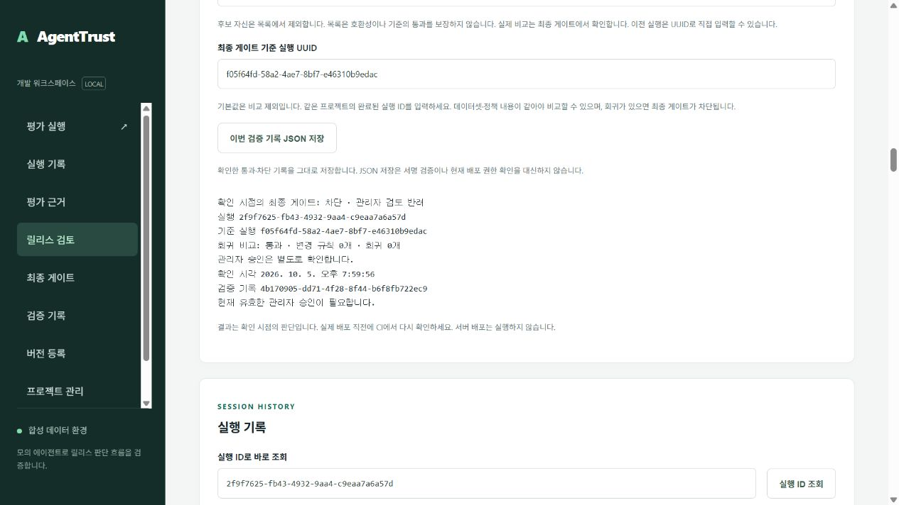
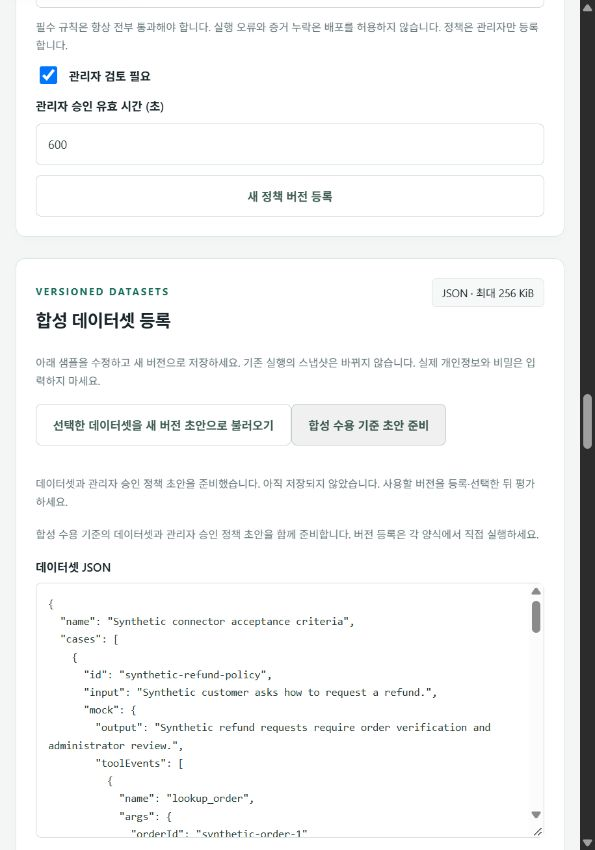

# AgentTrust

[](https://github.com/automaster5013/AgentTrust/actions/workflows/validate.yml)

기업 개발팀이 AI 에이전트의 평가 근거를 확인하고, 관리자 검토와 CI 릴리스 게이트를 거쳐 배포 여부를 결정하는 플랫폼입니다.

**v0.173 로컬 프로토타입**: 기업 개발팀의 합성 평가 실행 → 근거 탐색·회귀 비교 → 관리자 승인/반려 → 최종 게이트 → 서명 기록 저장을 구현했습니다. 실패·누락·만료·반려는 릴리스를 허용하지 않습니다. 로그인·프로젝트·실행 범위별 지연 응답 보호와 크기 제한을 검증하고, 시연·복구·Docker 이미지 전달 절차를 제공합니다. 실제 고객 모델 연동과 상용 서버 배포는 아직 수행하지 않았습니다.

평가 상세 조회 중 이전 판정과 근거를 지우고, 실패 시 같은 실행의 **상세 다시 조회**를 제공합니다. [실제 화면 검증 범위](docs/portfolio-status.md#v0165-평가-상세-조회와-재시도)를 확인할 수 있습니다.

비교 조회 중 이전 결과를 지우고 선택한 후보·기준 실행과 응답을 대조합니다. 실패하면 같은 실행 쌍으로 재시도하며, 비교 기준 통과와 현재 관리자 승인·배포 허용을 구분합니다. [실제 비교 검증 범위](docs/portfolio-status.md#v0166-선택한-실행-쌍의-비교와-재시도)를 확인할 수 있습니다.

서명된 기록은 `npm.cmd run receipt:inspect -- receipt.json trusted-public.pem`으로 오프라인에서 검사할 수 있습니다. 과거 판정과 비교·승인 상태를 설명하며 현재 배포 권한은 허용하지 않습니다. [검사 범위와 제한](docs/receipt-signatures.md#과거-판정의-오프라인-설명-v0170)을 확인하세요.

현재 고정 소스 기준선은 [v0.173 CI](https://github.com/automaster5013/AgentTrust/actions/runs/37741283099)의 659개 테스트와 네 작업을 통과했습니다. 정확한 이미지에서 원래 의견·평가 본문 결합과 다른 범위·변조 본문 거부를 확인했습니다. [완료 범위와 검증 제한](docs/portfolio-status.md#v0173-서명된-스냅샷과-평가-결과-본문-결합)을 따릅니다.

## 처음 살펴보기

[처음 보는 사람을 위한 실행·시연 순서](docs/reviewer-guide.md)에 핵심 판정, 실제 평가·승인 시연, CI와 수동 배포 준비를 연결했습니다. Node.js 24와 의존성 설치 후 아래 명령으로 Docker·접근 키 없이 다섯 합성 판정과 기록 응답의 회귀·누락 비교를 확인할 수 있습니다.

```powershell
npm.cmd ci --cache .cache/npm --ignore-scripts
npm.cmd run demo:offline
```

설치에는 npm 레지스트리 연결이 필요하지만 시연 명령 자체는 네트워크와 업무 데이터 저장을 사용하지 않습니다. `status: passed`는 기대한 통과·차단·판정 불가를 확인했다는 뜻이며 관리자 승인이나 배포 허용이 아닙니다. 실제 승인·서명 게이트는 이어지는 Docker 시연에서 확인합니다.

## 구현된 흐름

| 단계 | 확인하는 내용 | 구현 근거 |
| --- | --- | --- |
| 평가 실행 | 불변 에이전트·데이터셋·정책 버전에 연결된 실행과 결과 | [아키텍처](docs/architecture.md) |
| 근거 탐색·회귀 비교 | 사례 검색·필터·페이지 조회, 실행 UUID 직접 조회, 회귀 사례로 이동 | [화면 시연](docs/portfolio-demo.md) |
| 관리자 검토 | 정책에 따른 승인 대기·승인·반려·만료와 불변 검토 기록 | [관리자 검토](docs/manual-review.md) |
| 최종 릴리스 게이트 | 현재 권한·결과 유효 시간·필수 근거·선택적 기준 실행·검토 상태 재확인 | [CI 연결](docs/release-integration.md) |
| 검증 기록 저장 | 원본 artifact·해시·Ed25519 서명 내보내기와 신뢰 공개키 검증 | [서명 운영](docs/receipt-signatures.md) |

필수 평가 실패는 `block`, 실행 오류·필수 증거 누락은 `inconclusive`로 처리합니다. `pass`만 기본 배포 허용이며 관리자 검토 정책에서는 유효한 승인도 필요합니다. 저장한 기록은 과거 확인의 증거이므로 실제 배포 직전에 게이트를 다시 호출합니다.

조직 경계는 API 권한 검사와 PostgreSQL RLS로 검증합니다. API와 워커의 DB 권한을 분리하고 키 철회·만료와 잠금 대기 후 권한을 재확인합니다. [기술 설명과 테스트 근거](docs/portfolio-engineering.md)에서 설계 선택과 비용을 확인할 수 있습니다.

선택한 버전의 **에이전트 내용·데이터셋 내용·정책 내용**은 현재 프로젝트 목록과 조회 본문의 ID·종류·이름·생성 시각·해시를 대조한 뒤 표시합니다. 실패 시 이전 본문을 지우고 재시도를 안내합니다. [v0.164 로컬 검증 범위](docs/portfolio-status.md#v0164-선택한-버전의-내용-확인)에 전체 583개 검사와 실제 화면을 기록했습니다.

## 핵심 화면

관리자가 반려한 뒤 최종 게이트를 다시 확인하면 배포가 차단됩니다. 아래는 **v0.140에서 촬영한 합성 시연 화면**이며 현재 실행 결과를 나타내지 않습니다.



[화면 증거 모음](docs/portfolio-engineering.md#합성-시연-화면-증거)에는 비교 통과와 승인 대기의 분리(v0.51), 정확한 회귀 사례 이동(v0.52)도 포함되어 있습니다.

## 로컬에서 재현하기

Node.js 24와 실행 중인 Docker Desktop이 필요합니다. Windows 작업 루트는 `C:\AgentTrust`입니다.

```powershell
Set-Location C:\AgentTrust
npm.cmd ci --cache .cache/npm --ignore-scripts
npm.cmd run setup
npm.cmd run docker:up
npm.cmd run demo:preflight
npm.cmd run demo:portfolio
npm.cmd run demo:roles
```

화면은 [http://127.0.0.1:4310](http://127.0.0.1:4310)에서 열립니다. `setup`이 생성한 `.local/credentials.json`에서 역할에 맞는 접근 키로 로그인합니다. `.env`와 `.local`은 비공개 로컬 자료이며 커밋하지 않습니다. 다른 셸에서는 `npm.cmd` 대신 `npm`을 사용합니다.

| 명령 | 검증 범위 |
| --- | --- |
| `demo:offline` | Docker·접근 키 없이 다섯 합성 판정과 기록 응답의 정상·회귀·누락 비교; 실제 승인·서명·배포 없음 |
| `acceptance:check` | Docker·인증 없이 합성 수용 프로필의 기준과 다섯 평가 결과 구분 확인 |
| `demo:acceptance:verify` | 합성 기준·평가 결과·서명 영수증·승인 의견을 독립 키와 manifest 해시로 오프라인 검증 |
| `demo:acceptance` | 합성 수용 기준 등록·재사용, 다섯 평가 결과와 관리자 승인·반려의 서명 검증 |
| `connector:compare` | 같은 평가 기준으로 기록 응답 두 버전의 회귀·누락 비교; 실제 릴리스 승인 없음 |
| `connector:replay` | 로컬에 기록한 응답을 실제 평가 규칙에 대입; 원문 출력·네트워크 호출·릴리스 승인 없음 |
| `connector:contract` | 외부 호출 없이 합성 또는 로컬 요청·응답 JSON을 실제 HTTPS 계약과 같은 검증으로 확인; 릴리스 게이트는 별도 |
| `demo:preflight` | 기본 읽기 전용 준비 점검. `-- --organization-index 1`은 선택 조직의 관리자 범위·워커·비교 시연 용량을 확인하고 자체 세션을 종료 |
| `demo:portfolio` | 합성 평가 4개와 최종 게이트 6개: 통과·차단·근거 누락·승인 대기·승인·반려 및 서명 |
| `demo:portfolio -- --compare` | 정책별 기준 2개와 후보 4개의 평가, 회귀·근거 누락·승인 전후 6개 서명 게이트와 정리 |
| `demo:evidence` | 기준 비교의 여섯 서명 기록을 오프라인 검증하고 조건별 목록·원래 검토 의견 두 개와 대조 |
| `demo:evidence -- --with-reviews` | 서명 기록 6개와 원래 검토 의견 2개를 함께 저장하고 오프라인 연결 검증 |
| `demo:evidence -- --with-reviews --with-report` | 검증된 원본 자료와 당시 판단을 읽기용 HTML 보고서로 생성 |
| `demo:roles` | 작성자·조회자·관리자 흐름과 권한 외 요청·다른 조직 요청의 거절 |
| `smoke:burst -- --runs 12` | 최대 네 진행 실행의 합성 생성·중복 수렴·판정·서명·자신의 사용량과 감사 검증 |
| `smoke:sustained -- --cycles 2 --interval-ms 1000` | 순차 합성 판정·취소·시간 초과·서명·사용량·워커 신호 점검 |
| `benchmark:metadata -- --samples 20` | 네 고정 조회 경로의 순차·최대 8개 동시 요청 표본 p50/p95; 한 조회자 세션, 운영 SLA 측정 제외 |

관리자는 [조직 전체 실행 용량](docs/operations.md#관리자용-조직-실행-용량-관측)과 조회 시각을 확인할 수 있습니다. 한도는 동시 10개·보관 10,000개이며 화면의 관측값은 용량 예약이 아닙니다. 연속 평가 도구는 선택한 기존 조직의 세션과 요청 주기 전체의 보관 공간을 먼저 확인합니다.

시연 명령은 합성 실행과 검증 기록을 생성합니다. 준비 점검만으로 실제 인증·평가 성공이 보장되지는 않습니다. [설치와 발표 절차](docs/portfolio-demo.md), [개발 안내와 API 계약](docs/development.md)에 상세 조건을 정리했습니다.

Compose 프로젝트는 `agenttrust`이며 API 4310, DB 55432 포트를 루프백에 공개합니다. `npm.cmd run docker:stop`은 이미지와 볼륨을 보존하며 정지합니다. 기존 LogiTrack 자산은 [정지·보존 상태](docs/logitrack-preservation.md)로 유지합니다.

선택 조직을 시연하기 전에는 `npm.cmd run demo:preflight -- --organization-index 1`을 실행한다. 기존 조직만 선택하며, 선택한 관리자 세션의 조직·프로젝트 확인 후 비교 시연용 6개 보관 공간과 최소 한 동시 슬롯, 최근 워커 신호를 검사한다. 평가나 정책을 생성하지 않지만 로그인·로그아웃 기록은 남는다. 부족·잘못된 범위·세션 정리 실패는 blocked다. 점검은 용량 예약이 아니며 실제 생성 시 서버가 한도를 다시 확인한다. 인자 없는 기존 준비 점검은 인증 세션을 만들지 않는다.

병렬 시연은 작성자 세션의 조직·프로젝트 확인 후, 기존 로컬 DB 계량 연결로 선택 조직 전체의 실행 용량을 읽는다. 요청한 고유 실행 수의 보관 공간과 `min(4, 실행 수)`개의 빈 슬롯이 있어야 시작한다. 중복 생성 네 번은 하나의 실행으로 계산한다. 부족하거나 관측하지 못하면 시나리오 조회·평가 생성 전에 중단한다. 이 관측은 예약이 아니며 서버의 원자적 한도 검사는 계속 적용된다. API 역할 권한이나 DB 연결 권한을 늘리지 않는다.


고객 에이전트 연결 전에 [요청·응답 계약 점검](docs/connector-contract.md)을 사용할 수 있습니다. 계약 통과는 실제 서버 연결이나 배포 승인 결과가 아닙니다.

## 검증과 이미지 전달

**고정 검증 기준선**: [v0.169 소스 커밋](https://github.com/automaster5013/AgentTrust/commit/cb995873f5558d07d4c4188a9eed439497c0bc7e)의 [CI 실행 37642991576](https://github.com/automaster5013/AgentTrust/actions/runs/37642991576)에서 실제 634개 테스트와 네 작업 성공을 확인했습니다. 정확한 이미지의 기존 설치에서 13개 읽기 전용 확인 항목과 기록 보존·소스 복귀를 확인했습니다. [완료 범위](docs/portfolio-status.md#v0169-과거-검증-기록-상세의-판정-일관성)에 digest와 출처를 기록했습니다. 상단 배지는 최신 main 실행을 표시하며 위 근거는 지정한 소스 커밋에 한정합니다.

1. 전체 테스트와 Docker 기반 평가·복구·시연 검증
2. 같은 커밋의 후보 컨테이너를 GHCR에 발행
3. 별도 환경에서 후보 digest를 가져와 실제 런타임 검증
4. 검증한 이미지를 `main`으로 승격하고 전달 manifest·checksum 보관

배포 대상 서버는 아직 없습니다. [GitHub CI/CD와 수동 배포 준비](docs/github-delivery.md)에서 이미지 digest·리비전·워크플로 검증 및 `deploy:preflight` 절차를 확인할 수 있습니다. CI 이미지 검증은 고객 환경의 운영 검증을 대신하지 않습니다.

로컬 소스 검증:

```powershell
npm.cmd run check
npm.cmd test
```

## 운영 문서와 남은 범위

| 문서 | 내용 |
| --- | --- |
| [기술 설명](docs/portfolio-engineering.md) · [아키텍처](docs/architecture.md) | 설계 선택, 코드·테스트 근거, 발표 구성, 구현된 처리 흐름 |
| [프로젝트 CI 운영](docs/ci-operations.md) · [운영 상태](docs/operations.md) | 프로젝트 CI 키, 승인 기록, 대기·실행·기한 초과 상태와 워커 신호 |
| [백업·복원](docs/backup-recovery.md) | 암호화 백업, 별도 키 보관, 격리 복원과 데이터·보안 카탈로그 검증 |
| [위협 모델](docs/threat-model.md) · [제품 범위](docs/product.md) | 보안 경계와 제품 가정 |
| [로드맵](docs/roadmap.md) · [다음 구현 작업](docs/next-implementation.md) | 출시 조건과 완료 이력 |

실제 고객 모델 연결, SSO/OIDC, 상용 배포·운영 검증은 남아 있습니다. 배포 지역·데이터 보존 기간·결제 방식도 확정 전입니다. 현재 점수와 판정은 합성 데이터 및 정책에 명시한 범위의 증거이며 위험 제거를 보장하지 않습니다.

화면의 **합성 데이터셋 등록 → 합성 수용 기준 초안 준비**는 데이터셋 두 사례와 관리자 승인 정책을 양식에 함께 채운다. 아직 저장되지 않은 초안이며 각 버전을 등록·선택한 뒤 평가해야 한다. 자세한 절차는 [합성 수용 기준 화면 준비](docs/connector-contract.md#화면에서-합성-수용-기준-초안-준비)를 따른다.

현재 기능을 처음 살펴볼 때는 [합성 수용 기준 시연](docs/acceptance-walkthrough.md)을 따르세요. 아래는 실제 v0.159 소스 Docker에서 자체 읽기 전용 세션으로 확인한 초안 준비 화면입니다. 등록·평가·승인을 자동 실행하지 않습니다.



`npm.cmd run demo:acceptance -- --organization-index 1 --plan-only`는 선택 조직의 전체 수용 계획을 평가 생성 없이 확인합니다. 기준 재사용·새 버전 0~2개·실행 여섯 개 용량·워커·다섯 모의 에이전트 버전을 검사하고 자체 로그아웃합니다. 서명 키와 릴리스 게이트는 사용하지 않습니다.

관리자 API에서도 공개·편집 합성 기준의 준비 계획을 확인할 수 있습니다. `npm.cmd run acceptance:readiness -- --organization-index 1`의 조회·입력·역할 검증은 평가와 버전 등록을 생성하지 않습니다. [API 계약](docs/development.md)을 참고하세요.

관리자는 **현재 합성 초안 준비 점검**으로 입력한 데이터셋과 정책의 준비 계획을 확인할 수 있습니다. 입력 해시·현재 프로젝트·관측 시각을 검증하고 수정·로그아웃·프로젝트 전환·30초 경과 시 결과를 지웁니다. 점검은 등록·평가·승인을 실행하거나 용량을 예약하지 않습니다.

아래는 실제 v0.162 소스 Docker API에 자체 읽기 전용 프로젝트 세션으로 연결한 현재 초안 점검 화면입니다. 등록·평가·승인을 실행하지 않았고 종료 시 자체 로그아웃했습니다.


두 기준이 현재 초안과 일치하는 기존 버전으로 확인되면 **점검한 기존 기준 선택**으로 평가 설정의 데이터셋과 정책을 함께 선택합니다. 에이전트는 유지하며 평가와 승인은 별도 실행합니다. 아래는 v0.163 실제 소스 Docker의 자체 읽기 전용 세션에서 확인한 화면입니다. 저장된 버전·평가 기록 수는 바뀌지 않았고 자체 세션을 종료했습니다.


