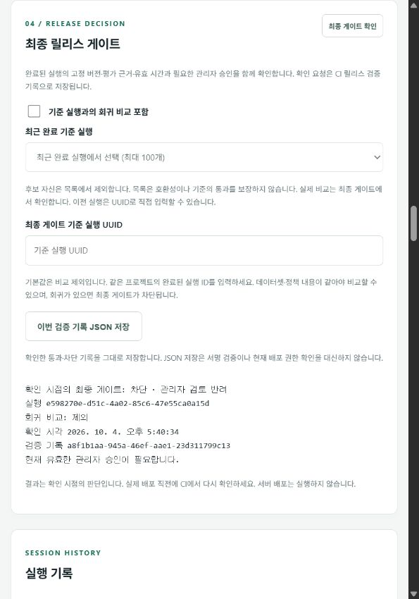

# AgentTrust

[](https://github.com/automaster5013/AgentTrust/actions/workflows/validate.yml)

기업 개발팀이 AI 에이전트의 평가 근거를 확인하고, 관리자 검토와 CI 릴리스 게이트를 거쳐 배포 여부를 결정하는 플랫폼입니다.

**v0.73 로컬 프로토타입**: 합성 데이터와 모의 에이전트로 평가 실행 → 근거 탐색·회귀 비교 → 관리자 승인/반려 → 최종 게이트 → 서명 기록 저장을 구현했습니다. v0.69에서 246개 테스트와 Docker 이미지 전달을 검증했고, v0.73에서는 시연 명령의 포트 검증과 로컬 HTTP 요청 경계를 기존 운영 점검과 통일했습니다. 실제 고객 모델 연동과 상용 서버 배포는 아직 수행하지 않았습니다.

## 구현된 흐름

| 단계 | 확인하는 내용 | 구현 근거 |
| --- | --- | --- |
| 평가 실행 | 불변 에이전트·데이터셋·정책 버전에 연결된 실행과 결과 | [아키텍처](docs/architecture.md) |
| 근거 탐색·회귀 비교 | 사례 검색·필터·페이지 조회, 실행 UUID 직접 조회, 회귀 사례로 이동 | [화면 시연](docs/portfolio-demo.md) |
| 관리자 검토 | 정책에 따른 승인 대기·승인·반려·만료와 불변 검토 기록 | [관리자 검토](docs/manual-review.md) |
| 최종 릴리스 게이트 | 현재 권한·결과 유효 시간·필수 근거·선택적 기준 실행·검토 상태 재확인 | [CI 연결](docs/release-integration.md) |
| 검증 기록 저장 | 원본 artifact·해시·Ed25519 서명 내보내기와 신뢰 공개키 검증 | [서명 운영](docs/receipt-signatures.md) |

필수 평가 실패는 `block`, 실행 오류·필수 증거 누락은 `inconclusive`로 처리합니다. `pass`만 기본 배포 허용이며 관리자 검토 정책에서는 유효한 승인도 필요합니다. 저장한 기록은 과거 확인의 증거이므로 실제 배포 직전에 게이트를 다시 호출합니다.

조직 경계는 API 권한 검사와 PostgreSQL RLS로 검증합니다. API와 워커의 DB 권한을 분리하고 키 철회·만료와 잠금 대기 후 권한을 재확인합니다. [기술 설명과 테스트 근거](docs/portfolio-engineering.md)에서 설계 선택과 비용을 확인할 수 있습니다.

## 핵심 화면

관리자가 반려한 뒤 최종 게이트를 다시 확인하면 배포가 차단됩니다. 아래는 **v0.57에서 촬영한 합성 시연 화면**이며 현재 실행 결과를 나타내지 않습니다.



[화면 증거 모음](docs/portfolio-engineering.md#합성-시연-화면-증거)에는 비교 통과와 승인 대기의 분리(v0.51), 정확한 회귀 사례 이동(v0.52)도 포함되어 있습니다.

## 로컬에서 재현하기

Node.js 24와 실행 중인 Docker Desktop이 필요합니다. Windows 작업 루트는 `C:\AgentTrust`입니다.

```powershell
Set-Location C:\AgentTrust
npm.cmd ci --cache .cache/npm --ignore-scripts
npm.cmd run setup
npm.cmd run docker:up
npm.cmd run demo:preflight
npm.cmd run demo:portfolio
npm.cmd run demo:roles
```

화면은 [http://127.0.0.1:4310](http://127.0.0.1:4310)에서 열립니다. `setup`이 생성한 `.local/credentials.json`에서 역할에 맞는 접근 키로 로그인합니다. `.env`와 `.local`은 비공개 로컬 자료이며 커밋하지 않습니다. 다른 셸에서는 `npm.cmd` 대신 `npm`을 사용합니다.

| 명령 | 검증 범위 |
| --- | --- |
| `demo:preflight` | 런타임·로컬 설정·Compose 서비스/포트·API health의 읽기 전용 준비 점검 |
| `demo:portfolio` | 합성 평가 4개와 최종 게이트 6개: 통과·차단·근거 누락·승인 대기·승인·반려 및 서명 |
| `demo:roles` | 작성자·조회자·관리자 흐름과 권한 외 요청·다른 조직 요청의 거절 |

시연 명령은 합성 실행과 검증 기록을 생성합니다. 준비 점검만으로 실제 인증·평가 성공이 보장되지는 않습니다. [설치와 발표 절차](docs/portfolio-demo.md), [개발 안내와 API 계약](docs/development.md)에 상세 조건을 정리했습니다.

Compose 프로젝트는 `agenttrust`이며 API 4310, DB 55432 포트를 루프백에 공개합니다. `npm.cmd run docker:stop`은 이미지와 볼륨을 보존하며 정지합니다. 기존 LogiTrack 자산은 [정지·보존 상태](docs/logitrack-preservation.md)로 유지합니다.

## 검증과 이미지 전달

**고정 검증 기준선**: [v0.60 소스 커밋](https://github.com/automaster5013/AgentTrust/commit/41611674e0a1411d3d7ba554d378167fa4f5e8c9)의 [CI 실행 #37191576626](https://github.com/automaster5013/AgentTrust/actions/runs/37191576626)에서 224개 테스트와 아래 네 작업이 모두 성공했습니다. 상단 배지는 최신 `main` 실행을 표시합니다.

1. 전체 테스트와 Docker 기반 평가·복구·시연 검증
2. 같은 커밋의 후보 컨테이너를 GHCR에 발행
3. 별도 환경에서 후보 digest를 가져와 실제 런타임 검증
4. 검증한 이미지를 `main`으로 승격하고 전달 manifest·checksum 보관

배포 대상 서버는 아직 없습니다. [GitHub CI/CD와 수동 배포 준비](docs/github-delivery.md)에서 이미지 digest·리비전·워크플로 검증 및 `deploy:preflight` 절차를 확인할 수 있습니다. CI 이미지 검증은 고객 환경의 운영 검증을 대신하지 않습니다.

로컬 소스 검증:

```powershell
npm.cmd run check
npm.cmd test
```

## 운영 문서와 남은 범위

| 문서 | 내용 |
| --- | --- |
| [기술 설명](docs/portfolio-engineering.md) · [아키텍처](docs/architecture.md) | 설계 선택, 코드·테스트 근거, 발표 구성, 구현된 처리 흐름 |
| [프로젝트 CI 운영](docs/ci-operations.md) · [운영 상태](docs/operations.md) | 프로젝트 CI 키, 승인 기록, 대기·실행·기한 초과 상태와 워커 신호 |
| [백업·복원](docs/backup-recovery.md) | 암호화 백업, 별도 키 보관, 격리 복원과 데이터·보안 카탈로그 검증 |
| [위협 모델](docs/threat-model.md) · [제품 범위](docs/product.md) | 보안 경계와 제품 가정 |
| [로드맵](docs/roadmap.md) · [다음 구현 작업](docs/next-implementation.md) | 출시 조건과 완료 이력 |

실제 고객 모델 연결, SSO/OIDC, 상용 배포·운영 검증은 남아 있습니다. 배포 지역·데이터 보존 기간·결제 방식도 확정 전입니다. 현재 점수와 판정은 합성 데이터 및 정책에 명시한 범위의 증거이며 위험 제거를 보장하지 않습니다.
