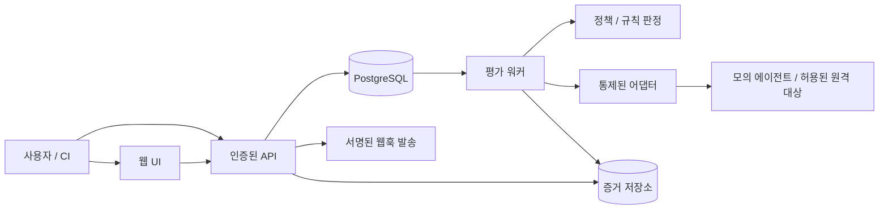

# 시스템 아키텍처

## 초기 기술 선택: 검증 전 제안

TypeScript 기반 웹 UI와 API, PostgreSQL 영속 저장소, DB 기반 작업 큐, 별도 워커, S3 호환 증거 저장소를 제안한다. 초기에는 모듈형 단일 API와 독립 워커로 시작한다. 패키지와 버전은 구현 착수 때 공식 문서·지원 상태를 확인하고 고정한다.

## 서비스 책임

API: 인증·조직 권한·입력 검증·버전 관리·실행 요청·결과 조회. 외부 모델 호출은 워커에 위임한다.
워커: 작업 lease/heartbeat, 자원 예산, 어댑터 호출, 마스킹, 규칙 평가, 결과 확정. 전역 관리자 권한 없이 필요한 실행 자격만 사용한다.
정책 엔진: 저장된 실행/규칙 스냅샷만 입력으로 사용한다. 필수 규칙 실패는 block, 실행/판정 오류 또는 필수 증거 부족은 inconclusive, 모든 필수 검증 완료와 통과 조건 충족만 pass다. pass만 기본 배포 허용으로 해석한다.
증거 저장소: 원문 저장은 별도 정책을 따른다. 객체 키는 조직/실행별로 분리하고 다운로드는 API 권한 확인 이후에만 허용한다.

## 도메인 모델

- Organization, Membership, Project: 소유권과 역할 경계.
- AgentVersion: 설정 참조, 버전 식별자, 설정 해시. 비밀 값 대신 비밀 참조를 저장한다.
- DatasetVersion, Case: 입력, 기대값, 규칙, 위험 태그, 콘텐츠 해시.
- PolicyVersion: 필수 규칙, 임계치, 예산, 승인 예외 권한.
- Run: 조직/프로젝트, 세 버전 참조, 실행 스냅샷, 상태, 예산, idempotency key.
- CaseAttempt, RuleResult, Artifact: 시도별 결과, 판정 근거, 마스킹된 증거와 해시.
- GateDecision, ExceptionApproval, AuditEvent, UsageEvent: 정책 결정과 예외, 행위 감사, 멱등 계량.

조직 소유 행에는 organization_id를 두고 부모 참조도 동일 조직인지 검증한다. 버전은 게시 이후 수정하지 않는다. 삭제 정책은 원문 제거와 최소 감사 메타데이터 보존의 관계를 명시해야 한다.

## 실행 계약과 복구

상태: queued → running → succeeded / failed / cancelled / timed_out. 게이트 판정은 실행 상태와 별개다. 실행 succeeded에도 규칙 실패로 block이 가능하다.
API는 작업 생성과 실행 스냅샷 저장을 하나의 트랜잭션으로 처리한다. 워커는 lease가 있는 작업만 수행하고 중복 전달을 전제로 설계한다. 동일 시도 결과의 중복 반영과 계량을 unique 제약으로 막는다. 실패한 워커의 lease 만료 후 재시도는 예산과 시도 상한 안에서만 허용한다.
취소 요청은 지속 저장하고 워커가 사례 실행 전후 확인한다. 전송된 외부 요청은 취소가 보장되지 않으므로 늦은 응답을 최종 판정에 반영하지 않고 실제 발생 비용을 별도 기록한다.

## API 초안

`POST /v1/projects`, `POST /v1/agent-versions`, `POST /v1/dataset-versions`, `POST /v1/policy-versions`, `POST /v1/runs`, `GET /v1/runs/{id}`, `GET /v1/runs/{id}/results`, `POST /v1/runs/{id}/cancel`, `GET /v1/runs/{id}/gate`.
모든 접근에 조직 권한 검사를 적용한다. 생성 요청은 크기 제한과 스키마 검증을 요구한다. 실행 생성은 멱등성 키를 받으며 다른 본문으로 같은 키를 재사용하면 충돌을 반환한다. 오류에는 추적 ID를 포함하고 비밀·스택은 노출하지 않는다.

## 배포와 관측성

개발/스테이징/운영의 DB·비밀·저장소를 분리한다. 운영은 TLS, 최소 권한, 마이그레이션 절차, 백업과 복원 훈련을 필요로 한다. 워커의 외부 연결은 통제된 egress 경로만 사용한다.
큐 대기시간, 실행시간, 오류율, 예산 초과, 조직별 사용량과 인증 실패를 측정한다. 추적 ID는 API→작업→판정에 전달한다. 알림 임계치는 파일럿에서 측정한 기준으로 결정한다.
