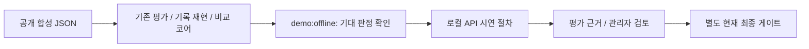
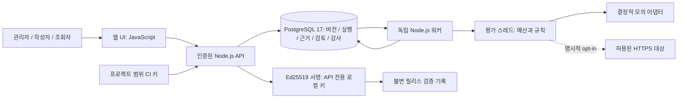
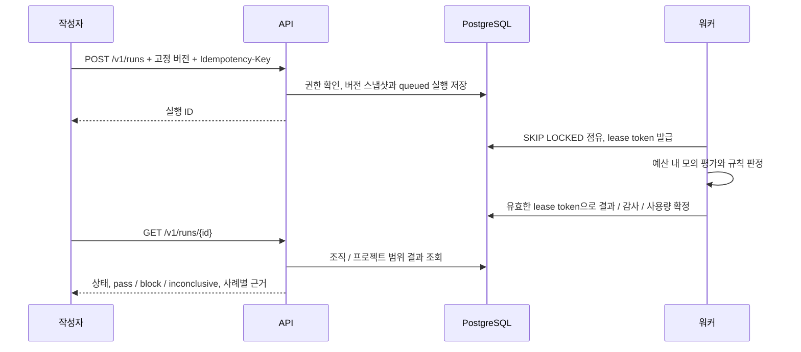
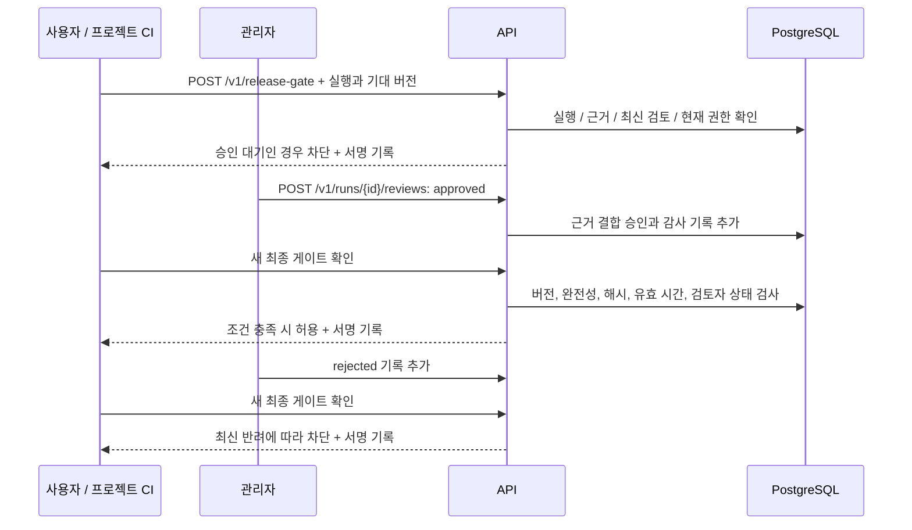
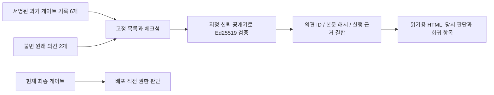
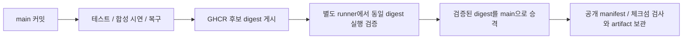
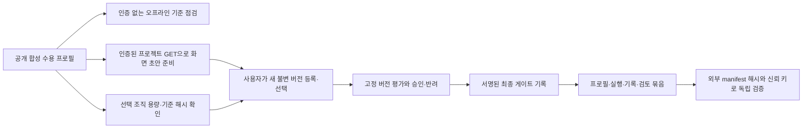

# 구현된 시스템 아키텍처

현재 v0.167의 코드와 로컬 Docker·지정한 GitHub CI에서 확인한 구조를 설명한다. v0.133 이후의 핵심 API·DB·워커 경계를 유지하며 오프라인 시연과 화면 조회 검증을 추가했다. 초기의 TypeScript·독립 객체 저장소·서명 웹훅 제안은 현재 구현에 포함되지 않는다. 제품 목표는 [제품 문서](product.md), 시연은 [포트폴리오 시연](portfolio-demo.md), 설계 판단과 검증 근거는 [기술 설명](portfolio-engineering.md)을 따른다.

## 처음 확인하는 오프라인 경로

오프라인 시연은 Docker·비밀 파일·외부 연결·업무 데이터 저장 없이 공개 예제를 읽는다. 정상·회귀·누락 판정 확인은 관리자 승인이나 서명 게이트를 대체하지 않는다. 실제 평가·검토·게이트 경로는 아래 구조와 [시연 안내](reviewer-guide.md)를 따른다.

## 실행 구성과 경계

런타임은 Node.js 24, 웹은 HTML/CSS/JavaScript ESM이다. [Compose](../compose.yaml)는 API·DB·워커 세 서비스를 실행한다. API와 DB의 호스트 포트는 기본적으로 loopback에만 노출된다. 워커는 internal backend 네트워크만 사용하며 기본 외부 연결이 없다. 원격 HTTPS 어댑터는 [통제 조건과 opt-in 절차](release-integration.md)를 따르며 실제 고객 대상 호출은 검증하지 않았다.

API는 로그인·조직/프로젝트 범위·역할·입력 계약·불변 버전·평가 요청·결과 조회·검토·최종 게이트를 처리한다. 워커가 평가 결과를 확정하고 API가 임의의 평가 결과를 통과로 저장하지 않는다. 평가 근거는 현재 PostgreSQL JSONB에 저장한다. 독립 객체 저장소와 임의 코드 실행은 없다.

실행 목록은 조직·프로젝트 범위에서 생성 시각과 UUID의 내림차순 커서를 사용한다. [마이그레이션 020](../infra/migrations/020_run_history_index.sql)의 비고유 인덱스가 이 순서를 지원한다. 목록에 큰 평가 스냅샷을 포함하지 않으며 권한·RLS·큐 점유의 의미는 유지한다. 인덱스의 추가 저장·쓰기 비용과 실제 조회 표본은 [기술 설명](portfolio-engineering.md#실행-이력-인덱스와-복구--v0133)에 기록했다.

DB 소유자 역할은 준비·마이그레이션에 사용한다. API 역할은 조직 RLS와 제한된 권한을 적용하며 인증 전에는 제한된 함수로 인증 상태를 조회한다. 워커는 조직을 가로지르는 큐 처리를 위해 별도 BYPASSRLS 역할을 사용하되 필요한 테이블·작업 권한으로 제한한다. 워커가 조직 RLS로 격리된다는 의미는 아니다. 역할·프로젝트 검사와 DB 제약을 함께 사용한다.

## 평가와 결과 확정

상태는 queued → running → succeeded/failed/cancelled/timed_out이다. 대기 상태에서 직접 취소·시간 초과로 종료될 수도 있다. succeeded는 처리 완료이며 규칙 통과를 뜻하지 않는다. 필수 규칙 실패는 block, 필수 근거 누락·실행 오류는 inconclusive이며 이미 확인된 필수 실패는 block을 유지한다.

실행 생성과 스냅샷 저장은 한 트랜잭션이다. 동일 조직·프로젝트의 같은 멱등성 키와 같은 본문은 동일 실행을 반환하고 다른 본문은 충돌한다. 워커 lease가 만료되면 시도·시간 예산 안에서 다시 점유할 수 있다. 이전 token의 늦은 응답은 최종 확정에 사용할 수 없다. 결과와 완료 감사·사용량을 함께 확정하며 저장 제약으로 중복 계량을 막는다. 이는 외부 모델 호출 자체가 한 번만 수행된다는 보장이 아니다.

## 관리자 검토와 현재 최종 게이트

관리자 검토 정책에서는 평가 pass여도 자동 배포 허용은 false다. 현재 최종 게이트가 완료된 통과 평가·기대 버전·근거 무결성/완전성·결과 유효 시간·현재 유효한 관리자 승인을 함께 검사한다. 기준 실행을 요청하면 같은 데이터셋·정책의 비교도 확인한다. 평가의 inconclusive가 최종 게이트에서는 배포 차단으로 반환될 수 있다.

검토와 게이트는 실행 잠금과 현재 자격 재검증을 사용한다. 최신 검토는 시각이 아닌 DB 순서 번호로 선택한다. 만료·철회·역할 변경·반려를 재확인하며, 과거 멱등 요청의 통과 결과가 현재 결과와 다르면 재사용을 거절한다. 검토와 릴리스 기록은 append-only로 보존한다. [관리자 검토](manual-review.md)와 [서명 운영](receipt-signatures.md)을 따른다.

Ed25519 서명은 신뢰 공개키에 대한 기록의 무결성을 확인한다. 과거 기록이 지금도 유효한 배포 권한임을 뜻하지 않는다. UI 안내는 서버 권한을 대신하지 않으며 배포 직전에 새 게이트를 확인해야 한다.

## 과거 근거의 오프라인 검증

[오프라인 읽기 도구](../scripts/portfolio-evidence.mjs)는 파일 수·크기·엄격한 UTF-8·체크섬·서명·조직/프로젝트/실행·시나리오 연결을 확인한다. 의견이 포함된 자료에서는 승인/반려 본문을 서명된 기록의 의견 해시에 결합한다. [HTML 생성](../scripts/portfolio-evidence-report.mjs)은 검증한 같은 버퍼를 사용하고 원본 폴더 밖에 새 파일만 만든다. 회귀 상세는 표시 한도를 안내하며 원본은 보존한다. HTML 자체에는 서명이나 현재 배포 권한이 없다.

웹의 원본 검토 펼치기는 서버가 검사한 JSON 응답을 텍스트로 읽는다. 이 표시가 신뢰 공개키의 독립 서명 검증을 대신하지 않는다. 반복 합성 시연은 [정책 원본 검사](../scripts/demo-policy-version.mjs) 후 정확한 불변 정책을 재사용하며 평가와 검토 ID는 새로 만든다. 기존 정책이나 과거 실행을 삭제하지 않는다.

## 복구와 소스 전달

백업은 별도 로컬 키를 사용하는 AES-256-GCM 인증 암호화를 제공한다. 복원은 격리된 DB에서 데이터 지문과 RLS·역할·트리거·제약 등 보안 카탈로그를 검사한다. 백업 키·서명 키·DB 비밀은 저장소와 CI 공개 artifact에 포함하지 않는다. 실제 RPO/RTO 계약이나 상용 복구 SLA를 측정한 것은 아니다. [백업·복원 검증](backup-recovery.md)을 따른다.

GitHub 소스 전달은 제품의 릴리스 게이트와 별도의 흐름이다.

전체 workflow 성공 후 전달 명세의 커밋·run·attempt를 GitHub 조회로 확인할 수 있다. 묶음 체크섬과 manifest는 서명된 공급망 증명으로 해석하지 않는다. 실제 서버 배포는 없으며 운영자가 신뢰한 digest를 사용해 사전 점검과 수동 배포를 준비하는 범위다. [GitHub 전달 문서](github-delivery.md)를 따른다.

## 구현 위치와 다음 범위

| 책임 | 실제 코드 |
|---|---|
| API와 역할 검사 | [server.js](../apps/api/server.js), [auth.js](../apps/api/auth.js), [role-guard.js](../apps/api/role-guard.js) |
| 실행 저장과 워커 확정 | [pg-store.js](../apps/api/pg-store.js), [engine.js](../apps/worker/engine.js), [finalize.js](../apps/worker/finalize.js) |
| 규칙·근거·최종 판단 | [evaluator](../packages/evaluator/index.js), [integrity.js](../packages/evaluator/integrity.js), [comparison.js](../packages/evaluator/comparison.js) |
| 검토·서명 기록 | [reviews.js](../apps/api/reviews.js), [ci.js](../apps/api/ci.js), [signature.js](../packages/receipts/signature.js) |
| 복구·소스 전달 | [recovery.mjs](../scripts/recovery.mjs), [workflow](../.github/workflows/validate.yml) |

SSO/OIDC·실제 고객 모델·고객 데이터 보존/삭제 정책·독립 객체 저장소·2인 승인・상용 서버 운영은 다음 범위다. 구체적인 외부 대상과 운영 요구가 정해진 뒤 구현과 검증을 분리해 진행한다.

## 수용 기준 준비와 독립 증거 — v0.159

[수용 프로필 검증](../packages/evaluator/acceptance-profile.js)은 데이터셋·정책 계약과 다섯 모의 동작의 기대 상태·판정을 함께 검사한다. [초안 준비](../apps/web/app.js)는 읽기 요청만 사용하며 준비 중 편집하거나 프로젝트를 바꾸면 이전 응답을 적용하지 않는다. [실제 합성 시연](../scripts/acceptance-scenario.mjs)은 조직 전체 등록 용량과 재사용 계획을 확인하고 저장된 불변 기준의 내용 해시를 검증한다.

[독립 증거 검증](../scripts/acceptance-evidence.mjs)은 프로필의 데이터셋·정책 해시를 여섯 실행의 스냅샷과 연결하고, 실제 규칙 결과·요약·서명 기록 일곱 개·원래 검토 두 개를 다시 검사한다. 기준 점검이나 과거 증거 검증이 현재 배포 권한을 생성하지 않는다. 등록·평가·현재 최종 게이트는 각각의 서버 검사를 따른다.
