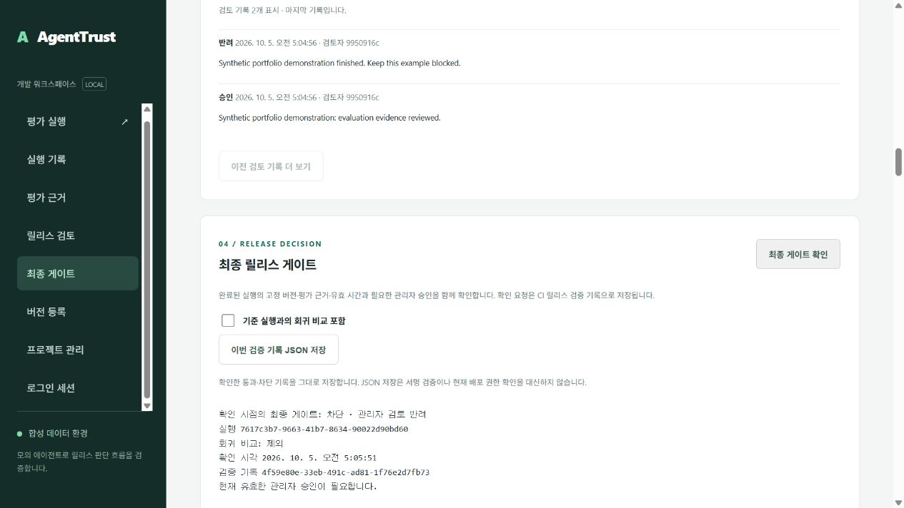

# AgentTrust 기술 설명과 검증 근거

기업 개발팀이 에이전트 변경의 평가 근거를 확인하고 릴리스 여부를 결정하는 로컬 프로토타입이다. v0.112까지 검증한 구현과 v0.112 CI 이미지의 기존 로컬 설치 실행 점검을 설명하며 고객 파일럿이나 상용 배포 성과를 주장하지 않는다. [실행 시연](portfolio-demo.md) → [실제 아키텍처](architecture.md) → 아래 검증 근거 순서로 살펴볼 수 있다.

## 해결하려는 문제

평가 점수만으로 배포를 결정하면 필수 규칙 실패, 누락된 근거, 오래된 결과와 이미 반려된 승인을 놓칠 수 있다. AgentTrust는 에이전트·데이터셋·정책의 고정 버전에 평가 결과를 결합하고, 배포 직전의 별도 게이트가 현재 근거와 승인 상태를 확인하도록 구성했다.

예를 들어 정상 응답은 평가 pass이고 최종 게이트도 허용될 수 있다. 같은 실행이 관리자 검토 정책을 사용하면 평가 pass여도 승인 전에는 차단된다. 승인 후 허용 기록이 생겨도 이후 반려되면 새 게이트는 차단된다. `npm run demo:portfolio`가 이 흐름과 업무 회귀·증거 누락을 재현한다.

## 설계 선택과 비용

| 선택 | 해결하는 문제 | 현재 비용과 제한 |
|---|---|---|
| PostgreSQL 영속 큐와 독립 워커 | 스냅샷·작업 생성의 원자성과 재시작 후 결과 보존 | DB에 큐와 근거 부하가 함께 발생한다. 대규모 처리 성능을 입증하지 않았다. |
| lease token과 시도 제한 | 종료된 시도의 늦은 응답이 새 결과를 덮어쓰는 문제 | 재시도로 외부 호출은 중복될 수 있다. 실제 청구·모델 비용 계량은 없다. |
| 불변 버전과 저장 근거 재검증 | 실행 후 정책 변경이나 해시만 맞춘 불완전한 근거의 재사용 | 기존 기록을 수정하지 않으므로 변경 시 새 버전·평가가 필요하다. |
| 역할·프로젝트 검사와 DB 조직 경계 | API 입력만으로 다른 조직/프로젝트 자원에 접근하는 문제 | 워커는 제한된 별도 BYPASSRLS 역할이다. 모든 주체를 같은 RLS로 격리하지 않는다. |
| 최신 검토와 현재 최종 게이트 | 과거 승인 기록이 반려·만료 후 계속 사용되는 문제 | 배포 직전 새 조회가 필요하고 확인 이후 상태 변경까지 막는 배포 트랜잭션은 없다. |
| Ed25519 릴리스 기록 | 신뢰 공개키를 가진 검증자가 과거 기록 변조를 탐지 | 서명은 현재 배포 권한이나 실제 사람의 검토를 증명하지 않는다. |
| AES-GCM 백업과 격리 복원 | 손상·변조된 백업과 보안 속성 누락을 검출 | 키를 별도로 보관해야 한다. 상용 RPO/RTO와 운영 SLA는 미측정이다. |
| 후보 digest의 별도 실행 검증 후 승격 | 소스 테스트만 통과한 이미지의 즉시 배포를 방지 | 이미지 전달 준비까지 구현했다. 운영 서버 자동 배포는 없다. |

## 코드에서 확인할 흐름

평가 요청은 [pg-store.js](../apps/api/pg-store.js)에서 버전 스냅샷과 함께 저장된다. [워커 engine](../apps/worker/engine.js)이 점유·lease·재시도를 처리하며 [finalizeClaim](../apps/worker/finalize.js)은 실행 상태와 token·lease 유효성을 조건으로 결과를 확정한다. 화면은 원문을 텍스트로 렌더링한다.

[근거 무결성 검사](../packages/evaluator/integrity.js)는 스냅샷 규칙과 저장 결과의 일치를 확인한다. [최종 게이트](../packages/evaluator/comparison.js)는 기대 버전, 완료된 통과 평가, 해시·구조·커버리지와 결과 유효 시간을 검사한다. 관리자 정책에서는 [최신 검토](../apps/api/reviews.js)의 내용 해시·실행 결합·검토자 상태·유효 시간을 추가로 확인한다. [CI 기록 처리](../apps/api/ci.js)가 검증 결과와 서명 기록을 저장한다.

조회자는 게이트를 확인할 수 있지만 승인할 수 없다. 작성자는 평가를 만들 수 있지만 정책이나 승인 기록을 만들 수 없다. `npm run demo:roles`는 이 역할 구분과 다른 조직 접근 거절을 실제 로컬 API에서 재현한다. 관리자 본인의 실행 승인은 현재 허용되므로 2인 승인 체계로 소개하지 않는다.

## 최근 릴리스 흐름의 구현

[화면 핸들러](../apps/web/app.js)는 최종 게이트에 선택적 기준 실행을 포함한다. 최근 완료 목록은 후보 자신을 제외하지만 호환성이나 통과를 보장하지 않는다. 서버는 같은 프로젝트와 데이터셋·정책 내용, 완료된 전체 근거를 확인한다. 기준·옵션·검토 상태 변경은 이전 판단과 원본 기록 저장을 무효화하고 늦은 응답을 차단한다.

관리자 검토 정책에서는 `comparison.evaluationPassed`와 전체 `deploymentAllowed`를 구분한다. 따라서 회귀 비교가 통과해도 승인 대기이면 최종 게이트는 차단이다. 회귀 규칙 링크는 후보의 정확한 사례 ID를 선택하고, 검색·필터 또는 선택 해제로 전체 탐색에 복귀한다. 사례 선택은 전체 평가 요약·판정·원본 JSON을 바꾸지 않는다.

[릴리스 CLI](../scripts/release-gate.mjs)는 필수·선택 UUID와 검증 키·유효 시간·빈 접근 키를 인증 요청 전에 검사한다. 응답은 최대 8 MiB로 읽고 UTF-8·JSON, 요청/해시/응답 결합과 판정 의미를 확인한다. 선택적 신뢰 공개키는 서명을 검증한다. `AGENTTRUST_RECEIPT_OUTPUT_FILE`을 지정하면 원본 artifact·해시·서명만 독점 생성하며 기존 파일을 덮어쓰지 않는다. 저장이나 검증 오류는 종료 코드 2이고, 정상 차단은 1, 허용은 0이다. 신뢰 공개키를 생략한 검사는 암호학적 출처 인증으로 설명하지 않는다.

## 재현 가능한 검증

| 검증 대상 | 저장소의 근거 | 해석할 범위 |
|---|---|---|
| 결정적 규칙과 최종 게이트 | [evaluator 테스트](../tests/evaluator.test.js), [release 테스트](../tests/release.test.js) | 고정 합성 사례와 계약의 통과/차단/판정 불가 |
| 권한·조직·프로젝트·승인·잠금 경계 | [API 통합 테스트](../tests/api.test.js), [역할 검사](../tests/role-guard.test.js) | 테스트한 API·DB 경계이며 외부 보안 감사는 아님 |
| 늦은 UI 응답·기준 변경·원본 저장·정확한 회귀 사례 이동 | [UI 테스트](../tests/ui-races.test.js) | 실제 핸들러에 지연 응답을 주입한 검증과 별도 브라우저 확인 |
| CI 입력·응답·스트림 제한 | [입력 테스트](../tests/release-cli-input.test.js), [응답 테스트](../tests/release-cli-response.test.js), [응답 읽기 테스트](../tests/release-cli-body.test.js) | 잘못된 설정의 요청 거절과 해시가 일치해도 모순인 응답의 거절 |
| 실제 CLI 파일·종료 코드 | [프로세스 테스트](../tests/release-cli-process.test.js), [내보내기 테스트](../tests/release-cli-export.test.js), [Docker CI smoke](../scripts/ci-smoke.mjs) | 합성 루프백 서버의 자식 프로세스 및 Docker 게이트 기록 저장·서명 재검증 |
| 재시작과 lease 복구 | [restart smoke](../scripts/smoke.mjs), [resilience smoke](../scripts/resilience-smoke.mjs) | 독립 Docker API/워커와 영속 데이터의 복구 |
| 서명과 백업 복구 | [서명 테스트](../tests/receipt-signature.test.js), [recovery smoke](../scripts/recovery-smoke.mjs) | 신뢰 로컬 키의 기록 검증과 격리 DB 복원 |
| 사용자·권한 시연 | [portfolio scenario](../scripts/portfolio-scenario.mjs), [role scenario](../scripts/portfolio-roles-scenario.mjs) | 합성 평가·승인·거절과 자체 세션 정리 |
| 이미지와 배포 묶음 | [GitHub workflow](../.github/workflows/validate.yml), [전달 안내](github-delivery.md) | 후보 digest 실행·승격·공개 묶음 저장과 사후 CI 조회 |

문서 작성 기준선은 커밋 `82a91fc56287f55d28d55c2731bd473f64176c40`의 [GitHub CI 실행](https://github.com/automaster5013/AgentTrust/actions/runs/37229398527)이다. 이 v0.112 실행의 테스트 328개와 네 작업이 성공했고 온라인 전달 기록도 대조했다. 이 링크는 해당 커밋의 근거이며 미래 변경의 성공을 의미하지 않는다. 현재 main은 저장소의 CI 배지와 해당 실행에서 확인한다.

실행은 [시연 안내](portfolio-demo.md)의 설치 절차를 따른다. `npm run demo:portfolio`와 `npm run demo:roles`는 각각 10단계·11단계의 결과를 출력한다. 자체 세션을 종료하고 관리자 사례를 반려로 남기며 기존 감사·평가 기록을 삭제하지 않는다. 보고서는 `.local`에 저장한다. 보고서·스크린샷을 공유하기 전에는 로컬 정보와 민감 데이터 포함 여부를 확인해야 한다. 접근 키·백업 키·서명 private key는 공유하지 않는다.

## 시연에서 설명할 내용

1. 합성 고객지원 사례의 정상 응답과 업무 회귀를 비교하고, 성공한 실행도 필수 규칙 실패로 차단될 수 있음을 보여준다.
2. 증거 누락 사례에서 판정 불가가 릴리스 허용으로 바뀌지 않는 것을 확인한다.
3. 관리자 정책의 평가 pass → 승인 대기 → 승인 후 허용 → 반려 후 차단을 검증 기록과 함께 설명한다.
4. 역할별 명령으로 작성자·조회자·관리자와 조직 경계의 실제 거절을 확인한다.
5. 아키텍처에서 재시작·중복 처리·늦은 결과·과거 승인 재사용을 어디에서 통제하는지 설명한다.
6. GitHub의 테스트·후보 이미지·별도 실행 검증·승격을 보여주고 상용 배포와 남은 작업을 구분한다.

## 합성 시연 화면 증거

아래는 실제 로컬 브라우저에서 확인한 과거 시점의 화면이다. 모의 응답과 합성 실행 ID만 포함하며 접근 키·서명 private key·고객 데이터를 포함하지 않는다. 스크린샷 자체는 암호학적 증거 또는 현재 배포 권한이 아니다. 동일 흐름을 재현하는 명령은 [시연 안내](portfolio-demo.md)를 따른다.

| 화면 | 확인한 행동 | 촬영한 구현 |
|---|---|---|
| [비교 통과와 승인 대기](evidence/comparison-approval.png) | 회귀 0개로 비교가 통과해도 관리자 승인 대기이면 최종 차단 | v0.51 |
| [정확한 회귀 사례 이동](evidence/exact-regression-case.png) | structured-answer 사례를 선택해 전체 3개 중 1개 표시; 전체 JSON은 유지 | v0.52 |
| [반려 후 현재 최종 차단](evidence/current-rejection.png) | 재시연의 관리자 사례를 UUID로 조회하고 새 게이트에서 반려·차단 확인 | v0.57 |
| [간결한 최종 게이트와 실행 메뉴](evidence/current-rejection-v091.png) | 조회자가 합성 반려 사례의 새 게이트를 확인; 선택한 실행의 근거·검토·게이트 이동과 기본 비교 입력 숨김 | v0.91 |
| [고정 요청과 근거를 확인한 최종 차단](evidence/current-rejection-v107.png) | 관리자가 새 게이트에서 반려·차단을 확인; 원본 저장 버튼 활성화 | v0.107 |
| [판정 의미를 대조한 최신 최종 차단](evidence/current-rejection-v112.png) | 본인 세션 종료·재로그인 후 정상 게이트 통과와 관리자 반려 차단 확인; 원본 저장 버튼 활성화 | v0.112 |

v0.112의 기존 로컬 재시연은 준비 점검 5단계, 평가·승인 10단계와 권한 11단계가 성공했다. 자체 세션 종료와 관리자 사례의 최종 반려를 확인했다. 브라우저의 차단 표시·원본 저장 활성화와, 별도 API에서 파일로 저장한 과거 기록의 오프라인 CLI 서명 검증을 구분한다. 이번 브라우저 점검에서 실제 다운로드 파일 완료는 확인하지 못했다. 이 로컬 재시연은 새 설치·실제 고객 연결·상용 서버 배포 검증이 아니다. 실행 보고서와 원본 서명 기록은 로컬에 보관하며 공개 저장소에는 화면만 게시한다.

## 아직 검증하지 않은 범위

실제 고객 모델과 개인정보, 고객 파일럿, SSO/OIDC, 독립 객체 저장소, 요금 청구, 데이터 보존·삭제 운영, 2인 승인과 운영 서버 배포는 완료하지 않았다. 동시 사용자 부하·운영 p95 지연·고객 도입 성과·RPO/RTO·모든 공격에 대한 안전성을 수치로 주장할 근거도 없다. 제한된 로컬 조회 시간 표본은 운영 성능 근거가 아니며 측정 방법을 아래에 따로 기록한다. 합성 규칙 검증과 통제된 구현이 제품·시장·운영 검증을 대신하지 않는다.

포트폴리오의 다음 단계는 시연 사용자 관점에서 설치와 화면 흐름을 점검하고, 기록된 결함을 수정하며 공개용 시연 자료를 준비하는 것이다. 실제 고객 연동과 상용 운영은 대상과 요구를 확정한 뒤 별도 검증한다.

## 로컬 반복 검증과 조회 시간 표본

2026-10-04 v0.69 API·워커의 약 30분 반복 점검에서 30주기·270개 합성 실행을 완료했다. 매 주기는 모의 응답·오류·시간 초과·취소를 포함한 9개 결과와 서명 게이트를 확인했다. 실행 범위의 사용량·사례 수와 종료 감사가 정확히 한 번 기록됐고 일시적 재시도는 0회였으며 자체 세션을 로그아웃했다. 주기 시작 간격은 60초이며 동시 270개 처리량이나 상용 부하 시험이 아니다. `npm run smoke:sustained -- --cycles 30 --interval-ms 60000`으로 기존 기록을 삭제하지 않고 새 합성 기록을 생성해 재현한다.

`npm run benchmark:metadata -- --samples 20`은 조회자 세션으로 네 고정 메타데이터 경로를 순차 조회한다. 각 경로의 두 예열을 제외한 20개 표본에서 HTTP 요청·JSON 본문 읽기의 nearest-rank p50/p95를 ms로 기록한다. v0.70 도구를 v0.69 서버에 실행한 한 표본에서 p95는 identity 6.649ms, catalog 12.212ms, run-summaries 40.597ms, usage 9.468ms였다. 합성 반복 평가와 함께 실행한 Windows 로컬 환경의 관측이며 성능 향상이나 운영 SLA를 주장하지 않는다. 로그인·로그아웃은 세션과 감사 기록을 만들지만 측정 대상 조회는 평가·승인·키를 생성하지 않는다.

조회 실패·로그아웃 실패·비공개 보고서 저장 실패는 통과로 출력하지 않는다. 표본 수는 1..100으로 제한하고 동시 요청이나 통과 임계값을 두지 않는다. `.local/metadata-benchmark-<UUID>.json`과 반복 검증 보고서는 private에 보관하며 키·쿠키·고객 자료는 공개 자료에 포함하지 않는다. 실제 운영 성능을 검증하려면 별도 배포 환경, 데이터 크기와 동시성 목표를 먼저 확정해야 한다.

## 실행 목록 계산의 실제 개선 — v0.79

기본 실행 목록에서 페이지를 정하기 전에 모든 후보의 snapshot/outcome JSON 메타데이터를 계산하던 쿼리를 바꿨다. 조직·프로젝트·cursor·상태·판정 필터와 정렬을 내부 조회에 유지하고 페이지를 먼저 선택한 뒤 이름·요약·게이트·정밀 cursor 시각을 계산한다. 결과 순서는 외부 조회에서도 명시한다. 새 인덱스나 마이그레이션은 추가하지 않았다.

같은 로컬 729개 행의 25개 목록과 다음 cursor 해시는 변경 전후 같았다. 두 번 예열을 제외한 20개 순차 표본의 관측은 다음과 같다. HTTP는 기존 조회자 측정 명령으로 v0.78 API와 v0.79 API를 각각 확인했으며 두 세션 모두 로그아웃했다. SQL 시간은 API 인증·HTTP와 트랜잭션의 다른 문장을 제외한다.

| 측정 | 이전 p50 / p95 (ms) | 이후 p50 / p95 (ms) |
|---|---|---|
| 직접 실행 목록 SQL | 38.279 / 51.002 | 3.394 / 4.979 |
| HTTP `/v1/runs?limit=25`와 본문 읽기 | 47.410 / 56.429 | 11.448 / 13.912 |

읽기 전용 EXPLAIN ANALYZE에서 JSON 계산이 729개 행에서 Limit 뒤 26개 행으로 이동했고, 해당 실행 시간은 45.935→1.562ms, shared hit blocks는 4576→292였다. 전체 API 회귀 검증은 조직 경계·상태/판정 필터·cursor 범위·중복 없는 페이지·unpaged 호환성과 전체 근거 미노출을 확인한다. 결과 유효성·최종 게이트·승인 결정은 변경하지 않았다. 판정 필터는 후보 outcome을 여전히 읽어야 하므로 모든 필터의 같은 개선을 주장하지 않는다. 단일 Windows 로컬 데이터의 순차 표본이며 운영 SLA와 동시 사용자 부하를 입증하지 않는다.

## 제한된 병렬 생성과 재시연 근거 — v0.81~0.82

smoke:burst의 실제 로컬 20개 합성 평가가 중복 요청 수렴, 최대 네 진행 실행, 판정·서명 및 자신의 사용량·감사 정확성을 검증했다. CLI는 --runs 2..20 범위이며 각 완료를 기다려 다음을 제출한다. 조직당 활성 실행 한도 10개를 우회하지 않는다. 네 병렬 HTTP 요청은 네 독립 워커나 운영 처리량을 의미하지 않는다.

v0.82의 장시간 점검은 손상된 로그인 본문이나 오류 응답에서도 발급된 세션을 정리하며 실제 자식 프로세스 테스트로 변경 전 실패를 재현했다. 정상 로컬 두 주기 18개 점검도 통과했다. 새 설치는 CI 근거로, 로컬 재시연은 기존 설치 보존 근거로 구분한다. 재시연의 상세 범위는 시연 안내를 따른다.

## 최대 사례·규칙 수의 합성 점검

2026-10-04의 기존 로컬 API v0.93에서 사례 100개·사례별 필수 규칙 20개인 합성 데이터셋을 새 불변 버전으로 저장했다. 세 실행을 순서대로 수행해 규칙 2,000개 통과 두 번과 2,000개 실패 한 번을 확인했다. 같은 데이터셋·정책의 비교는 정상 후보의 회귀 0개와 실패 후보의 회귀 2,000개를 구별하고 신뢰 공개키로 게이트 서명을 검증했다. 실행별 사용량 세 건·평가 사례 총 300개·각 한 번의 시도를 확인하고 자체 세션을 종료했다. 전체 실행 JSON은 450,009~451,376바이트였다.

브라우저 v0.94에서는 기본 10개 사례 표시, 마지막 capacity-case-99 검색, 전체 100개/실패 2,000개 요약 유지, 최종 게이트 차단과 회귀 링크 10개 제한·나머지 기록 안내를 확인했다. 화면의 JSON 저장 버튼은 활성화됐으나 이 브라우저 점검에서 실제 파일 다운로드 완료는 확인하지 못했다. 별도 API 시연의 서명 검증과 구분한다. 고객 데이터·다중 워커·지속 처리량·SLA의 근거는 아니다. 상세 자료는 private .local에 보관한다.

## 반복 평가 중 컨테이너 자원 관측

2026-10-04 14:15~14:33 UTC에 로컬 v0.94의 반복 평가를 유지하면서 55초 간격으로 20회 `docker stats`와 API health를 조회했다. 매회 API·워커·DB 세 컨테이너와 API health 정상 응답을 확인했다. 관측한 Docker 메모리 표시 값은 아래와 같으며 브라우저 메모리나 전체 시스템 사용량 측정은 아니다.

| 컨테이너 | 관측 메모리 최솟값~최댓값 (MiB) |
|---|---|
| API | 28.25~40.68 |
| 워커 | 26.05~51.09 |
| PostgreSQL | 256.80~272.40 |

20개의 시점 관측은 구간 사이의 모든 최대값, 메모리 누수 부재, 수용량, 운영 SLA를 증명하지 않는다. 장시간 평가의 사용량·감사 정합성 검증과 구분하며 원본 자료는 private `.local`에 보관한다.

## 장시간 합성 검증 완료 기록 — 2026-10-04

이번 자율 작업 중 서로 다른 네 점검이 각각 30주기·270개 평가로 완료됐다. 각 점검은 60초 주기 시작 간격으로 약 29분 동안 진행됐다. 실행된 로컬 버전은 차례로 v0.69, v0.83, v0.94, v0.94다. 총 1,080개의 고유 실행 중 통과 240개·차단 360개·판정 불가 480개를 모의 모드의 기대값대로 확인했다. 오류·증거 누락·시간 초과·취소는 의도한 판정 불가 사례이며 검증 명령 실패를 뜻하지 않는다.

네 명령 모두 전송/503 재시도 0회, 자신의 실행에 대한 정확한 사용량·평가 사례 수·종료 감사 한 건과 자체 세션 로그아웃을 확인했다. 기존 평가·감사·합성 증거는 보존했다. 한 워커의 순차 검증이며 1,080개 동시 실행이나 실제 고객 모델·운영 처리량/SLA 검증은 아니다. 원본 보고서와 고유 실행 ID 대조는 private .local에 보관한다.

## 현재 요청·서명 기록·복구 설정 경계 — v0.97~0.107

최종 게이트 화면은 보관 artifact.result 전체와 표시할 결과를 대조하고, 전송한 버전·옵션 요청 전체, 현재 조직·프로젝트와 조회한 실행의 근거 해시를 연결한다. 구조 비교는 깊이·노드 수를 제한하며 서명 출처 검증은 독립 신뢰 공개키를 사용하는 CLI에서 수행한다. 화면의 원본 저장 활성화만으로 암호학적 검증 완료를 주장하지 않는다.

실행 취소·목록 조회·초기 로그인과 CI 키 복사의 늦은 응답은 자신의 로그인 범위와 선택/작업 세대에만 안내와 버튼 복구를 반영한다. 실제 UI 핸들러의 변경 전 실패를 재현하고 정상 재조회·현재 오류 후 명시적 재시도를 확인했다. v0.107 브라우저에서 잘못된 접근 키 거절 후 정상 관리자 재로그인, 통과 기록과 반려 후 차단 기록을 확인했다.

로컬 setup·복구는 생성된 운영/테스트의 여섯 DB URL과 역할·포트·설정을 검사한다. 복구는 pool 생성이나 백업 파일 읽기 전에 잘못된 대상을 거절한다. 온라인·오프라인 릴리스 CLI 및 시연·배포 준비 검사는 단일 공개 SPKI PEM의 엄격한 UTF-8·1 KiB 제한을 공유하며 개인키에서 공개 부분을 자동 추출하지 않는다.

## 기존 설치의 v0.107 레지스트리 이미지 점검

2026-10-05 03:00~03:01 KST에 위 고정 CI 커밋의 digest 이미지를 실제로 내려받아 기존 로컬 DB에 연결했다. 이미지의 revision·digest와 컨테이너 격리, 교체 전후 평가 근거·해시·사용량·종료 감사 보존을 확인했다. 해당 이미지에서 10단계 합성 평가·승인·반려 시연과 신뢰 공개키 서명 검증이 통과했고, 점검 후 현재 소스 API·워커와 정상 health로 복귀했다.

전환 직전 새 AES-GCM 백업을 격리 DB에 복원해 데이터·보안 카탈로그 지문과 조직/인증 RLS, 애플리케이션 CONNECT 차단을 확인했다. 인증 메타데이터 위조는 복원 DB 생성 전에 거절되고 시험 사본·임시 평문은 정리됐다. 이 결과는 기존 로컬 설치와 합성 데이터의 훈련이며 상용 서버 배포·RPO/RTO 보장이 아니다. 원본 키·백업·상세 보고서는 private .local에 보관한다.

## 추가 장시간·동시 조회 관측 — 2026-10-05

v0.100 로컬 API·워커의 두 보고서가 각각 30주기·270개 평가를 완료했다. 약 58분의 합계 540개 고유 실행은 통과 120개·차단 180개·판정 불가 240개로 기대값과 일치했다. 각 보고서는 자신의 사용량·평가 사례 수·종료 감사 한 건과 세션 로그아웃을 확인했으며 전송/503 재시도는 0회였다. 이전 장시간 기록과 다른 실행 ID로 대조했다.

반복 평가 중 조회자 세션으로 기록 2,175개를 87페이지에서 읽고, 시작 시점의 첫 ID 이하를 기준으로 조직·프로젝트 범위와 정확한 정렬 순서·중복 없음·목록의 전체 근거 미노출을 확인했다. 한 조회자 세션의 메타데이터 측정은 최대 여덟 HTTP 요청의 제한된 wave로 88개 읽기를 완료했다. 여러 사용자·여러 워커 또는 처리량 SLA 측정으로 해석하지 않는다.

같은 반복 평가 구간의 02:36~02:54 KST에 Docker 자원과 health를 20회 관측했다. API 메모리 표시 범위는 41.26~46.50 MiB, 워커는 26.62~53.38 MiB, PostgreSQL은 284.40~318.20 MiB였다. 별도 테스트 DB의 전체 테스트도 같은 DB 컨테이너에서 진행한 구간이다. 모든 시점 health가 정상이었으며, 시점 사이 최대값이나 누수 부재·운영 수용량을 증명하지 않는다.

## 2026-10-05 추가 자율 개발 검증

v0.97~v0.112에서 실제 UI 핸들러의 지연 응답·인증·프로젝트 경계, 원본 기록 결합과 판정 의미 검사를 보완했다. v0.112는 선택한 통과 평가와 정책에 맞는 승인, 요청한 기준 실행의 완전하고 회귀 없는 비교를 함께 확인한다. 서명된 응답이어도 모순인 허용은 화면에 적용하지 않는다. 정상 허용과 승인 후 허용의 유효한 기록은 계속 받아들인다. UI 검증은 암호학적 출처 인증을 대신하지 않는다.

v0.100의 2개 구간과 v0.107의 4개 구간에서 각각 30주기·60초 간격의 순차 검증을 완료했다. 이번 창의 합계는 중복 없는 **1,620개 실행**(pass 360, block 540, inconclusive 720)과 재시도 0회다. 이전 창의 1,260개 실행은 이 수에 포함하지 않았다. 사용량·사례 수·종료 감사의 정확히 한 번 기록과 자체 세션 종료를 대조했다. 동시에 1,620개 처리한 부하 시험이 아니다.

v0.107 운영 조회는 45초 간격의 120개 표본에서 API 건강 상태와 최근 워커 신호가 모두 정상이며 기한 초과 대기·만료 lease는 관찰되지 않았다. 별도 60개 자원 표본(약 56분)의 메모리 범위는 API 41.96~51.45 MiB, 워커 26.75~55.17 MiB, DB 171.7~284.2 MiB였다. PostgreSQL 컨테이너는 격리 테스트 DB와 공유하며 그 사이 전체 테스트도 실행됐다. 연속 모니터링, SLA, 누수 부재나 조직별 사용량을 증명하지 않는다.

실제 70초 대기한 관리자 승인 사례는 승인 전 차단 → 승인 후 허용 → 60초 승인 만료 후 차단 → 반려 후 차단을 확인했다. 별도 기준 실행 비교의 6개 서명 게이트도 비교 통과가 관리자 검토를 우회하지 않음을 확인했다. 과거 통과 실행은 CLI의 현재 시간 검사에서 차단됐고, 저장 파일의 서명은 오프라인 CLI로 별도 검증했다. 과거 서명의 유효성과 현재 배포 허용을 구분한다.

v0.112 CI의 실제 전달 ZIP을 내려받아 체크섬·오프라인 묶음·온라인 GitHub 기록을 대조했다. 검증 이미지 `sha256:def05cada951929729c80051aa2079d22f22a7aa23bc27a3efa0d307940809b5`를 기존 로컬 설치에 연결해 이미지 식별·네트워크 격리·전후 저장 근거·서명 시연을 확인하고 소스 컨테이너로 복귀했다. 별도 암호화 백업의 격리 복원도 데이터 지문·보안 카탈로그·조직 정책·애플리케이션 연결 차단을 통과했다. 새 설치나 상용 서버 배포 검증은 아니다.

v0.111의 첫 로컬 전체 테스트는 recovery 테스트 파일 프로세스가 개별 진단 없이 실패했다. 원인을 식별했다고 주장하지 않는다. 해당 파일의 독립 4개 검사와 전체 325개 재검증, 이후 v0.112의 로컬·CI 328개 검사는 모두 통과했다. 기존 LogiTrack의 12개 정지 컨테이너, 7개 볼륨과 현재 보존된 5개 태그 이미지는 읽기 전용으로 대조하며 삭제·재시작하지 않았다.
