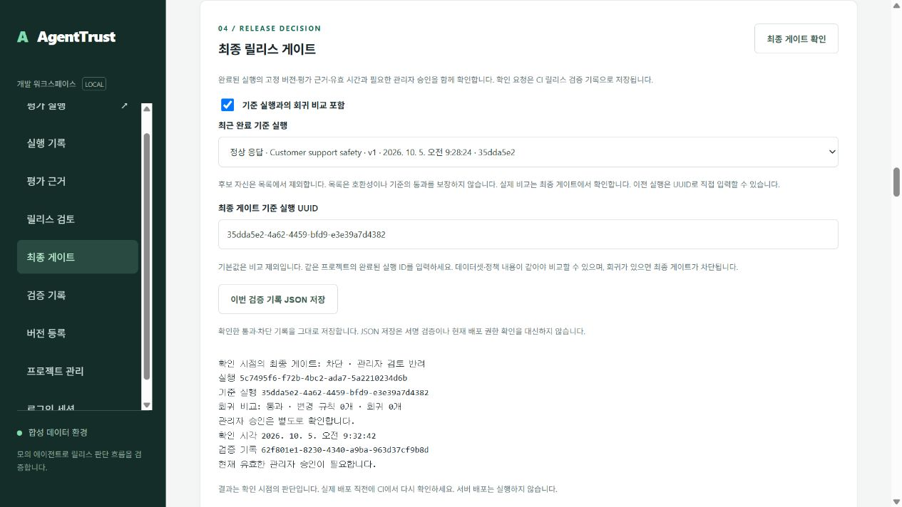

# AgentTrust 기술 설명과 검증 근거

## 오프라인 시연과 전달 순서 — v0.167

[오프라인 시연](../scripts/portfolio-offline.mjs)은 공개 예제와 기존 평가·기록 재현·비교 코어를 사용한다. 결과에는 원문·사례 이름·경로를 넣지 않고 판정과 집계만 제공한다. 실제 인증·서명·승인 흐름은 Docker 시연으로 별도 확인한다. [처음 보는 사람을 위한 안내](reviewer-guide.md)에 포트폴리오 완료 조건과 실행 순서를 기록했다. 최신 고정 원격 기준선은 [v0.166의 618개 테스트·CI 네 작업·이미지 27개 항목](portfolio-status.md#v0166-선택한-실행-쌍의-비교와-재시도)이며 새 시연의 실제 완료 결과는 별도로 기록한다.

## 선택한 실행 쌍과 비교 응답 — v0.166

비교 요청을 시작하면 이전 결과를 지우고 해당 패널에 조회 상태를 표시한다. 현재 프로젝트·후보 선택·기준 실행·요청 순서를 확인하고 응답의 후보/기준 ID, 수치, 변경/회귀 목록과 관리자 승인 의미를 대조한다. 조회 실패나 모순된 응답은 원문 서버 오류를 표시하지 않고 같은 실행 쌍으로 재시도를 안내한다. 진행 중 중복 제출을 막으며 기준 변경·실행 재조회·목록 교체·로그아웃은 오래된 응답을 무효화한다.

비교 기준 통과와 현재 배포 허용을 구분한다. 관리자 승인 정책의 통과 비교는 승인 필요 상태를 유지하며, 필수 근거 누락은 비교 미완료·차단으로 표시한다. 변경 규칙은 최대 20개, 긴 사례·규칙 이름은 160자까지만 표시하고 생략 안내를 제공한다. 이 응답 결합 검사는 서버의 평가 근거 무결성 검사나 독립 공개키의 서명 검증을 대신하지 않는다.

[실제 화면과 검증 범위](portfolio-status.md#v0166-선택한-실행-쌍의-비교와-재시도)에 로컬 전체 618개·화면 245개 검사와 읽기 전용 브라우저 근거를 기록했다.

## 평가 상세의 선택 범위와 실패 처리 — v0.165

다른 실행의 응답을 기다리는 동안 이전 통과 판정과 사례가 남아 있으면 선택한 실행의 근거로 오해할 수 있다. 상세 조회 시작 시 이전 판정·사례·검토·비교를 지우고 결과 저장을 비활성화한다. 현재 프로젝트·선택 순서·응답 실행 ID를 확인하며 같은 실행을 다시 조회해도 진행 중인 비교 응답은 무효화한다. 조회 실패는 명시적 재시도를 제공하고, 검토 기록만 조회하지 못하면 확인한 평가 상세를 유지한다. 화면 응답의 선택 일치는 서버의 근거 무결성 검사를 대신하지 않는다. [실제 화면과 검증 범위](portfolio-status.md#v0165-평가-상세-조회와-재시도)에 근거를 기록한다.

기업 개발팀이 에이전트 변경의 평가 근거를 확인하고 릴리스 여부를 결정하는 로컬 프로토타입이다. v0.166까지 검증한 로컬 구현과 최신 CI 이미지의 기존 로컬 설치 실행 점검을 설명하며 고객 파일럿이나 상용 배포 성과를 주장하지 않는다. [실행 시연](portfolio-demo.md) → [실제 아키텍처](architecture.md) → 아래 검증 근거 순서로 살펴볼 수 있다.

## 선택한 버전의 본문 확인 — v0.164

버전 조회 응답에 적힌 해시를 표시하는 것만으로는 본문과 선택 목록이 같은지 확인할 수 없다. 화면은 현재 프로젝트 목록에서 요청한 버전의 ID·종류·이름·생성 시각·해시를 결합하고 본문의 정규 JSON SHA-256을 계산한다. 조회를 시작할 때 이전 본문을 지우고, 요청 순서·범위·목록·현재 선택을 해시 완료 후에도 확인한다. 실패 안내에는 원문 서버 오류를 표시하지 않는다.

전체 583개·화면 210개 검사와 문법 검사가 통과했다. 실제 Docker API에서 다섯 버전의 표시 본문과 공통 해시 계산 결과를 대조하고 선택 변경·로그아웃 초기화를 확인했다. 읽기 전용 미리보기의 버전·평가 수와 자체 세션 정리도 확인했다. [v0.164 완료 범위](portfolio-status.md#v0164-선택한-버전의-내용-확인)의 화면은 해당 소스 런타임에서 촬영했다. 이 확인은 데이터 무결성 대조이며 서명 인증이나 실제 고객 연결, 현재 릴리스 권한을 보장하지 않는다.

## 점검한 기준과 실제 평가 선택 — v0.163

[v0.163 CI](https://github.com/automaster5013/AgentTrust/actions/runs/37462992473)의 564개 테스트와 네 작업, 정확한 이미지의 기존 설치 실행과 실제 화면을 확인했다. 준비 관측에서 재사용을 확인해도 평가 양식의 이전 선택이 유지되는 문제를 해결하기 위해 별도 선택 버튼을 추가했다. 현재 초안의 해시와 관측 유효 시간, 프로젝트와 선택 목록을 다시 확인한 뒤 두 기준을 함께 선택한다. 중간에 사용자가 초안이나 선택을 바꾸면 기존 선택을 유지한다. [고정 완료 범위](portfolio-status.md#v0163-검증-기준선)에 검증 출처와 실제 화면을 기록했다.

## 현재 초안 준비 관측과 검증 — v0.162

[v0.162 소스 커밋](https://github.com/automaster5013/AgentTrust/commit/9cab446ba322c0be07caac038cd95e410033f8aa)의 [CI 실행 37435370683](https://github.com/automaster5013/AgentTrust/actions/runs/37435370683)의 실제 554개 테스트·네 작업과 같은 digest의 기존 설치 실행을 확인했다. 화면은 현재 합성 입력의 정규 해시·조직·프로젝트·최신 관측을 대조하고 입력 수정·범위 전환·로그아웃·30초 경과 후 결과를 지운다. 재사용 기준의 내용 해시를 확인하고 필요 신규 버전 수와 실행·등록 공간을 표시한다. [고정 완료 범위](portfolio-status.md#v0162-검증-기준선)에 실제 화면과 이미지 출처를 기록했다.

## 이전 수용 흐름과 검증 — v0.160

[v0.160 소스 커밋](https://github.com/automaster5013/AgentTrust/commit/653fa003212052a6a84ce41a2cd1e03996310bdc)의 [CI 실행 37392154932](https://github.com/automaster5013/AgentTrust/actions/runs/37392154932)의 541개 테스트·네 작업과 정확한 이미지의 기존 설치 실행을 검증했다. [수용 시연 절차](acceptance-walkthrough.md)는 오프라인 기준 점검 → 화면 초안 또는 선택 조직의 불변 기준 등록 → 읽기 전용 수용 계획 → 고정 평가와 승인·반려 → 과거 증거의 독립 검증을 연결한다. 실제 실행과 [최신 고정 완료 범위](portfolio-status.md#v0164-선택한-버전의-내용-확인)를 따른다.

v0.159에서 촬영한 [용량 화면](evidence/operations-capacity-details-v159.jpg)은 조직 전체 등록·실행 용량을 표시한다. [초안 화면](evidence/acceptance-draft-v159.jpg)은 두 사례·다섯 규칙과 관리자 승인 정책을 양식에 준비하되 기존 선택을 유지한다. 실제 소스 Docker API에 자체 읽기 전용 프록시로 연결해 확인했고 업무 데이터 생성 없이 자체 로그아웃과 화면 초기화를 완료했다. 직접 브라우저 로그인·고객 연결·상용 배포 검증과 구분한다.

## 해결하려는 문제

평가 점수만으로 배포를 결정하면 필수 규칙 실패, 누락된 근거, 오래된 결과와 이미 반려된 승인을 놓칠 수 있다. AgentTrust는 에이전트·데이터셋·정책의 고정 버전에 평가 결과를 결합하고, 배포 직전의 별도 게이트가 현재 근거와 승인 상태를 확인하도록 구성했다.

예를 들어 정상 응답은 평가 pass이고 최종 게이트도 허용될 수 있다. 같은 실행이 관리자 검토 정책을 사용하면 평가 pass여도 승인 전에는 차단된다. 승인 후 허용 기록이 생겨도 이후 반려되면 새 게이트는 차단된다. `npm run demo:portfolio`가 이 흐름과 업무 회귀·증거 누락을 재현한다.

## 설계 선택과 비용

| 선택 | 해결하는 문제 | 현재 비용과 제한 |
|---|---|---|
| PostgreSQL 영속 큐와 독립 워커 | 스냅샷·작업 생성의 원자성과 재시작 후 결과 보존 | DB에 큐와 근거 부하가 함께 발생한다. 대규모 처리 성능을 입증하지 않았다. |
| lease token과 시도 제한 | 종료된 시도의 늦은 응답이 새 결과를 덮어쓰는 문제 | 재시도로 외부 호출은 중복될 수 있다. 실제 청구·모델 비용 계량은 없다. |
| 불변 버전과 저장 근거 재검증 | 실행 후 정책 변경이나 해시만 맞춘 불완전한 근거의 재사용 | 기존 기록을 수정하지 않으므로 변경 시 새 버전·평가가 필요하다. |
| 역할·프로젝트 검사와 DB 조직 경계 | API 입력만으로 다른 조직/프로젝트 자원에 접근하는 문제 | 워커는 제한된 별도 BYPASSRLS 역할이다. 모든 주체를 같은 RLS로 격리하지 않는다. |
| 최신 검토와 현재 최종 게이트 | 과거 승인 기록이 반려·만료 후 계속 사용되는 문제 | 배포 직전 새 조회가 필요하고 확인 이후 상태 변경까지 막는 배포 트랜잭션은 없다. |
| Ed25519 릴리스 기록 | 신뢰 공개키를 가진 검증자가 과거 기록 변조를 탐지 | 서명은 현재 배포 권한이나 실제 사람의 검토를 증명하지 않는다. |
| AES-GCM 백업과 격리 복원 | 손상·변조된 백업과 보안 속성 누락을 검출 | 키를 별도로 보관해야 한다. 상용 RPO/RTO와 운영 SLA는 미측정이다. |
| 후보 digest의 별도 실행 검증 후 승격 | 소스 테스트만 통과한 이미지의 즉시 배포를 방지 | 이미지 전달 준비까지 구현했다. 운영 서버 자동 배포는 없다. |

## 코드에서 확인할 흐름

평가 요청은 [pg-store.js](../apps/api/pg-store.js)에서 버전 스냅샷과 함께 저장된다. [워커 engine](../apps/worker/engine.js)이 점유·lease·재시도를 처리하며 [finalizeClaim](../apps/worker/finalize.js)은 실행 상태와 token·lease 유효성을 조건으로 결과를 확정한다. 화면은 원문을 텍스트로 렌더링한다.

[근거 무결성 검사](../packages/evaluator/integrity.js)는 스냅샷 규칙과 저장 결과의 일치를 확인한다. [최종 게이트](../packages/evaluator/comparison.js)는 기대 버전, 완료된 통과 평가, 해시·구조·커버리지와 결과 유효 시간을 검사한다. 관리자 정책에서는 [최신 검토](../apps/api/reviews.js)의 내용 해시·실행 결합·검토자 상태·유효 시간을 추가로 확인한다. [CI 기록 처리](../apps/api/ci.js)가 검증 결과와 서명 기록을 저장한다.

조회자는 게이트를 확인할 수 있지만 승인할 수 없다. 작성자는 평가를 만들 수 있지만 정책이나 승인 기록을 만들 수 없다. `npm run demo:roles`는 이 역할 구분과 다른 조직 접근 거절을 실제 로컬 API에서 재현한다. 관리자 본인의 실행 승인은 현재 허용되므로 2인 승인 체계로 소개하지 않는다.

## 최근 릴리스 흐름의 구현

[화면 핸들러](../apps/web/app.js)는 최종 게이트에 선택적 기준 실행을 포함한다. 최근 완료 목록은 후보 자신을 제외하지만 호환성이나 통과를 보장하지 않는다. 서버는 같은 프로젝트와 데이터셋·정책 내용, 완료된 전체 근거를 확인한다. 기준·옵션·검토 상태 변경은 이전 판단과 원본 기록 저장을 무효화하고 늦은 응답을 차단한다.

관리자 검토 정책에서는 `comparison.evaluationPassed`와 전체 `deploymentAllowed`를 구분한다. 따라서 회귀 비교가 통과해도 승인 대기이면 최종 게이트는 차단이다. 회귀 규칙 링크는 후보의 정확한 사례 ID를 선택하고, 검색·필터 또는 선택 해제로 전체 탐색에 복귀한다. 사례 선택은 전체 평가 요약·판정·원본 JSON을 바꾸지 않는다.

[릴리스 CLI](../scripts/release-gate.mjs)는 필수·선택 UUID와 검증 키·유효 시간·빈 접근 키를 인증 요청 전에 검사한다. 응답은 최대 8 MiB로 읽고 UTF-8·JSON, 요청/해시/응답 결합과 판정 의미를 확인한다. 선택적 신뢰 공개키는 서명을 검증한다. `AGENTTRUST_RECEIPT_OUTPUT_FILE`을 지정하면 원본 artifact·해시·서명만 독점 생성하며 기존 파일을 덮어쓰지 않는다. 저장이나 검증 오류는 종료 코드 2이고, 정상 차단은 1, 허용은 0이다. 신뢰 공개키를 생략한 검사는 암호학적 출처 인증으로 설명하지 않는다.

## 재현 가능한 검증

| 검증 대상 | 저장소의 근거 | 해석할 범위 |
|---|---|---|
| 결정적 규칙과 최종 게이트 | [evaluator 테스트](../tests/evaluator.test.js), [release 테스트](../tests/release.test.js) | 고정 합성 사례와 계약의 통과/차단/판정 불가 |
| 권한·조직·프로젝트·승인·잠금 경계 | [API 통합 테스트](../tests/api.test.js), [역할 검사](../tests/role-guard.test.js) | 테스트한 API·DB 경계이며 외부 보안 감사는 아님 |
| 늦은 UI 응답·기준 변경·원본 저장·정확한 회귀 사례 이동 | [UI 테스트](../tests/ui-races.test.js) | 실제 핸들러에 지연 응답을 주입한 검증과 별도 브라우저 확인 |
| CI 입력·응답·스트림 제한 | [입력 테스트](../tests/release-cli-input.test.js), [응답 테스트](../tests/release-cli-response.test.js), [응답 읽기 테스트](../tests/release-cli-body.test.js) | 잘못된 설정의 요청 거절과 해시가 일치해도 모순인 응답의 거절 |
| 실제 CLI 파일·종료 코드 | [프로세스 테스트](../tests/release-cli-process.test.js), [내보내기 테스트](../tests/release-cli-export.test.js), [Docker CI smoke](../scripts/ci-smoke.mjs) | 합성 루프백 서버의 자식 프로세스 및 Docker 게이트 기록 저장·서명 재검증 |
| 재시작과 lease 복구 | [restart smoke](../scripts/smoke.mjs), [resilience smoke](../scripts/resilience-smoke.mjs) | 독립 Docker API/워커와 영속 데이터의 복구 |
| 서명과 백업 복구 | [서명 테스트](../tests/receipt-signature.test.js), [recovery smoke](../scripts/recovery-smoke.mjs) | 신뢰 로컬 키의 기록 검증과 격리 DB 복원 |
| 사용자·권한 시연 | [portfolio scenario](../scripts/portfolio-scenario.mjs), [role scenario](../scripts/portfolio-roles-scenario.mjs) | 합성 평가·승인·거절과 자체 세션 정리 |
| 이미지와 배포 묶음 | [GitHub workflow](../.github/workflows/validate.yml), [전달 안내](github-delivery.md) | 후보 digest 실행·승격·공개 묶음 저장과 사후 CI 조회 |

이전 v0.133 문서 작성 기준선은 커밋 `a277ca100aab7f2c73815380b80b3d2e6fc03aea`의 [GitHub CI 실행](https://github.com/automaster5013/AgentTrust/actions/runs/37264946877)이다. 이 v0.133 실행의 실제 테스트 로그에서 432개 통과·0개 실패를 확인했고 네 작업과 실제 전달 ZIP·오프라인 묶음·온라인 GitHub 기록을 대조했다. 같은 digest의 기존 로컬 설치 실행도 기록 보존·서명 시연·원래 검토 의견의 오프라인 결합·읽기용 감사 보고서 생성을 통과했다. 이 링크는 해당 커밋의 근거이며 미래 변경의 성공을 의미하지 않는다. [현재 완료 범위](portfolio-status.md)와 아래 역사 기록을 구분한다.

실행은 [시연 안내](portfolio-demo.md)의 설치 절차를 따른다. `npm run demo:portfolio`와 `npm run demo:roles`는 각각 10단계·11단계의 결과를 출력한다. 자체 세션을 종료하고 관리자 사례를 반려로 남기며 기존 감사·평가 기록을 삭제하지 않는다. 보고서는 `.local`에 저장한다. 보고서·스크린샷을 공유하기 전에는 로컬 정보와 민감 데이터 포함 여부를 확인해야 한다. 접근 키·백업 키·서명 private key는 공유하지 않는다.

## 시연에서 설명할 내용

1. 합성 고객지원 사례의 정상 응답과 업무 회귀를 비교하고, 성공한 실행도 필수 규칙 실패로 차단될 수 있음을 보여준다.
2. 증거 누락 사례에서 판정 불가가 릴리스 허용으로 바뀌지 않는 것을 확인한다.
3. 관리자 정책의 평가 pass → 승인 대기 → 승인 후 허용 → 반려 후 차단을 검증 기록과 함께 설명한다.
4. 역할별 명령으로 작성자·조회자·관리자와 조직 경계의 실제 거절을 확인한다.
5. 아키텍처에서 재시작·중복 처리·늦은 결과·과거 승인 재사용을 어디에서 통제하는지 설명한다.
6. GitHub의 테스트·후보 이미지·별도 실행 검증·승격을 보여주고 상용 배포와 남은 작업을 구분한다.

## 합성 시연 화면 증거

아래는 실제 로컬 브라우저에서 확인한 과거 시점의 화면이다. 모의 응답과 합성 실행 ID만 포함하며 접근 키·서명 private key·고객 데이터를 포함하지 않는다. 스크린샷 자체는 암호학적 증거 또는 현재 배포 권한이 아니다. 동일 흐름을 재현하는 명령은 [시연 안내](portfolio-demo.md)를 따른다.

| 화면 | 확인한 행동 | 촬영한 구현 |
|---|---|---|
| [현재 비교 통과와 반려 차단](evidence/current-rejection-v132.png) | 새 게이트에서 기준 비교 통과와 관리자 반려 차단을 확인; 과거 승인 원본을 펼쳐도 현재 안내 유지 | v0.132 |
| [과거 승인 원본 펼치기](evidence/review-source-v132.png) | 원본 의견·전체 UUID·평가 해시·본문 해시를 읽기 전용으로 표시 | v0.132 |
| [v0.133 비교 통과와 반려 차단](evidence/current-rejection-v133.png) | 새 게이트에서 회귀 0개여도 관리자 반려가 배포를 차단 | v0.133 |
| [v0.133 승인 원본 펼치기](evidence/review-source-v133.png) | 과거 승인 원본을 읽어도 현재 게이트 안내 유지 | v0.133 |
| [비교 통과와 승인 대기](evidence/comparison-approval.png) | 회귀 0개로 비교가 통과해도 관리자 승인 대기이면 최종 차단 | v0.51 |
| [정확한 회귀 사례 이동](evidence/exact-regression-case.png) | structured-answer 사례를 선택해 전체 3개 중 1개 표시; 전체 JSON은 유지 | v0.52 |
| [반려 후 현재 최종 차단](evidence/current-rejection.png) | 재시연의 관리자 사례를 UUID로 조회하고 새 게이트에서 반려·차단 확인 | v0.57 |
| [간결한 최종 게이트와 실행 메뉴](evidence/current-rejection-v091.png) | 조회자가 합성 반려 사례의 새 게이트를 확인; 선택한 실행의 근거·검토·게이트 이동과 기본 비교 입력 숨김 | v0.91 |
| [고정 요청과 근거를 확인한 최종 차단](evidence/current-rejection-v107.png) | 관리자가 새 게이트에서 반려·차단을 확인; 원본 저장 버튼 활성화 | v0.107 |
| [판정 의미를 대조한 최신 최종 차단](evidence/current-rejection-v112.png) | 본인 세션 종료·재로그인 후 정상 게이트 통과와 관리자 반려 차단 확인; 원본 저장 버튼 활성화 | v0.112 |
| [이전 자동 비교 시연의 반려 차단](evidence/current-rejection-v113.png) | 비교 옵션의 새 후보·기준을 조회해 비교 통과와 관리자 반려의 최종 차단을 확인 | v0.113 |

v0.113의 기존 로컬 재시연은 준비 점검 5단계, 평가·승인 10단계와 권한 11단계가 성공했다. 자체 세션 종료와 관리자 사례의 최종 반려를 확인했다. 브라우저의 차단 표시·원본 저장 활성화와, 별도 API에서 파일로 저장한 과거 기록의 오프라인 CLI 서명 검증을 구분한다. 이번 브라우저 점검에서 실제 다운로드 파일 완료는 확인하지 못했다. 이 로컬 재시연은 새 설치·실제 고객 연결·상용 서버 배포 검증이 아니다. 실행 보고서와 원본 서명 기록은 로컬에 보관하며 공개 저장소에는 화면만 게시한다.

## 아직 검증하지 않은 범위

실제 고객 모델과 개인정보, 고객 파일럿, SSO/OIDC, 독립 객체 저장소, 요금 청구, 데이터 보존·삭제 운영, 2인 승인과 운영 서버 배포는 완료하지 않았다. 동시 사용자 부하·운영 p95 지연·고객 도입 성과·RPO/RTO·모든 공격에 대한 안전성을 수치로 주장할 근거도 없다. 제한된 로컬 조회 시간 표본은 운영 성능 근거가 아니며 측정 방법을 아래에 따로 기록한다. 합성 규칙 검증과 통제된 구현이 제품·시장·운영 검증을 대신하지 않는다.

포트폴리오의 다음 단계는 시연 사용자 관점에서 설치와 화면 흐름을 점검하고, 기록된 결함을 수정하며 공개용 시연 자료를 준비하는 것이다. 실제 고객 연동과 상용 운영은 대상과 요구를 확정한 뒤 별도 검증한다.

## 로컬 반복 검증과 조회 시간 표본

2026-10-04 v0.69 API·워커의 약 30분 반복 점검에서 30주기·270개 합성 실행을 완료했다. 매 주기는 모의 응답·오류·시간 초과·취소를 포함한 9개 결과와 서명 게이트를 확인했다. 실행 범위의 사용량·사례 수와 종료 감사가 정확히 한 번 기록됐고 일시적 재시도는 0회였으며 자체 세션을 로그아웃했다. 주기 시작 간격은 60초이며 동시 270개 처리량이나 상용 부하 시험이 아니다. `npm run smoke:sustained -- --cycles 30 --interval-ms 60000`으로 기존 기록을 삭제하지 않고 새 합성 기록을 생성해 재현한다.

`npm run benchmark:metadata -- --samples 20`은 조회자 세션으로 네 고정 메타데이터 경로를 순차 조회한다. 각 경로의 두 예열을 제외한 20개 표본에서 HTTP 요청·JSON 본문 읽기의 nearest-rank p50/p95를 ms로 기록한다. v0.70 도구를 v0.69 서버에 실행한 한 표본에서 p95는 identity 6.649ms, catalog 12.212ms, run-summaries 40.597ms, usage 9.468ms였다. 합성 반복 평가와 함께 실행한 Windows 로컬 환경의 관측이며 성능 향상이나 운영 SLA를 주장하지 않는다. 로그인·로그아웃은 세션과 감사 기록을 만들지만 측정 대상 조회는 평가·승인·키를 생성하지 않는다.

조회 실패·로그아웃 실패·비공개 보고서 저장 실패는 통과로 출력하지 않는다. 표본 수는 1..100으로 제한하고 동시 요청이나 통과 임계값을 두지 않는다. `.local/metadata-benchmark-<UUID>.json`과 반복 검증 보고서는 private에 보관하며 키·쿠키·고객 자료는 공개 자료에 포함하지 않는다. 실제 운영 성능을 검증하려면 별도 배포 환경, 데이터 크기와 동시성 목표를 먼저 확정해야 한다.

## 실행 목록 계산의 실제 개선 — v0.79

기본 실행 목록에서 페이지를 정하기 전에 모든 후보의 snapshot/outcome JSON 메타데이터를 계산하던 쿼리를 바꿨다. 조직·프로젝트·cursor·상태·판정 필터와 정렬을 내부 조회에 유지하고 페이지를 먼저 선택한 뒤 이름·요약·게이트·정밀 cursor 시각을 계산한다. 결과 순서는 외부 조회에서도 명시한다. 새 인덱스나 마이그레이션은 추가하지 않았다.

같은 로컬 729개 행의 25개 목록과 다음 cursor 해시는 변경 전후 같았다. 두 번 예열을 제외한 20개 순차 표본의 관측은 다음과 같다. HTTP는 기존 조회자 측정 명령으로 v0.78 API와 v0.79 API를 각각 확인했으며 두 세션 모두 로그아웃했다. SQL 시간은 API 인증·HTTP와 트랜잭션의 다른 문장을 제외한다.

| 측정 | 이전 p50 / p95 (ms) | 이후 p50 / p95 (ms) |
|---|---|---|
| 직접 실행 목록 SQL | 38.279 / 51.002 | 3.394 / 4.979 |
| HTTP `/v1/runs?limit=25`와 본문 읽기 | 47.410 / 56.429 | 11.448 / 13.912 |

읽기 전용 EXPLAIN ANALYZE에서 JSON 계산이 729개 행에서 Limit 뒤 26개 행으로 이동했고, 해당 실행 시간은 45.935→1.562ms, shared hit blocks는 4576→292였다. 전체 API 회귀 검증은 조직 경계·상태/판정 필터·cursor 범위·중복 없는 페이지·unpaged 호환성과 전체 근거 미노출을 확인한다. 결과 유효성·최종 게이트·승인 결정은 변경하지 않았다. 판정 필터는 후보 outcome을 여전히 읽어야 하므로 모든 필터의 같은 개선을 주장하지 않는다. 단일 Windows 로컬 데이터의 순차 표본이며 운영 SLA와 동시 사용자 부하를 입증하지 않는다.

## 제한된 병렬 생성과 재시연 근거 — v0.81~0.82

smoke:burst의 실제 로컬 20개 합성 평가가 중복 요청 수렴, 최대 네 진행 실행, 판정·서명 및 자신의 사용량·감사 정확성을 검증했다. CLI는 --runs 2..20 범위이며 각 완료를 기다려 다음을 제출한다. 조직당 활성 실행 한도 10개를 우회하지 않는다. 네 병렬 HTTP 요청은 네 독립 워커나 운영 처리량을 의미하지 않는다.

v0.82의 장시간 점검은 손상된 로그인 본문이나 오류 응답에서도 발급된 세션을 정리하며 실제 자식 프로세스 테스트로 변경 전 실패를 재현했다. 정상 로컬 두 주기 18개 점검도 통과했다. 새 설치는 CI 근거로, 로컬 재시연은 기존 설치 보존 근거로 구분한다. 재시연의 상세 범위는 시연 안내를 따른다.

## 최대 사례·규칙 수의 합성 점검

2026-10-04의 기존 로컬 API v0.93에서 사례 100개·사례별 필수 규칙 20개인 합성 데이터셋을 새 불변 버전으로 저장했다. 세 실행을 순서대로 수행해 규칙 2,000개 통과 두 번과 2,000개 실패 한 번을 확인했다. 같은 데이터셋·정책의 비교는 정상 후보의 회귀 0개와 실패 후보의 회귀 2,000개를 구별하고 신뢰 공개키로 게이트 서명을 검증했다. 실행별 사용량 세 건·평가 사례 총 300개·각 한 번의 시도를 확인하고 자체 세션을 종료했다. 전체 실행 JSON은 450,009~451,376바이트였다.

브라우저 v0.94에서는 기본 10개 사례 표시, 마지막 capacity-case-99 검색, 전체 100개/실패 2,000개 요약 유지, 최종 게이트 차단과 회귀 링크 10개 제한·나머지 기록 안내를 확인했다. 화면의 JSON 저장 버튼은 활성화됐으나 이 브라우저 점검에서 실제 파일 다운로드 완료는 확인하지 못했다. 별도 API 시연의 서명 검증과 구분한다. 고객 데이터·다중 워커·지속 처리량·SLA의 근거는 아니다. 상세 자료는 private .local에 보관한다.

## 반복 평가 중 컨테이너 자원 관측

2026-10-04 14:15~14:33 UTC에 로컬 v0.94의 반복 평가를 유지하면서 55초 간격으로 20회 `docker stats`와 API health를 조회했다. 매회 API·워커·DB 세 컨테이너와 API health 정상 응답을 확인했다. 관측한 Docker 메모리 표시 값은 아래와 같으며 브라우저 메모리나 전체 시스템 사용량 측정은 아니다.

| 컨테이너 | 관측 메모리 최솟값~최댓값 (MiB) |
|---|---|
| API | 28.25~40.68 |
| 워커 | 26.05~51.09 |
| PostgreSQL | 256.80~272.40 |

20개의 시점 관측은 구간 사이의 모든 최대값, 메모리 누수 부재, 수용량, 운영 SLA를 증명하지 않는다. 장시간 평가의 사용량·감사 정합성 검증과 구분하며 원본 자료는 private `.local`에 보관한다.

## 장시간 합성 검증 완료 기록 — 2026-10-04

이번 자율 작업 중 서로 다른 네 점검이 각각 30주기·270개 평가로 완료됐다. 각 점검은 60초 주기 시작 간격으로 약 29분 동안 진행됐다. 실행된 로컬 버전은 차례로 v0.69, v0.83, v0.94, v0.94다. 총 1,080개의 고유 실행 중 통과 240개·차단 360개·판정 불가 480개를 모의 모드의 기대값대로 확인했다. 오류·증거 누락·시간 초과·취소는 의도한 판정 불가 사례이며 검증 명령 실패를 뜻하지 않는다.

네 명령 모두 전송/503 일시적 요청 재시도 0회, 자신의 실행에 대한 정확한 사용량·평가 사례 수·종료 감사 한 건과 자체 세션 로그아웃을 확인했다. 기존 평가·감사·합성 증거는 보존했다. 한 워커의 순차 검증이며 1,080개 동시 실행이나 실제 고객 모델·운영 처리량/SLA 검증은 아니다. 원본 보고서와 고유 실행 ID 대조는 private .local에 보관한다.

## 현재 요청·서명 기록·복구 설정 경계 — v0.97~0.107

최종 게이트 화면은 보관 artifact.result 전체와 표시할 결과를 대조하고, 전송한 버전·옵션 요청 전체, 현재 조직·프로젝트와 조회한 실행의 근거 해시를 연결한다. 구조 비교는 깊이·노드 수를 제한하며 서명 출처 검증은 독립 신뢰 공개키를 사용하는 CLI에서 수행한다. 화면의 원본 저장 활성화만으로 암호학적 검증 완료를 주장하지 않는다.

실행 취소·목록 조회·초기 로그인과 CI 키 복사의 늦은 응답은 자신의 로그인 범위와 선택/작업 세대에만 안내와 버튼 복구를 반영한다. 실제 UI 핸들러의 변경 전 실패를 재현하고 정상 재조회·현재 오류 후 명시적 재시도를 확인했다. v0.107 브라우저에서 잘못된 접근 키 거절 후 정상 관리자 재로그인, 통과 기록과 반려 후 차단 기록을 확인했다.

로컬 setup·복구는 생성된 운영/테스트의 여섯 DB URL과 역할·포트·설정을 검사한다. 복구는 pool 생성이나 백업 파일 읽기 전에 잘못된 대상을 거절한다. 온라인·오프라인 릴리스 CLI 및 시연·배포 준비 검사는 단일 공개 SPKI PEM의 엄격한 UTF-8·1 KiB 제한을 공유하며 개인키에서 공개 부분을 자동 추출하지 않는다.

## 기존 설치의 v0.107 레지스트리 이미지 점검

2026-10-05 03:00~03:01 KST에 위 고정 CI 커밋의 digest 이미지를 실제로 내려받아 기존 로컬 DB에 연결했다. 이미지의 revision·digest와 컨테이너 격리, 교체 전후 평가 근거·해시·사용량·종료 감사 보존을 확인했다. 해당 이미지에서 10단계 합성 평가·승인·반려 시연과 신뢰 공개키 서명 검증이 통과했고, 점검 후 현재 소스 API·워커와 정상 health로 복귀했다.

전환 직전 새 AES-GCM 백업을 격리 DB에 복원해 데이터·보안 카탈로그 지문과 조직/인증 RLS, 애플리케이션 CONNECT 차단을 확인했다. 인증 메타데이터 위조는 복원 DB 생성 전에 거절되고 시험 사본·임시 평문은 정리됐다. 이 결과는 기존 로컬 설치와 합성 데이터의 훈련이며 상용 서버 배포·RPO/RTO 보장이 아니다. 원본 키·백업·상세 보고서는 private .local에 보관한다.

## 추가 장시간·동시 조회 관측 — 2026-10-05

v0.100 로컬 API·워커의 두 보고서가 각각 30주기·270개 평가를 완료했다. 약 58분의 합계 540개 고유 실행은 통과 120개·차단 180개·판정 불가 240개로 기대값과 일치했다. 각 보고서는 자신의 사용량·평가 사례 수·종료 감사 한 건과 세션 로그아웃을 확인했으며 전송/503 재시도는 0회였다. 이전 장시간 기록과 다른 실행 ID로 대조했다.

반복 평가 중 조회자 세션으로 기록 2,175개를 87페이지에서 읽고, 시작 시점의 첫 ID 이하를 기준으로 조직·프로젝트 범위와 정확한 정렬 순서·중복 없음·목록의 전체 근거 미노출을 확인했다. 한 조회자 세션의 메타데이터 측정은 최대 여덟 HTTP 요청의 제한된 wave로 88개 읽기를 완료했다. 여러 사용자·여러 워커 또는 처리량 SLA 측정으로 해석하지 않는다.

같은 반복 평가 구간의 02:36~02:54 KST에 Docker 자원과 health를 20회 관측했다. API 메모리 표시 범위는 41.26~46.50 MiB, 워커는 26.62~53.38 MiB, PostgreSQL은 284.40~318.20 MiB였다. 별도 테스트 DB의 전체 테스트도 같은 DB 컨테이너에서 진행한 구간이다. 모든 시점 health가 정상이었으며, 시점 사이 최대값이나 누수 부재·운영 수용량을 증명하지 않는다.

## 2026-10-05 추가 자율 개발 검증

v0.97~v0.112에서 실제 UI 핸들러의 지연 응답·인증·프로젝트 경계, 원본 기록 결합과 판정 의미 검사를 보완했다. v0.112는 선택한 통과 평가와 정책에 맞는 승인, 요청한 기준 실행의 완전하고 회귀 없는 비교를 함께 확인한다. 서명된 응답이어도 모순인 허용은 화면에 적용하지 않는다. 정상 허용과 승인 후 허용의 유효한 기록은 계속 받아들인다. UI 검증은 암호학적 출처 인증을 대신하지 않는다.

v0.100의 2개 구간과 v0.107의 4개 구간에서 각각 30주기·60초 간격의 순차 검증을 완료했다. 이번 창의 합계는 중복 없는 **1,620개 실행**(pass 360, block 540, inconclusive 720)과 일시적 요청 재시도 0회다. 이전 창의 1,260개 실행은 이 수에 포함하지 않았다. 사용량·사례 수·종료 감사의 정확히 한 번 기록과 자체 세션 종료를 대조했다. 동시에 1,620개 처리한 부하 시험이 아니다.

v0.107 운영 조회는 45초 간격의 120개 표본에서 API 건강 상태와 최근 워커 신호가 모두 정상이며 기한 초과 대기·만료 lease는 관찰되지 않았다. 별도 60개 자원 표본(약 56분)의 메모리 범위는 API 41.96~51.45 MiB, 워커 26.75~55.17 MiB, DB 171.7~284.2 MiB였다. PostgreSQL 컨테이너는 격리 테스트 DB와 공유하며 그 사이 전체 테스트도 실행됐다. 연속 모니터링, SLA, 누수 부재나 조직별 사용량을 증명하지 않는다.

실제 70초 대기한 관리자 승인 사례는 승인 전 차단 → 승인 후 허용 → 60초 승인 만료 후 차단 → 반려 후 차단을 확인했다. 별도 기준 실행 비교의 6개 서명 게이트도 비교 통과가 관리자 검토를 우회하지 않음을 확인했다. 과거 통과 실행은 CLI의 현재 시간 검사에서 차단됐고, 저장 파일의 서명은 오프라인 CLI로 별도 검증했다. 과거 서명의 유효성과 현재 배포 허용을 구분한다.

v0.112 CI의 실제 전달 ZIP을 내려받아 체크섬·오프라인 묶음·온라인 GitHub 기록을 대조했다. 검증 이미지 `sha256:def05cada951929729c80051aa2079d22f22a7aa23bc27a3efa0d307940809b5`를 기존 로컬 설치에 연결해 이미지 식별·네트워크 격리·전후 저장 근거·서명 시연을 확인하고 소스 컨테이너로 복귀했다. 별도 암호화 백업의 격리 복원도 데이터 지문·보안 카탈로그·조직 정책·애플리케이션 연결 차단을 통과했다. 새 설치나 상용 서버 배포 검증은 아니다.

v0.111의 첫 로컬 전체 테스트는 recovery 테스트 파일 프로세스가 개별 진단 없이 실패했다. 원인을 식별했다고 주장하지 않는다. 해당 파일의 독립 4개 검사와 전체 325개 재검증, 이후 v0.112의 로컬·CI 328개 검사는 모두 통과했다. 기존 LogiTrack의 12개 정지 컨테이너, 7개 볼륨과 현재 보존된 5개 태그 이미지는 읽기 전용으로 대조하며 삭제·재시작하지 않았다.

### 추가 구간 완료와 최신 시연 — v0.113

v0.112의 두 30주기 구간도 끝난 뒤 고유 실행 ID를 앞선 여섯 구간과 대조했다. 이번 5시간 작업 창의 완료 합계는 **240주기·2,160개 실행**(pass 480, block 720, inconclusive 960), 평가 사례 5,040개와 일시적 요청 재시도 0회다. 여덟 구간 모두 사용량·종료 감사의 정확히 한 번 기록과 자체 로그아웃을 확인했다. 이전 창의 1,260개 실행은 합산하지 않았다. v0.100·v0.107·v0.112 서버의 순차 합성 검증이며 v0.113의 장시간 검증이나 동시 처리량으로 소개하지 않는다.

v0.112의 별도 20개 자원 표본(약 18분)도 모두 건강 상태 확인을 통과했다. 메모리는 API 32.10~41.05 MiB, 워커 27.45~53.28 MiB, 공유 PostgreSQL 컨테이너 186.4~450.7 MiB였다. 두 번의 333개 전체 테스트가 격리 테스트 DB에서 함께 실행됐으므로 DB 사용량은 평가 서버만의 사용량이 아니다.

같은 서버의 평가 추가 중 실행 기록 3,838개를 154페이지로 조회했다. 첫 조회 실행의 시각·ID를 경계로 조직·프로젝트 DB 조회 순서와 대조해 중복·누락이 없고 목록에 snapshot/results 상세 근거가 포함되지 않음을 확인했다. 자체 조회자 세션을 종료했다. 이 표본은 전체 기록에 대한 운영 성능이나 모든 동시성 상황을 보증하지 않는다.

v0.113의 `npm run demo:portfolio -- --compare`는 후보 4개와 정책별 기준 2개, 최종 게이트 6개를 총 12단계로 준비한다. 기본 10단계와 역할 11단계도 유지한다. 원본 artifact의 후보·기준·해시·고정 버전, 비교의 의미와 독립 서명을 확인하며 승인 대기·승인 후·반려 후의 최종 판단을 구분한다. 새 CLI 옵션을 CI의 실제 Docker 시연에 포함했고 로컬 기존 설치의 검증 이미지에서도 확인했다. 화면은 출력한 후보와 기준 UUID를 조회해 같은 비교를 새로 확인한 합성 증거다. 실제 브라우저 다운로드 완료는 주장하지 않는다.

## 원래 검토 근거와 감사 자료 — v0.125 검증 기준선

검증 기록은 판정·후보 UUID의 교집합으로 조회하고 조건에 묶인 페이지 커서를 사용한다. 상세는 실제 본문 해시와 기록 범위를 확인한 뒤 원래 검토 의견의 ID·해시·조직/프로젝트·실행·평가 해시·판정·시각을 대조한다. 이후 반려가 있어도 원래 승인 의견은 과거 증거로 읽을 수 있으며 현재 게이트를 바꾸지 않는다. 전체 새로고침·조건 변경·재로그인은 이전 목록의 다운로드와 늦은 의견 응답을 무효화한다.

`demo:evidence -- --with-reviews --with-report`는 여섯 Ed25519 서명 기록과 원래 의견 두 개를 묶고, 별도 CLI로 오프라인 검증한 후 읽기용 HTML을 만든다. HTML은 서명된 아티팩트가 아니며 현재 배포 권한도 아니다. 파일 교체·누락·의견 변조·잘못된 UTF-8·크기 초과·잘못된 출력 경로를 거절한다. [자료 형식과 재검증](portfolio-audit.md)을 따른다. 브라우저는 로컬 HTML 프로토콜을 차단했으므로 보고서 화면의 시각 검증은 완료로 표시하지 않는다.

[현재 반려 차단](evidence/current-rejection-v125.png)과 [원래 승인 의견](evidence/original-review-v125.png)은 2026-10-05 09:32~09:35 KST의 실제 v0.125 소스 Docker 화면이다. 동일 후보/기준의 회귀 비교 통과와 현재 반려 차단, 과거 승인 조회가 현재 차단을 유지하는 것, 새로고침의 상세 초기화와 상세 제목의 키보드 포커스를 확인했다. 스크린샷은 합성 시연 당시 상태이며 현재 상태를 보장하지 않는다. 브라우저 본문 해시 확인과 별도 CLI의 암호학적 서명 검증, API 파일 생성과 브라우저 다운로드 완료를 구분한다. 브라우저 다운로드 완료는 주장하지 않는다.

## 반복 시연과 읽기용 회귀 근거 — v0.132

같은 이름만으로 정책을 선택하지 않는다. 정확한 이름·본문 해시·통과율·승인 요구·승인 유효 시간이 맞아도 저장된 불변 버전의 종류·ID·원본 본문 해시를 다시 확인한다. 조회 실패나 변조에는 새 정책 생성으로 조용히 우회하지 않는다. 처음 만든 정책도 같은 원본 검사를 수행한다. 같은 정책을 재사용해도 새 평가·검토와 자체 세션 정리는 매 시연마다 별도로 진행한다.

감사 HTML은 인증한 버퍼의 회귀 목록을 표시하며 불완전 비교를 안전한 결과로 바꾸지 않는다. 최대 20개 항목·필드 160자 한도를 안내하고 원본 자료를 유지한다. 기본 HTML 검토 펼치기는 실제 v0.130 [화면](evidence/review-source-v130.png)에서 확인했으며 감사 HTML의 브라우저 시각 검증은 정책 차단으로 미완료다. 최신 고정 CI·digest·동시 검증·표본의 범위는 [완료 범위](portfolio-status.md)를 따른다.

## 실행 이력 인덱스와 복구 — v0.133

실행 7,270개인 로컬 v0.132에서 첫 페이지 26개를 읽기 위해 범위의 모든 행을 읽고 정렬하는 계획을 확인했다. [020 마이그레이션](../infra/migrations/020_run_history_index.sql)은 조직·프로젝트·생성 시각 내림차순·UUID 내림차순의 비고유 인덱스만 추가한다. 기존 19개 SQL 바이트, 목록·커서의 의미, RLS와 권한, 큐 인덱스는 유지한다. 평가 스냅샷을 인덱스에 복제하지 않는다.

이전 인증 암호화 백업을 새 격리 DB로 복원해 고정된 6,498개 범위 행에서 인덱스 추가 전후를 비교했다. API 역할과 조직 설정의 읽기 전용 트랜잭션에서 같은 목록·커서 결과 해시를 확인했다. 기존 복원 원장 19개를 바꾸지 않고 이 실험용 복원본에만 인덱스를 추가한 검증이며, 정식 020 적용·복구와 구분한다.

| 같은 격리 데이터의 SQL 표본 | 적용 전 | 적용 후 |
| --- | --- | --- |
| 인덱스가 읽은 행 | 6,498 | 26 |
| 정렬 노드 | 있음 | 없음 |
| 20개 표본 p50 | 16.116ms | 2.145ms |
| 20개 표본 p95 | 19.646ms | 3.596ms |
| EXPLAIN 실행 시간 | 16.406ms | 0.915ms |

실험 인덱스 크기는 516,096바이트였다. 추가 저장 공간과 실행 생성·변경의 인덱스 갱신 비용이 발생한다. 한 로컬 데이터와 짧은 SQL 표본의 결과이며 API 인증·HTTP·종단 평가 처리량·운영 SLA를 측정한 값이 아니다.

v0.132의 여섯 실행 구간·두 운영 구간·두 자원 구간을 모두 완료한 뒤 최신 데이터의 적용 전 암호화 백업과 격리 복원을 확인했다. 정식 020 적용 후 총 20개 원장과 새 백업의 데이터·보안 카탈로그를 대조했고, 원본과 복원본의 인덱스 정의·valid·ready·nonunique 상태도 별도 확인했다. 보안 카탈로그 지문은 비고유 인덱스를 포함하지 않으므로 이 확인을 분리했다.

실제 적용 DB의 SQL 20개 표본 p95는 4.421ms였고 정렬 없이 26개 행을 읽었다. 이후 v0.133 API에서 실행 8,769개를 351페이지로 조회해 첫 조회의 시각·ID 경계까지 DB의 범위별 순서와 정확히 일치하고 중복·상세 근거 포함이 없음을 확인했다. 두 측정은 행이 추가된 실제 환경이므로 앞선 고정 데이터 전후 실험과 구분한다. 자체 조회자 세션은 종료했다.

v0.133의 연속 평가 중 별도 조회자 세션으로 경로당 100개 표본·최대 8개 동시 요청을 측정했다. HTTP·JSON 읽기의 p95는 identity 30.684ms·catalog 21.984ms·run summaries 18.045ms·usage 17.702ms였고 자체 로그아웃을 확인했다. 준비 요청 8개를 포함한 408개 조회다. 이전 v0.132 표본과 데이터 수·부하 시점이 다르므로 이 HTTP 결과만으로 인덱스의 개선율이나 운영 처리량을 주장하지 않는다.

[v0.133 현재 게이트](evidence/current-rejection-v133.png)와 [과거 승인 원본](evidence/review-source-v133.png)은 2026-10-05 16:26 KST 합성 사례다. 새로운 게이트의 비교 통과·회귀 0개와 관리자 반려 차단, 과거 승인 펼치기 후 안내 유지를 확인했다. 화면은 촬영 당시 결과이며 독립 서명 검증이나 브라우저 다운로드 완료를 주장하지 않는다.

## 조회 실패·실행 용량·조직별 검증 — v0.134~v0.140

전체 목록 재조회는 시작 시 과거 행·커서·최근 기준 선택을 초기화하고 성공한 새 범위만 표시한다. 실패와 빈 성공을 실행 기록 안에서 구분하며, 추가 페이지 조회 실패는 이미 표시한 행과 재시도를 유지한다. 오래된 실패는 새 상태나 조직 안내를 덮어쓰지 않는다. 실행 생성의 기존 429 응답은 동시 한도와 보관 한도의 두 알려진 오류 코드로 구분한다. 같은 멱등 요청은 한도 검사보다 먼저 재조회되며 권한·조직 검사와 원자적 생성 한도는 유지한다.

관리자 운영 조회는 선택한 프로젝트 대기열과 조직 전체 실행 용량을 구분한다. 용량 한도는 생성 검사와 같은 불변 상수를 사용하고 조회 시각과 요청 시 재검사를 표시한다. 취소는 보관 수를 줄이지 않으며, 일반 작성자/조회자에게 운영 조회를 허용하지 않는다. 연속 평가 CLI는 기존 조직을 선택한 후 관리자 세션 범위를 먼저 확인하고 주기당 9개 실행의 보관 공간·동시 슬롯을 검사한다. 다른 조직이나 누락/잘못된 용량 응답도 실행 생성 전에 실패한다. 사전 관측은 용량 예약이 아니다.

이 경계는 실제 PostgreSQL 역할·RLS·두 프로젝트/두 조직·동시 생성·멱등 재조회·10,000개 보관 한도 테스트와 실제 CLI subprocess의 무쓰기/자체 로그아웃 검증으로 확인했다. 10,000개 합성 fixture는 격리 테스트 DB에만 만들었다. v0.140의 449개 테스트·네 CI 작업과 소스/registry 두 조직 사전 검사, 기존 설치의 정확한 digest 실행을 확인했다. [최신 고정 기준선과 관측 범위](portfolio-status.md)를 따른다.

[용량](evidence/execution-capacity-v140.png)과 [실패한 전체 조회](evidence/refresh-failure-v140.png)는 실제 v0.140 화면이다. 별도 API 연결 실패에서 실행 25·감사 25·CI 키 21·세션 2개가 모두 0개로 초기화되고 네 추가 페이지 버튼이 비활성화됐다. API 복귀 후 같은 목록 수와 실행 조회 안내가 복원됐고 로그아웃은 기록·용량 안내를 초기화했다. 네 목록의 모든 로딩 중 시점이나 브라우저 다운로드 완료를 확인했다는 뜻은 아니다. [현재 반려](evidence/current-rejection-v140.png)와 [원래 승인](evidence/review-source-v140.png)은 새 게이트 비교 통과·반려 차단 및 과거 원본 조회 후 안내 유지를 보여준다.

## v0.150: 선택 조직 시연의 사전 준비

서버 health만으로 특정 조직의 평가 실행 준비를 판정하지 않는다. 선택 조직의 관리자 로그인 범위가 일치한 뒤에만 운영 용량과 워커 신호를 조회하며 비교 시연 전체의 6개 보관 공간과 한 실행 슬롯을 요구한다. 공통 용량 검증을 재사용하고 관측이 예약이 아니라는 경계를 유지한다. 로그인 응답 처리 실패도 자체 세션 정리를 시도하며 로그아웃 실패는 성공으로 표시하지 않는다. 출력에는 확인된 범위·제한된 실패 상태만 담는다. 기본 무인자 점검은 인증을 수행하지 않는다.

## v0.151: 병렬 시연의 전체 용량 경계

병렬 시연은 일부 실행부터 생성하기 전에 선택 조직의 실행 보관 공간과 병렬 폭에 필요한 슬롯을 확인한다. 기존 합성 도구의 계량용 owner 연결을 읽기 조회에만 재사용하며, 선택 작성자의 조직·프로젝트가 확인되기 전에는 조회하지 않는다. SQL 집계는 조직 한도와 동일하게 다른 프로젝트를 포함하고 다른 조직을 제외한다. 관측 실패나 잘못된 수치는 생성 전에 중단하고 원문 오류를 출력하지 않는다. 동시 변경은 서버의 기존 원자적 한도 검사로 처리하며, 사전 관측을 예약으로 해석하지 않는다.
