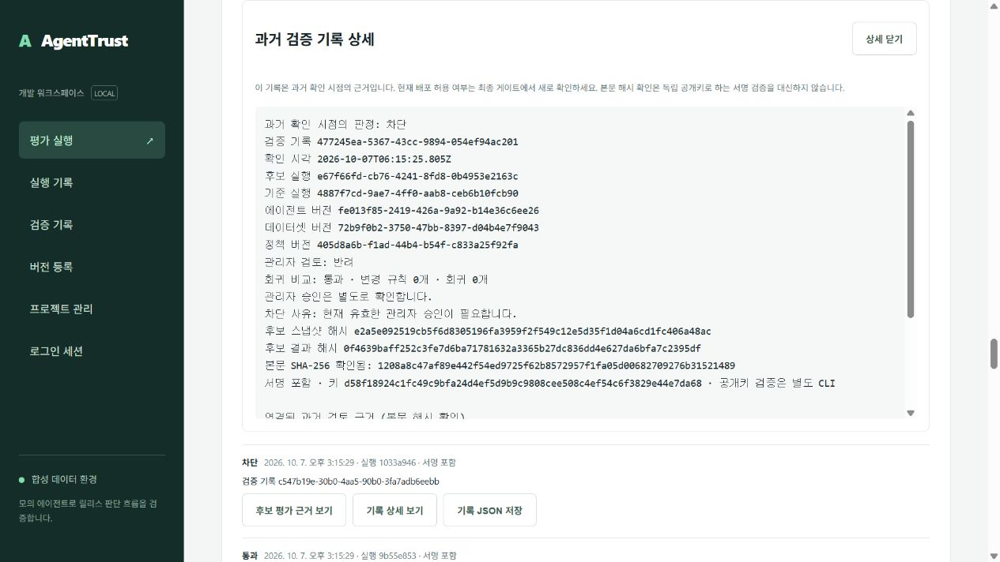
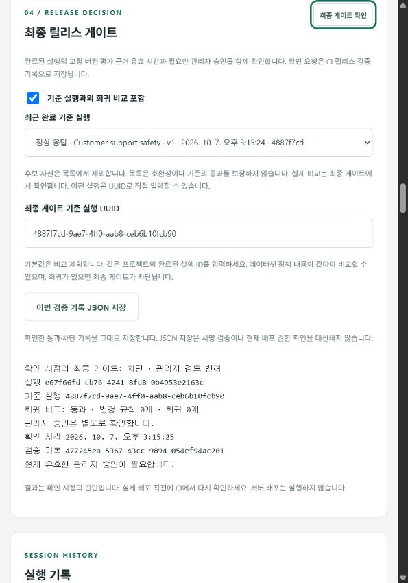
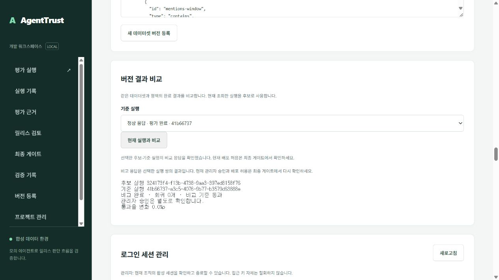
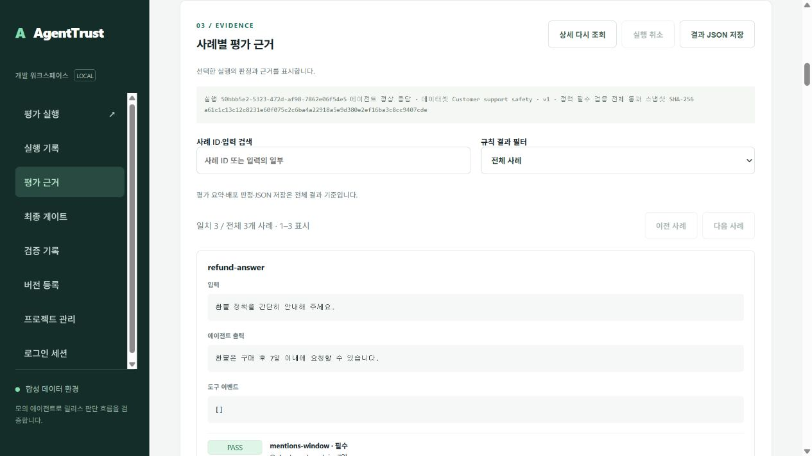
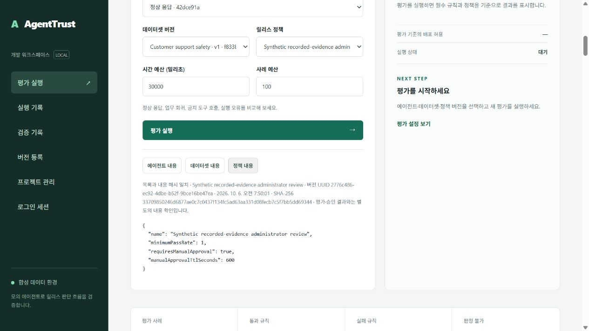
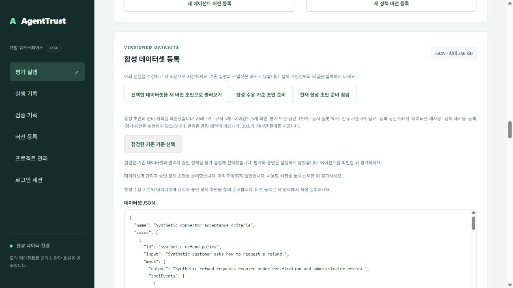
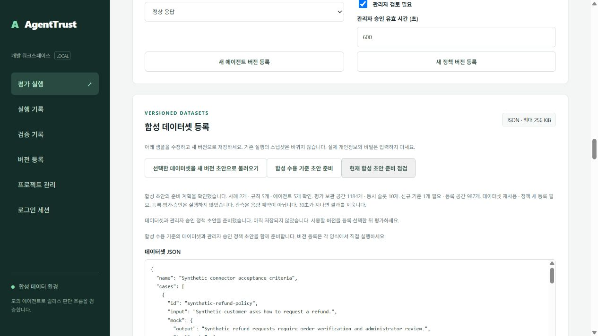

# AgentTrust 포트폴리오 완료 범위

기업 개발팀의 합성 평가 실행과 릴리스 승인 흐름을 재현하는 로컬 프로토타입이다. 현재 로컬 기능은 v0.180이며, 아래 원격 검증 기록은 각 소스 버전에 한정한다. 고객 파일럿이나 상용 서버 운영 결과로 소개하지 않는다.

## v0.180 분리된 합성 다중 사용자 부하 검증

`npm run benchmark:staging`은 생성된 별도 임시 DB, 독립 서명 키, 두 합성 조직과 조회자 20명을 사용한다. 기존 설치의 업무 데이터·시연 키·설정은 바꾸지 않는다. 첫 주기에 조직당 10개씩 대기 실행 총 20개를 접수한 뒤 워커 루프 2개를 시작한다. 이는 실행 20개를 동시에 처리한다는 뜻이 아니며 실제 관측한 실행 중 수와 워커 수를 따로 기록한다. 네 메타데이터 경로는 최대 20개 요청을 병렬로 측정한다.

조직별 사례 수를 3개와 2개로 다르게 설정해 사용량의 조직 범위와 정확히 한 번의 집계를 확인하고, 각 조회자의 다른 조직 실행 접근이 404인지 검사한다. 자신의 세션만 로그아웃하고 생성한 임시 DB만 제거하며 원래 DB의 보안 설정 지문을 비교한다. 중단과 정리 실패는 완료로 기록하지 않는다. 로컬 초기 20명 부하를 통과했으며 v0.180 전체 테스트·CI·게시 이미지·장시간 검증은 진행 중이다. 소스 API·워커 스레드와 로컬 PostgreSQL을 측정하는 도구이며 고객 부하·정확한 Docker 런타임의 성능·상용 SLA를 증명하지 않는다.

운영 상태의 워커 나이도 하나의 DB statement snapshot에서 계산해, 시각 조회 직후 갱신된 정상 신호를 미래 신호로 잘못 판단하는 경쟁을 방지했다.

## v0.179 조직별 운영 경고와 동일 스키마 롤백 사전 점검

관리자 전용 `GET /v1/operations-alerts`와 `npm run operations:alerts`는 서비스 워커 신호, 선택 프로젝트의 기한 초과·lease 만료, 조직 전체 보관·버전·동시 실행 한도를 구분한다. 조회 실패·외부 조직·모순 증거는 정상으로 표시하지 않으며 자체 시연 세션만 로그아웃한다. 저장 용량 95%는 경고, 보관·버전 한도 도달과 처리 기한 초과는 심각 상태다. 과거 모의 평가 실패 횟수는 인프라 장애로 판단하지 않는다.

`npm run rollback:preflight`는 서로 다른 고정 이미지와 전체 Git revision, 두 revision의 동일한 마이그레이션 SQL, 현재 DB ledger 및 인증된 최근 복원 근거를 읽기 전용으로 확인한다. 이전 런타임 설정·CI·데이터 의미 호환성·실제 롤백은 별도 검증 대상이며 자동 배포나 스키마 downgrade를 수행하지 않는다. 현재 기능의 로컬 전체 694개와 [v0.179 CI 네 작업](https://github.com/automaster5013/AgentTrust/actions/runs/37856635940)이 통과했다. 소스·정확한 게시 이미지에서 두 조직의 운영 경고와 자체 로그아웃을 확인했다. 기존 설치의 동일 스키마 v0.179 → v0.177 → v0.179 전환 및 소스 복귀를 수행하고 업무 행·ledger·보안 설정 지문과 DB 컨테이너 동일성을 확인했다. v0.177은 자체 Docker 워커 healthcheck가 없어 기존 Compose와 최근 DB 신호로 검증했으며 새 readiness 경로가 있다고 주장하지 않았다. 별도 상용 서버의 무중단·데이터 의미 호환성 검증은 수행하지 않았다. 고객 서버 배포·외부 알림 서비스 구축 완료를 뜻하지 않는다.

## v0.178 의존 서비스 readiness와 워커 복귀 검사

공개 `/ready`는 안전한 애플리케이션 DB 역할과 DB 시계 기준 워커 신호를 확인한다. 15초 초과·미래·누락·비정상 신호나 DB/역할 검사 실패는 503으로 처리하고 내부 오류를 공개하지 않는다. 기존 `/health`는 유지하며 워커에는 읽기 전용 Docker healthcheck를 추가했다. 정확한 이미지 승격 검사도 워커 건강 상태를 요구한다.

로컬 실제 워커 일시 정지에서 `/ready` 503과 `/health` 200을 구분했고, 워커 복귀와 정상 readiness를 확인했다. 자체 로그인·새 평가·승인·버전 생성 없이 진행했다. 전체 681개 테스트와 [v0.178 CI 네 작업](https://github.com/automaster5013/AgentTrust/actions/runs/37854941555)이 통과했다. 소스와 정확한 게시 이미지 양쪽의 워커 정지·복귀 및 독립 전달 근거를 확인하고 기존 설치를 소스로 복귀시켰다. 이는 의존성 준비 상태이며 고객 파일럿·처리량·상용 출시 완료를 증명하지 않는다. [운영 절차](operations.md#의존-서비스-준비-상태--v0178)를 따른다.

## v0.177 원래 평가 본문의 선택적 구조 검사

`receipt:inspect`의 후보·기준 원문 결합에 `--check-evidence-structure`를 추가했다. 서명·범위·본문 해시를 먼저 인증한 뒤 서명된 스냅샷과 결과만으로 상태·집계·버전 ID를 유도하고 기존 evaluator 코어로 버전 내용 해시·사례/규칙 커버리지·기록된 근거의 규칙 상태·정책 게이트를 확인한다. 기준이 있으면 같은 두 본문에서 계산한 비교와 서명된 비교를 대조한다. 기존 원문 해시 결합은 유지하며 선택 옵션을 생략하면 본문 구조를 확인했다고 주장하지 않는다.

unsigned 실행 상태·집계·시각·버전 주석은 검사에 사용하지 않으며 원문을 수정하지 않는다. 기록된 근거에 규칙을 적용하지만 에이전트·도구·HTTPS 어댑터를 다시 호출하지 않는다. 오류·근거 누락·승인 대기라도 완전한 사례/규칙 구조와 당시 차단 판정이 일치하면 과거 차단으로 유지한다. 비어 있거나 잘린 근거는 엄격한 구조 검사 대상에서 거부한다. 현재 검토자·승인 효력·배포 허용은 false다. 새 여섯 검사를 포함한 로컬 직렬 전체 675개·문법 검사와 기존 실제 과거 반려 기록·기준 원문 및 바뀐 unsigned 주석 사본의 CLI를 확인했다. [v0.177 소스 커밋](https://github.com/automaster5013/AgentTrust/commit/0d474e97f016dc0336a0f9151d35e12fd52eea20)의 [GitHub CI 37778841972](https://github.com/automaster5013/AgentTrust/actions/runs/37778841972) 네 작업과 675개 테스트가 통과했다. 소스·정확한 게시 이미지에서 두 조직의 원래 본문 구조 검사를 확인했다. 기존 설치의 과거 원문·의견·범위를 읽기 전용으로 검증했고, 별도 임시 키로 서명한 합성 모순 기록은 해시 결합에 성공해도 구조 옵션에서 종료 코드 2로 거부했다. 네트워크와 비밀 환경 파일을 연결하지 않고 DB·버전·보관 실행 수를 유지하며 소스 v0.177으로 복귀했다. 이미지 digest는 `ghcr.io/automaster5013/agenttrust@sha256:c458a38fda4df266bf4c321a92f107d8f597e96e8e59713a615e7ca3f131ed0d`다. 기존 unsigned 주석은 인증했다고 주장하지 않으며 고객 서버 배포나 새 평가·승인·게이트는 수행하지 않았다.

## v0.176 원래 검토 의견을 필수로 요구하는 묶음 검사

`demo:evidence:inspect`에 `--require-reviews`를 추가했다. 기본 동작은 기존 v1/v2 묶음을 지원하고 검증된 의견 유무를 명시한다. 감사 자료에 원래 승인·반려 의견이 필요한 경우 이 옵션으로 인증된 참조와 결합한 두 의견 본문을 필수로 요구한다. 의견 파일과 unsigned manifest의 의견 항목을 제거해 v1으로 낮춘 묶음도 여섯 서명이 그대로 유효해도 거부한다. 기대 범위·manifest 지문과 함께 사용할 수 있으며 현재 배포 권한은 허용하지 않는다. 새 두 검사를 포함한 로컬 전체 669개·문법 검사와 [v0.176 소스 커밋](https://github.com/automaster5013/AgentTrust/commit/5fd81b1fa7f7acb20585883e151366c6c941c721)의 [GitHub CI 37775036487](https://github.com/automaster5013/AgentTrust/actions/runs/37775036487) 네 작업이 통과했다. 소스·정확한 게시 이미지에서 두 조직의 원래 의견 필수 검사와 의견 없는 v1 묶음의 거부(종료 코드 2)를 확인했다. 전달 ZIP·manifest·digest와 기존 설치의 읽기 전용 v2 검사·다른 프로젝트 및 v1 의견 누락 거부를 확인했다. 공개키와 해당 자료만 읽기 전용으로 연결하고 네트워크를 껐다. DB·버전·보관 실행 수를 유지하며 소스 v0.176으로 복귀했다. 이미지 digest는 `ghcr.io/automaster5013/agenttrust@sha256:ab7079e0ec88744a3f81f6b97d44b75ea1869bed00c1083e753b9b1ddfa3c208`다. 현재 고객 서버 배포나 새 평가·승인·게이트는 수행하지 않았다.

## v0.175 여섯 서명 기록의 오프라인 일괄 검사

`demo:evidence:inspect`는 기존 v1/v2 포트폴리오 묶음을 바꾸지 않고 여섯 기록의 독립 신뢰 공개키 서명과 판정·비교·원래 검토 의견의 내부 일관성을 검사한다. 기대 조직·프로젝트 쌍과 manifest SHA-256을 지정할 수 있으며 다른 범위·서명된 모순·불완전 묶음은 거부한다. 모든 기록이 통과한 뒤에만 하나의 요약을 출력한다. 의견·사유 원문과 평가 입력·출력은 요약에서 제외한다. manifest 자체는 서명되지 않았으며 평가 본문·현재 검토자 권한·현재 배포 허용의 검증 여부는 false다. 새 여섯 검사와 기존 실제 v2 묶음의 읽기 전용 CLI·다른 범위 거부를 확인했다. 로컬 전체 667개·문법 검사와 [v0.175 CI 37773388580](https://github.com/automaster5013/AgentTrust/actions/runs/37773388580)의 네 작업이 통과했다. 소스·정확한 게시 이미지에서 두 조직의 여섯 기록씩을 검사했고 ZIP·manifest·digest를 확인했다. 기존 설치의 정확한 이미지에서 보존된 v2 묶음·원래 의견 두 건·다른 범위 거부(종료 코드 2)를 확인했다. DB·기록·설정을 보존하며 소스로 복귀했다. 이미지 digest는 `ghcr.io/automaster5013/agenttrust@sha256:f9cf7d347bdfe25fb6ab11fda9de137857fd2658f9c443851bdd2558569168c9`다.

## v0.174 Windows 이미지 증거 검사 호환성

Windows에서는 Unix 사용자 ID 함수가 제공되지 않아 `AGENTTRUST_IMAGE`를 지정한 원래 의견·평가 본문 이미지 검사가 시작 전에 실패했다. Windows는 이미지의 기본 사용자(`node`)를 유지하고, Unix는 유효한 숫자 UID/GID로 호스트 파일 소유권을 유지하도록 수정했다. 네트워크 차단·읽기 전용 마운트·권한 제한은 동일하다. 두 환경과 잘못된 ID 거부를 검사한다. 로컬 직렬 전체 661개 테스트와 문법 검사를 통과했다. [v0.174 소스 커밋](https://github.com/automaster5013/AgentTrust/commit/184e825b89d54af03f280068b349e7c151bcced9)의 [GitHub CI 37757876518](https://github.com/automaster5013/AgentTrust/actions/runs/37757876518)에서 661개 통과·0개 실패 및 네 작업 성공을 확인했다. 전달 ZIP·manifest·digest와 소스 및 정확한 게시 이미지에서 두 조직의 원래 의견·후보·기준 본문 결합을 확인했다. 이 CI는 Unix 호스트에서 실행된다. 이후 문서 커밋의 [CI 37758623257](https://github.com/automaster5013/AgentTrust/actions/runs/37758623257)와 정확한 이미지에서 Windows 기본 사용자 node(UID 1000)·오프라인 검사·범위 및 본문 변조 거부를 확인했다. 기존 로컬 설치의 이미지 교체·소스 복귀와 새 백업 격리 복원 여덟 항목 및 이력 인덱스 동일성도 통과했다. DB·기록·설정과 정지된 LogiTrack 자산을 보존했다. 아래 v0.173 완료 근거와 이전 화면 자료는 그대로 보존한다.

## v0.173 서명된 스냅샷과 평가 결과 본문 결합

`receipt:inspect`에 후보·기준 평가 원문 파일 옵션을 추가했다. 서명과 기대 범위를 먼저 인증하고 선택 실행·조직·프로젝트와 서명된 스냅샷·결과 해시에 원문을 결합한다. 비교 기록은 후보와 기준 두 원문이 모두 필요하며, 없는 기준이나 결과 해시가 누락된 근거는 거부한다. 원문 파일은 각각 기존 16 MiB·엄격한 UTF-8와 깊이·항목 제한을 따른다. 평가 입력·출력은 요약에 포함하지 않는다.

`evidenceBodiesVerified`는 서명된 스냅샷 및 결과(사례 결과와 gate) 본문 해시에 한정한다. 실행 상태·요약·시각 등 해시 밖의 메타데이터는 인증하지 않으며 현재 평가·관리자 권한·배포 권한을 확인하지 않는다. 원래 의견 파일과 기대 범위 옵션을 함께 사용할 수 있다. 새 일곱 검사를 포함한 로컬 직렬 전체 659개·문법 검사와 기존 실제 기록의 원문·의견 결합 및 자체 로그아웃을 완료했다. [v0.173 소스 커밋](https://github.com/automaster5013/AgentTrust/commit/881d38860f35f654a3e8a52c0f62b7108d84699d)의 [GitHub CI 37741283099](https://github.com/automaster5013/AgentTrust/actions/runs/37741283099)에서 기본 전체 659개 통과·0개 실패와 네 작업 성공을 확인했다. 두 조직의 원래 승인·반려 의견과 후보·기준 원문 네 건이 소스 CLI 및 정확한 게시 이미지에서 일치했다. 전달 ZIP·manifest·digest와 로컬 정확한 이미지의 오프라인 검사·다른 범위 및 본문 변조 거부(종료 코드 2)를 확인했다. 공개키·기록·의견·후보·기준 파일만 읽기 전용으로 연결하고 네트워크를 껐다. DB·버전·보관 실행 수를 유지하며 소스 v0.173으로 복귀했다. 이미지 digest는 `ghcr.io/automaster5013/agenttrust@sha256:938b3d5f63f524922117fb73e869e09dd5f7fb9ce461a56e9bf8b292b381df9e`다. 새 평가·승인·게이트나 고객 서버 배포는 수행하지 않았다.

## v0.172 서명된 참조에 연결한 원래 검토 의견

`receipt:inspect`의 `--review-file` 옵션으로 원래 관리자 의견을 읽어 서명된 기록의 검토 ID·본문 해시·조직·프로젝트·후보 실행과 근거 해시를 대조한다. 판정과 시각의 일관성을 확인하며 의견·검토자 원문은 출력하지 않는다. 검토 파일은 64 KiB와 엄격한 UTF-8로 제한하고 서명·기대 범위를 먼저 확인한다. `reviewBodyVerified`가 true여도 현재 검토자 권한·현재 배포 허용은 false다. 기존 시연과 같은 검토 결합 코어를 공유한다.

새 여섯 검사로 변조 및 해시 재계산, 서명된 모순 메타데이터, 연결되지 않은 의견, CLI 출력 비노출·파일 제한·옵션 조합을 확인한다. 로컬 전체 652개·문법 검사와 실제 기존 반려 기록의 원래 의견 조회·검증·자체 로그아웃을 완료했다. [v0.172 소스 커밋](https://github.com/automaster5013/AgentTrust/commit/cd1061bba51aa75ac84282719934e4110efa9b11)의 [GitHub CI 37739039321](https://github.com/automaster5013/AgentTrust/actions/runs/37739039321)에서 전체 652개와 네 작업 성공을 확인했다. 두 조직의 원래 승인·반려 의견 검사 네 건이 소스 및 정확한 이미지에서 일치했으며, 전달 ZIP·manifest·digest와 로컬 이미지의 오프라인 검사·잘못된 범위 거부(종료 코드 2)도 통과했다. DB·기록·용량을 유지하며 소스로 복귀했고 고객 서버 배포는 수행하지 않았다. 이미지 digest는 `ghcr.io/automaster5013/agenttrust@sha256:3cdafc48fa9c2d9c183328fdfcd3880675b3286124a96c37261b28b7ad943791`다.

## v0.171 오프라인 기록의 기대 조직·프로젝트·실행 결합

`receipt:inspect`에 기대 조직·프로젝트 ID 쌍과 선택 후보·기준 실행 ID를 지정하는 옵션을 추가했다. 다른 범위의 유효한 서명 기록도 거부하며 기준을 제외한 기대는 `--baseline-run-id none`으로 명시한다. 부분·중복·알 수 없는 옵션과 잘못된 ID를 파일 읽기 전에 거부한다. UUID 대소문자를 정규화하고 실제 확인한 기대 범위·후보·기준만 검증 여부 true로 출력한다. 기대를 생략하면 세 항목은 false이며 현재 배포 허용은 항상 false다.

새 다섯 검사는 유효한 다른 조직·프로젝트·실행·기준 기록 거부, 옵션 오용과 대소문자 정규화, 기대 생략 여부를 확인한다. 실제 CLI 검사에도 올바른 선택과 네 잘못된 선택을 추가했다. 결과 해시가 명시적으로 null인 정상 차단 기록은 근거 해시 불완전으로 설명한다. 통과·비교 가능·승인 유효 상태에 필요한 해시가 없으면 거부한다. 최종 로컬 직렬 전체 646개와 문법 검사가 통과했고, [소스 커밋](https://github.com/automaster5013/AgentTrust/commit/1d6497371e92d1477cca3eadf6b1387f05a6cfa5)의 [GitHub CI 37700645134](https://github.com/automaster5013/AgentTrust/actions/runs/37700645134)에서 기본 전체 646개 통과·0개 실패와 네 작업 성공을 확인했다. 초기 로컬 병렬 검사의 기존 HTTP 파일 비정상 종료는 단독 네 검사·관련 네 파일의 병렬 12회·직렬 전체 재검사로 확인했다. 종료 원인은 확정하지 않았고 실패 기록을 보존했다. CI 소스와 게시 이미지의 실제 기본 검사 출력, 전달 ZIP·digest·manifest와 정확한 이미지에서의 기대 범위 일치·다른 프로젝트 거부(종료 코드 2)를 확인했다. 서명 기록과 공개키 두 입력 파일만 읽기 전용으로 연결한 네트워크 없는 이미지 검사에서 비밀 설정을 연결하지 않았다. 기존 설치의 읽기 점검 후 소스 v0.171로 복귀했고 DB·버전·보관 실행 수를 유지했다. 이미지 digest는 `ghcr.io/automaster5013/agenttrust@sha256:1a657cc1ff6d7a3265e4d44f3ee026a6928561a7e0f054cf228e4de181f1b8d0`다. 고객 연결과 서버 배포는 수행하지 않았다.

## v0.170 서명된 과거 기록의 오프라인 설명

독립적으로 신뢰한 공개키로 서명 인증 후 판정·사유·실행과 근거 참조·기준 비교·과거 승인 상태의 내부 일관성을 검사하는 `receipt:inspect`를 추가했다. 원문 사유·규칙 이름·검토 의견을 출력하지 않으며 현재 배포 허용과 근거 원문·검토 원문의 검증 여부는 false로 명시한다. 입력 깊이·항목 수·파일 크기를 제한하고 실패 시 안전한 오류와 종료 코드 2를 반환한다. Docker 이미지에 검사 CLI를 포함했다. 사용법과 제한은 [서명 기록 안내](receipt-signatures.md#과거-판정의-오프라인-설명-v0170)를 따른다.

새 일곱 검사에서 서명은 유효하지만 구조가 모순된 기록, 수동 승인과 비교의 불일치, 원문 노출 방지, 잘못된 공개키·UTF-8·인수·깊이 제한을 확인했다. 전체 로컬 검사는 병렬 실행 수 4에서 641개 통과·0개 실패였고, [소스 커밋](https://github.com/automaster5013/AgentTrust/commit/bb49026bf3dc9bba5a4f3d3289cde4ef66e3f877)의 [GitHub CI 37697789506](https://github.com/automaster5013/AgentTrust/actions/runs/37697789506)에서 기본 전체 641개와 네 작업 성공을 확인했다. 초기 로컬 기본 병렬 검사의 기존 요청 제한 파일 비정상 종료는 해당 다섯 검사와 제한 병렬 전체 재검사로 확인했으며 원격 기본 전체 검사도 통과했다. 소스와 정확한 이미지 CI 로그의 실제 검사 JSON, 전달 ZIP·digest·manifest와 정확한 이미지의 로컬 오프라인 검사·읽기 점검·소스 복원을 확인했다. 기존 실제 서명 기록의 비교 통과와 관리자 반려를 검사했으며 조회 세션을 종료했다. DB·버전·보관 실행 수를 유지했고 서버 배포는 수행하지 않았다. 이미지 digest는 `ghcr.io/automaster5013/agenttrust@sha256:44209a400120f68f6c139fcac5518e57ee5205af4d8f1fb810eef11f3b4c29d9`다.

## v0.169 과거 검증 기록 상세의 판정 일관성

과거 기록 상세를 표시하기 전에 통과 판정과 차단 사유·관리자 승인·기준 비교의 일관성을 확인한다. 실시간 비교와 같은 구조 검사로 전체 변경·회귀 목록의 실행 쌍·수치·상태·중복과 대응 관계를 대조하며 화면에 생략된 항목도 검사한다. 요청한 기준 비교의 누락이나 요청하지 않은 비교는 상세 설명에 사용하지 않는다.

비교 기준 통과와 당시 관리자 승인 만료·반려를 구분한다. 상세 설명이 모순되어도 기록과 본문 해시가 일치하는 원본 JSON의 내보내기는 유지하며 현재 게이트나 배포 권한으로 사용하지 않는다. 화면 검사는 기존 API 근거 검사와 신뢰 공개키의 독립 서명 검증을 대신하지 않는다.

수정 전 네 실패와 정상 경로 하나를 재현했고 새 다섯 검사를 포함한 전체 로컬 634개·화면 256개와 문법 검사가 통과했다. 실제 v0.169 소스 Docker API의 기존 기록을 읽는 자체 프로젝트 프록시에서 정상 상세·원래 반려 의견·명시적 재조회·상세 닫기·로그아웃 정리를 확인했다. 프록시에서만 만든 세 모순 응답은 일치하는 본문 해시가 있어도 상세 설명에서 거부했다. 새 평가·승인·게이트 생성과 원본 기록 변경은 없었고 자체 세션·탭·프록시를 종료했다. 원본 JSON 보존과 독립 서명은 화면 회귀 검사에서 확인했으며 이번 실제 브라우저 검증은 파일 다운로드나 직접 로그인·고객 서버 배포를 포함하지 않는다. [v0.169 소스 커밋](https://github.com/automaster5013/AgentTrust/commit/cb995873f5558d07d4c4188a9eed439497c0bc7e)의 [실제 CI 실행 37642991576](https://github.com/automaster5013/AgentTrust/actions/runs/37642991576)에서 634개 통과·0개 실패와 네 작업 성공을 확인했다. 전달 ZIP digest·manifest checksum·원격 실행 출처를 대조하고, 정확한 이미지의 기존 설치에서 13개 읽기 전용 확인 항목을 통과했다. 네트워크 없는 오프라인 시연과 수용 계획을 확인하고 소스 v0.169로 복귀했으며 DB 컨테이너·저장 버전·보관 실행 수를 유지했다. 이미지 digest는 `ghcr.io/automaster5013/agenttrust@sha256:b52a08a30709ea49bebf49a1ad44eef1a656aeb9a0be1593991493319e667872`다. 고객 서버 배포는 수행하지 않았다.



## v0.168 최종 게이트 응답의 기록과 비교 경계

최종 게이트의 통과·차단 응답 모두에서 검증 기록의 schema, UUID와 확인 시각을 검사한다. 선택한 기준이 있으면 기존 비교 검사 코어로 실행 쌍·수치·변경·회귀 목록과 관리자 승인 의미를 확인한다. 기준을 요청하지 않은 응답의 비교·기준 근거는 표시하지 않는다. 차단 사유는 최대 64개·각 500자로 제한하며 빈 차단 사유 목록은 확인 실패로 처리한다.

서버 오류 원문은 최종 게이트 패널에 표시하지 않는다. 실패하면 다운로드 가능한 현재 기록과 회귀 링크를 정리하고 기록 조회 후 재시도를 안내한다. 요청 시간 초과는 서버에서 처리됐을 수 있다는 안내를 유지한다. 회귀 이름은 화면에서 160자로 제한하고 전체 검증 JSON은 바꾸지 않는다. 화면의 본문 해시 확인은 신뢰 공개키의 독립 서명 검증이나 배포 직전 새 게이트를 대신하지 않는다.

새 회귀 검사 여섯 개를 포함한 로컬 전체 629개·화면 검사 251개와 문법 검사가 통과했다. 실제 v0.168 소스 Docker API를 읽는 자체 프로젝트 범위 프록시에서 기존 차단 기록을 재생해 정상 표시, 안전한 서버 오류, 메타데이터·실행 쌍 손상 거부, 명시적 재시도, 기준 변경 후 늦은 응답 무효화와 로그아웃 정리를 확인했다. 새 최종 게이트·평가·승인은 생성하지 않았고 저장 버전·보관 실행 수를 유지하며 자체 세션·탭·프록시를 종료했다. 직접 브라우저 로그인·독립 서명 검증·배포 직전 새 게이트·고객 서버 배포는 이번 브라우저 검증에 포함하지 않는다. 원격 CI와 정확한 이미지의 실제 완료 근거는 다음과 같다.

[v0.168 소스 커밋](https://github.com/automaster5013/AgentTrust/commit/10f26a348b673c1738e33c60b0ea6d6b64231364)의 [실제 CI 실행 37639920215](https://github.com/automaster5013/AgentTrust/actions/runs/37639920215)에서 실제 로그의 629개 통과·0개 실패와 네 작업 성공을 확인했다. 전달 ZIP의 digest와 manifest checksum, 실행·시도·커밋·이미지를 오프라인/원격 검사로 대조했다. 정확한 digest 이미지를 기존 설치에 적용해 13개 확인 항목과 소스 복귀를 완료했으며 DB 컨테이너·저장 버전·보관 실행 수는 유지했다. 네트워크 없는 오프라인 시연과 읽기 전용 수용 계획을 포함하며 새 평가·승인·게이트는 만들지 않았다. 재생한 과거 증빙의 서명은 별도로 기존 신뢰 공개키를 사용해 확인했고 해당 조회 세션을 종료했다. 고객 서버 배포는 수행하지 않았다.

```text
ghcr.io/automaster5013/agenttrust@sha256:491b0bdafbc24818633cd8603a814025ea5491509f5d950b31f75446d8ad0afa
```



## v0.167 오프라인 포트폴리오 시연

`npm.cmd run demo:offline`은 공개 합성 예제와 실제 평가·기록 재현·비교 코어를 사용한다. 정상·업무 회귀·금지 도구·근거 누락·실행 오류의 다섯 판정, 기록 응답 네 가지와 정상·회귀·누락 비교를 한 명령으로 보여준다. Docker·접근 키·업무 데이터 저장이 필요 없으며 관리자 승인·최종 게이트·서명·배포를 수행하지 않는다. 의존성 설치에는 네트워크가 필요하지만 시연 자체는 오프라인이다. 실패·누락의 차단도 기대 결과이므로 시연 상태 `passed`가 배포 허용을 뜻하지 않는다.

[처음 보는 사람을 위한 안내](reviewer-guide.md)는 오프라인 확인 → 실제 로컬 API 시연 → 세 화면 설명 → CI·수동 배포 준비 순서와 포트폴리오 완료 조건을 제공한다. 로컬 전체 623개 통과·0개 실패와 문법 검사를 확인했다. 이 중 새 오프라인 시연 검사는 5개이며 전체 수에 포함된다. 실제 CLI를 다른 작업 디렉터리에서 네트워크·프로세스 실행·비밀 파일 열기·파일 쓰기를 금지하고 검증했다. 로컬 빌드 이미지도 네트워크 없음·읽기 전용 파일시스템·최소 권한으로 시연을 통과했다. 원격 CI와 정확한 GHCR 이미지의 실제 완료 근거는 아래에 기록한다.

[v0.167 소스 커밋](https://github.com/automaster5013/AgentTrust/commit/4a1fb71f08623330b89a3b464d54e3bbab6d37bb)의 [실제 CI 실행 37601422747](https://github.com/automaster5013/AgentTrust/actions/runs/37601422747)에서 623개 통과·0개 실패와 네 작업 성공을 확인했다. 실제 전달 ZIP의 digest·manifest checksum과 같은 실행·시도·커밋·이미지를 오프라인/원격 검사로 대조했다. 정확한 GHCR 이미지를 네트워크 없는 읽기 전용 컨테이너에서 실행해 오프라인 시연을 확인했으며, 기존 로컬 API·워커에 적용해 이미지 출처·격리·웹 파일·읽기 전용 수용 계획을 확인하고 소스로 복원했다. 기존 버전과 보관 실행 수는 바뀌지 않았다. 이번 로컬 이미지 점검은 새 평가·승인·서명 게이트를 생성하지 않았으며 해당 전체 회귀는 CI의 독립 환경에서 확인했다. 고객 서버 배포·고객 연결은 포함하지 않는다.

```text
ghcr.io/automaster5013/agenttrust@sha256:eee7aa529bfb2972b46d5c3cbf6aeeac1e1f9d146717aa44a9086e42ee8a5f86
```

## v0.166 선택한 실행 쌍의 비교와 재시도

비교 요청을 시작하면 이전 결과를 지우고 해당 패널에 조회 상태를 표시한다. 현재 프로젝트·후보 선택·기준 실행·요청 순서를 확인하고 응답의 후보/기준 ID, 수치, 변경/회귀 목록과 관리자 승인 의미를 대조한다. 조회 실패나 모순된 응답은 원문 서버 오류를 표시하지 않고 같은 실행 쌍으로 재시도를 안내한다. 진행 중 중복 제출을 막으며 기준 변경·실행 재조회·목록 교체·로그아웃은 오래된 응답을 무효화한다.

비교 기준 통과와 현재 배포 허용을 구분한다. 관리자 승인 정책의 통과 비교는 승인 필요 상태를 유지하며, 필수 근거 누락은 비교 미완료·차단으로 표시한다. 변경 규칙은 최대 20개, 긴 사례·규칙 이름은 160자까지만 표시하고 생략 안내를 제공한다. 이 응답 결합 검사는 서버의 평가 근거 무결성 검사나 독립 공개키의 서명 검증을 대신하지 않는다.

로컬 전체 검사 618개·화면 검사 245개·문법 검사가 통과했다. 수정 전 이전 비교 결과 유지와 다른 실행 ID 응답 표시를 두 실패 테스트로 재현했다. 실제 v0.166 소스 Docker API의 기존 실행에서 회귀 2개 차단, 조회 중 초기화, 일회성 실패 후 같은 실행 쌍 재시도, 늦은 비교 응답과 다른 실행 ID 거절, 승인 필요 상태 유지, 필수 근거 누락과 로그아웃 이후 초기화를 확인했다. 자체 프로젝트 범위의 읽기 전용 프록시를 사용했고 등록 버전·보관 실행 수를 유지하며 자체 세션·탭·프록시를 종료했다. 직접 브라우저 로그인·고객 연결·외부 서버 배포 검증은 포함하지 않는다. 원격 CI와 정확한 이미지의 실제 완료 근거는 아래에 기록한다.

[v0.166 소스 커밋](https://github.com/automaster5013/AgentTrust/commit/faed0aa6c4fa49e0e56d61ac8c509a41ee7b2f36)의 [실제 CI 실행 37570936902](https://github.com/automaster5013/AgentTrust/actions/runs/37570936902)에서 전체 618개 통과·0개 실패와 네 작업 성공을 확인했다. 전달 ZIP의 checksum·manifest와 GitHub 실행·커밋·digest를 오프라인/원격 검증으로 대조했다. 검증 이미지의 고정 주소는 다음과 같다.

```text
ghcr.io/automaster5013/agenttrust@sha256:e1ba84fa7ec3f27202542f722ac407c965254b6221b79cf432aa63d6dcd9a567
```

이 정확한 이미지를 기존 로컬 설치에서 실행해 웹 파일·비교 코드·평가·서명·승인·역할·읽기 계획·수용 증거·지속성을 포함한 27개 항목을 확인하고 동일 소스 버전으로 복원했다. 이후 새 암호화 백업의 데이터·보안 카탈로그 지문·조직/인증 RLS·애플리케이션 CONNECT 차단·위조 거절·임시 평문/시험 사본 정리의 여덟 항목과 복원 인덱스를 확인했다. 이는 기존 로컬 설치와 격리 복원 검증이며 고객 서버 배포를 뜻하지 않는다.

이 작업 창의 완료된 표본은 운영 210개·리소스 270개·최종 상태 20개다. 별도 운영 관측은 103개 표본 후 자체 세션 철회로 401이 발생해 종료 코드 1이었으며 완료 집계에서 제외했다. 철회 주체는 확인되지 않았다. 새 세션의 후속 관측과 최종 감사는 통과했다. 표본 사이의 연속 가용성이나 SLA를 입증하지 않는다. LogiTrack의 정지 컨테이너 12개·볼륨 7개·원래 ID의 이미지 태그 5개와 기존 비공개 파일·비밀 설정·20개 마이그레이션을 보존했다.



## v0.165 평가 상세 조회와 재시도

로컬 전체 회귀 검사 594개·화면 검사 221개·문법 검사가 통과했다. 같은 실행을 재조회할 때 진행 중이던 비교 응답도 무효화한다.

다른 실행을 선택하면 이전 판정·사례·요약을 즉시 지우고 조회 상태를 표시한다. 조회 실패 시 결과 저장을 비활성화하고 **상세 다시 조회**로 같은 실행을 다시 확인한다. 응답의 실행 ID와 현재 프로젝트·선택 순서를 검사하여 늦은 응답이 새 선택을 덮어쓰지 않도록 한다. 확인한 완료 상태보다 이전의 진행 상태도 표시하지 않는다. 연결된 검토 기록만 실패한 경우에는 이미 확인한 평가 상세를 유지하고 별도 안내한다.

실제 소스 Docker API에 자체 프로젝트 범위 읽기 전용 프록시로 연결해 조회 중 초기화, 지연 응답 보호, 프록시의 일회성 오류 이후 재시도, 이전 오류 안내 정리와 로그아웃 초기화를 확인했다. 저장 버전·평가 수는 바뀌지 않았고 자체 세션과 탭을 종료했다. 직접 브라우저 로그인·고객 연결·외부 배포 검증은 포함하지 않는다. 원격 CI와 이미지 전달의 실제 완료 근거는 아래에 기록한다.

[v0.165 소스 커밋](https://github.com/automaster5013/AgentTrust/commit/b1e8258dec33e7392ae78411ad3ffa8f2561ed35)의 [실제 CI 실행 37546249046](https://github.com/automaster5013/AgentTrust/actions/runs/37546249046)에서 594개 통과·0개 실패와 네 작업 성공을 확인했다. 전달 ZIP·checksum·온라인 기록을 대조하고 아래 정확한 이미지를 기존 Compose 설치에서 실행했다. 웹 파일 바이트·상세 조회 코드의 패키징·기록 보존·승인·반려·서명·역할·조회·병렬 실행 등 26개 완료 항목을 확인한 뒤 소스 환경으로 복원했다. 실제 브라우저 상호작용은 소스 Docker 런타임에서 확인했으며 이미지의 웹 파일 대조와 구분한다. 고객 연결이나 외부 서버 배포는 수행하지 않았다.

```text
ghcr.io/automaster5013/agenttrust@sha256:35fd5ed59caa8086ba8f0b3537fca9babb896a1d5d12ef1df812ab7028722b7f
```



## v0.164 선택한 버전의 내용 확인

평가 양식의 **에이전트 내용·데이터셋 내용·정책 내용**은 현재 프로젝트 목록의 버전 ID·종류·이름·생성 시각·해시와 조회 응답을 대조하고, 본문의 정규 JSON SHA-256을 다시 계산한 뒤 표시한다. 조회를 시작하면 이전 본문을 지우며 실패 시 같은 버튼으로 재시도를 안내한다. 늦은 응답·해시 완료는 선택 변경·목록 재조회·프로젝트 전환·로그아웃 이후 내용을 복원하지 않는다. 내용 해시 일치는 평가 통과·서명 인증·현재 릴리스 승인과 별도다.

로컬 전체 회귀 검사 583개·화면 검사 210개·문법 검사가 통과했다. 실제 v0.164 Docker API에 자체 프로젝트 범위 읽기 전용 프록시로 연결해 다섯 버전 본문의 표시 해시·선택 변경·로그아웃 초기화를 확인했다. 저장 버전·평가 수는 바뀌지 않았고 자체 세션·미리보기·탭을 종료했다. 직접 브라우저 로그인·고객 연결·외부 배포 검증은 포함하지 않는다.

[v0.164 소스 커밋](https://github.com/automaster5013/AgentTrust/commit/25ce9e53e02fbcacc69f4d98f80e54288f2a3701)의 [실제 CI 실행 37509368931](https://github.com/automaster5013/AgentTrust/actions/runs/37509368931)에서 583개 통과·0개 실패와 네 작업 성공을 확인했다. 전달 ZIP·checksum·온라인 기록을 대조하고, 아래 정확한 이미지를 기존 Compose 설치에서 실행했다. 커밋의 웹 파일 바이트·새 버전 확인 코드·읽기 계획·기록 보존·서명·승인·반려·역할·조회·병렬 실행 등 25개 검증 항목을 확인한 뒤 소스 환경으로 복원했다. 실제 브라우저 상호작용은 소스 Docker 런타임에서 확인했으며 이미지의 웹 파일 대조와 구분한다.

```text
ghcr.io/automaster5013/agenttrust@sha256:0979b3a17b1bfc4bb0acd706363a6d259cad1d406b17964a83b92a4913b1333c
```



## v0.163 검증 기준선

[v0.163 소스 커밋](https://github.com/automaster5013/AgentTrust/commit/f4704bc152eb90bf70f12822019937a916e8a90e)의 [CI 실행 37462992473](https://github.com/automaster5013/AgentTrust/actions/runs/37462992473)에서 실제 564개 통과·0개 실패와 네 작업 성공, 전달 ZIP·checksum·온라인 기록을 대조했다. 정확한 이미지를 기존 Compose API·워커에서 실행해 기록 보존·준비 계획·서명·승인·반려·역할·조회·병렬 실행 등 23개 완료 검증을 확인하고 소스 v0.163으로 복원했다.

```text
ghcr.io/automaster5013/agenttrust@sha256:2b9e7ebcd293305467f72516f98a6ceaf49ef9d77c0734e6d1960233fae7ff9e
```

관리자의 **점검한 기존 기준 선택**은 현재 초안의 데이터셋·정책이 모두 재사용 가능한 경우에만 두 버전을 평가 양식에 함께 선택한다. 에이전트는 유지하며 등록·평가·승인은 수행하지 않는다. 선택 시 입력 해시·프로젝트·30초 유효 시간·목록을 다시 확인하고, 비동기 검증 중 편집·선택 변경·만료·범위 전환·로그아웃을 보호한다. 화면 테스트 191개와 전체 회귀 테스트 564개·문법 검사가 통과했다.

실제 소스 Docker API의 자체 프로젝트 범위 읽기 전용 프록시로 함께 선택·신규 기준 필요 시 비활성화·수정·48초 경과 후 만료·재점검·로그아웃을 확인했다. 저장 버전·평가 기록 수는 바뀌지 않았고 자체 세션·프록시·탭을 종료했다. 직접 브라우저 로그인·고객 모델 연결·외부 서버 배포를 검증한 것은 아니다.



아래 v0.162 및 이전 출처는 해당 버전의 기록으로 보존한다.

## v0.162 검증 기준선

[v0.162 소스 커밋](https://github.com/automaster5013/AgentTrust/commit/9cab446ba322c0be07caac038cd95e410033f8aa)의 [CI 실행 37435370683](https://github.com/automaster5013/AgentTrust/actions/runs/37435370683)에서 실제 554개 통과·0개 실패와 네 작업 성공, 전달 ZIP·checksum·온라인 기록을 대조했다. 정확한 이미지를 기존 Compose 설치의 API·워커에서 실행하여 입력 해시에 결합된 읽기 전용 수용 계획, 저장 기록 보존·서명·비교·원래 검토 의견·역할·조회·병렬 실행을 포함한 23개 완료 검증을 확인하고 소스 v0.162로 복원했다.

```text
ghcr.io/automaster5013/agenttrust@sha256:9e3364dcdd1e3994d6ccc4d2354d47195841942393036c29e02c0c440f624120
```

실제 v0.162 소스 Docker 화면에서 현재 합성 초안의 계획과 기준 재사용·신규 등록 공간을 확인했다. 초안 수정과 30초 만료 뒤 관측 제거, 재점검과 로그아웃 초기화를 확인했다. 자체 프로젝트 범위의 읽기 전용 프록시를 사용했고 등록 버전·보관 실행 수가 바뀌지 않았으며 자체 세션을 종료했다. 직접 브라우저 로그인·고객 연결·외부 서버 배포를 검증했다는 의미는 아니다.



2026-10-06T08:46:21.428353+00:00까지 이번 개발 구간에서 완료한 3개 관측은 90주기·고유 평가 810개·사례 1,890개, 재시도 0회다. 사용량·감사 일치·자체 로그아웃과 이전 완료 실행 ID와의 미중복을 확인했다. 이후 진행 중인 관측이나 이전 개발 구간은 이 집계에 포함하지 않는다. 처리량·SLA 증거로 사용하지 않는다.

## 현재 초안과 결합한 관리자 준비 점검 — v0.162

현재 양식의 합성 기준을 읽기 전용 API에 보내고 응답의 정규 JSON 해시·조직·프로젝트·30초 관측을 확인한다. 입력 수정과 지연 응답·로그아웃·프로젝트 전환 시 결과를 버리며, 기준 재사용·신규 등록 공간을 표시한다. 기존 등록·평가·승인을 실행하지 않는다. 관련 화면·코어 검사 186개와 전체 회귀 검사 554개·문법 검사가 통과했다. 실제 원격 CI 네 작업과 554개 테스트, 정확한 이미지와 현재 초안의 브라우저 흐름도 확인했다.

## v0.161 추가 기능: 관리자 준비 계획 API

공개 기준 GET과 편집한 합성 기준의 64 KiB POST를 같은 준비 검증 코어로 처리한다. 관리자·프로젝트 경계와 원문 없는 실패, 업무 데이터 무변경을 검증했고 로컬 전체 테스트 545개가 통과했다. 아래 v0.160 고정 CI·이미지 기준선은 해당 버전의 기록이다.

## v0.160 추가 기능: 읽기 전용 수용 계획

선택 조직의 관리자 범위·워커·실행 여섯 개 용량과 기준 재사용·등록 공간, 기존 모의 에이전트·정확한 재사용 기준의 불변 내용을 확인한다. 평가·등록·승인·게이트 기록은 생성하지 않고 서명 키 없이 자체 세션을 종료한다. 로컬 전체 테스트 541개가 통과했다. 아래 v0.159의 이미지·브라우저·고정 관찰 근거는 해당 버전의 기록이며 새 기능의 실제 CI·이미지 결과와 구분한다.

## 이전 v0.160 검증 기준선

[v0.160 소스 커밋](https://github.com/automaster5013/AgentTrust/commit/653fa003212052a6a84ce41a2cd1e03996310bdc)의 [CI 실행 37392154932](https://github.com/automaster5013/AgentTrust/actions/runs/37392154932)에서 실제 541개 통과·0개 실패와 네 작업 성공, 전달 ZIP·checksum·온라인 기록을 대조했다. 아래 정확한 이미지를 기존 Compose 설치에서 실행하여 읽기 전용 수용 계획, 공개 프로필, 실제 평가·승인·반려와 독립 서명 증거, 기존 기록 보존·역할·조회·병렬 실행을 확인하고 소스 v0.160 API·워커로 복원했다.

```text
ghcr.io/automaster5013/agenttrust@sha256:d1967112fd177a9e6d569ddee15fb02df83ecf54d2ad43222c755d5d1534146a
```

준비 계획은 호스트 CLI에서 실제 registry API를 조회했으며 새 평가·버전·승인 기록 없이 두 기준의 정확한 재사용과 에이전트 다섯 개를 확인하고 자체 로그아웃했다. CLI 자체가 이미지 안에 있다는 의미는 아니다. 브라우저 화면은 아래에 명시한 v0.159 기록이다.

2026-10-06 00:25 UTC까지 당시 개발 창에서 완료한 네 관찰 구간은 120주기·고유 평가 1,080개·사례 2,520개, 재시도 0회다. 사용량·감사 기록 일치와 자체 로그아웃, 이전 완료 실행 ID와 미중복을 확인했다. 운영 관찰 120회와 자원 관찰 90회도 완료했다. 표본은 처리량·SLA 증명이 아니며 이후 진행 중인 관찰은 포함하지 않는다.

## 이전 v0.159 검증 기준선

[v0.159 소스 커밋](https://github.com/automaster5013/AgentTrust/commit/848cad24bb99a9aa87a0d09674ed8a671f804dd3)의 [CI 실행 37390238772](https://github.com/automaster5013/AgentTrust/actions/runs/37390238772)에서 실제 535개 통과·0개 실패와 네 작업의 성공, 실제 전달 ZIP·checksum과 오프라인·온라인 기록을 대조했다. 아래 digest를 기존 AgentTrust Compose 설치에서 실행해 OCI revision·동일 이미지·저장 기록 보존·서명된 기본/비교 흐름·원래 검토 자료·수용 증거 묶음·조직 등록 용량·역할·조회 측정·병렬 평가를 확인하고 소스 v0.159 API·워커로 복원했다.

```text
ghcr.io/automaster5013/agenttrust@sha256:56854e63b1ff0ed24f39653a8eb9d6a01dd5446779f0a3b31bd7330da85b1231
```

[합성 수용 절차](acceptance-walkthrough.md)를 따른다. 호스트 CLI가 실제 registry API·워커를 검증하며 CLI 자체가 이미지 안에 있다고 주장하지 않는다. 이미지 안의 공개 합성 프로필과 순수 검증 코어는 별도 워커 런타임 점검에서 확인했다.

브라우저에서는 실제 소스 v0.159 Docker API에 자체 읽기 전용 프록시 세션으로 연결했다. [조직 용량 표시](evidence/operations-capacity-details-v159.jpg), [수용 기준 초안](evidence/acceptance-draft-v159.jpg), [워크스페이스](evidence/operations-capacity-v159.jpg)를 확인했다. 두 사례·다섯 규칙, 통과율 100%·관리자 승인·600초 초안과 기존 선택 버전 유지, 자체 로그아웃 후 용량·초안 상태 초기화를 검증했다. 업무 데이터 POST는 실행하지 않았으며 직접 브라우저 로그인 흐름을 새로 검사한 결과로 소개하지 않는다.

이번 자율 개발 구간에서 2026-10-05 23:50 UTC까지 완료된 세 구간의 90주기·고유 평가 810개·사례 1,890개는 사용량·완료 감사 일치, 자체 로그아웃, 재시도 0회와 이전 완료 보고서의 실행 ID 미중복을 확인했다. 이후 진행 중인 구간과 이전 개발 창의 합계는 포함하지 않는다. 완료된 운영 관찰은 90회, 자원 관찰은 60회다. 표본은 처리량·SLA 증명이 아니다.

## v0.159 추가 기능: 화면의 합성 수용 초안

관리자는 공개 합성 데이터셋과 관리자 승인 정책을 화면의 초안에 함께 불러온다. 준비는 인증된 현재 프로젝트의 GET 요청만 사용하고 버전 등록·평가·승인은 별도로 실행한다. 로컬 전체 테스트 535개가 통과했으며 권한·편집 충돌·로그아웃 후 늦은 응답·실패 재시도와 실제 API의 조회 경계·업무 데이터 무변경을 확인했다. 현재 화면의 실제 브라우저 검증은 별도 근거로 기록한다.

## v0.158 추가 기능: 인증 없는 수용 프로필 점검

Docker·API·DB·접근 키 없이 합성 기준의 다섯 기대 결과와 완전 통과·관리자 승인 요구를 점검한다. 시연과 같은 검증 코어를 사용하고 원문·이름·경로를 JSON 결과에 포함하지 않는다. 로컬 전체 테스트 529개가 통과했다. 준비 점검 성공은 실제 등록·고객 연결·릴리스 승인이 아니다.

## v0.157 추가 기능: 조직 버전 용량과 등록 계획

관리자 운영 상태와 화면에 조직 전체 버전 용량을 표시한다. 수용 시연은 정확히 재사용할 기준을 제외한 새 버전 수를 계산하고 부족하면 등록 전에 중단한다. 한도가 가득 찬 경우에도 두 기준의 정확한 재사용은 허용한다. 로컬 전체 테스트 525개가 통과했으며 실제 API의 교차 프로젝트·조직 범위와 경쟁 등록에서 한도를 확인했다. 관측은 용량 예약이나 여러 등록의 원자성을 보장하지 않는다.

## v0.156 추가 기능: 수용 기준 증거 묶음

합성 프로필·평가 여섯 개·서명 영수증 일곱 개·검토 의견 두 개를 새 비공개 묶음으로 내보내고 독립 공개 키와 manifest SHA-256으로 오프라인 검증한다. 규칙·요약·고정 버전의 무결성을 다시 검사하고 기준 해시를 서명된 실행 증거에 결합한다. 로컬 전체 테스트 518개가 통과했다. [검증 범위](connector-contract.md#수용-기준과-승인-증거-묶음의-오프라인-검증)는 과거 합성 증거이며 현재 릴리스 승인과 구분한다.

## v0.155 추가 기능: 합성 수용 기준 시연

합성 데이터셋·관리자 승인 정책을 실제 불변 버전으로 등록·재사용하고 평가 여섯 개와 서명 영수증 일곱 개를 검증한다. 종료 시 정상 후보도 반려하여 차단한다. 잘못된 프로필은 로그인 전 거절하고 조직 범위·용량·워커를 등록 전 확인한다. 로컬 전체 테스트 513개가 통과했다. [수용 기준 시연](connector-contract.md#합성-수용-기준의-실제-평가승인-시연)은 실제 고객 연결·상용 배포의 증거가 아니다.

## v0.154 추가 기능: 기록 응답의 회귀 비교

같은 데이터셋·정책으로 기준·후보 기록을 평가한다. 선택 규칙의 회귀는 후보 평가 pass여도 차단하며 증거 누락은 비교 불확정이다. 실제 출처·서명·릴리스 승인은 검증하지 않고 배포를 허용하지 않는다. 로컬 전체 테스트 503개가 통과했다. [비교 사용법](connector-contract.md#기준후보-기록의-회귀-비교)을 따른다.

## v0.153 추가 기능: 기록 응답의 오프라인 평가

기록된 요청이 사례·입력·에이전트 버전에 유일하게 결합된 경우에만 응답을 실제 평가 코어에 대입한다. 누락·잘못된 증거를 dataset mock으로 대체하지 않는다. 원문·사례/규칙 ID·정책 텍스트를 출력하지 않으며 실제 출처·원격 버전·릴리스 승인은 미검증으로 표시한다. 로컬 전체 테스트 496개가 통과했다. [기록 재현 사용법](connector-contract.md#기록된-응답을-평가-규칙에-재현하기)을 따른다.

## v0.152 추가 기능: 고객 연결 계약 점검

합성 예제 또는 사용자 로컬 요청·응답 파일을 실제 HTTPS 계약과 같은 검증으로 점검한다. 네트워크 호출이나 평가·릴리스 승인은 수행하지 않고 원문·경로·원문 오류를 출력하지 않는다. 파일은 각각 64 KiB 이하의 UTF-8 JSON이며 기본 worker의 외부 연결 비활성 상태를 유지한다. 로컬 전체 테스트 488개가 통과했다. [계약 점검 사용법](connector-contract.md)을 따른다. 실제 고객 엔드포인트 연결 결과로 소개하지 않는다.

## v0.151 추가 기능: 병렬 시연 용량 확인

병렬 시연은 선택 작성자 범위를 확인한 뒤, 조직 전체의 보관 공간과 `min(4, 실행 수)`개의 활성 슬롯을 읽고 전체 계획을 시작할 수 있는지 판단한다. 부족·잘못된 값·DB 관측 실패는 시나리오 조회와 평가 생성 전에 중단한다. 중복 요청 네 번을 하나의 고유 실행으로 계산하며 실제 생성 시 서버 한도 검사를 유지한다. 기존 로컬 계량 연결만 사용하고 API 역할 권한을 확장하지 않는다. 전체 로컬 테스트 482개가 통과했다. 아래 장시간 관찰·화면 근거는 각각 명시된 이전 버전의 자료다.

## v0.150 추가 기능: 선택 조직 준비 점검

`npm.cmd run demo:preflight -- --organization-index 1`로 기존 두 번째 조직의 관리자 범위·프로젝트, 비교 시연용 용량, 최근 워커 신호를 확인한다. 평가 생성 없이 자체 세션만 열고 종료한다. 범위 불일치는 운영 조회 전 거절하며 용량·워커·세션 정리 실패는 blocked다. 기본 점검은 기존 인증 없는 읽기 전용 동작을 유지한다. 로컬 전체 테스트 477개와 [v0.150 CI 네 단계](https://github.com/automaster5013/AgentTrust/actions/runs/37377834480)가 통과했다. 아래 v0.149의 고정 CI·장시간 관찰·화면 근거는 이전 완료 기준선이며 v0.150의 새 실행 결과로 재해석하지 않는다.

## 이전 v0.149 검증 기준선

소스 커밋 [`fc559dbb97c147879d6fe7b9cfeb08801527fcc7`](https://github.com/automaster5013/AgentTrust/commit/fc559dbb97c147879d6fe7b9cfeb08801527fcc7)의 [CI 실행 37334205268](https://github.com/automaster5013/AgentTrust/actions/runs/37334205268)에서 실제 테스트 로그의 **472개 통과·0개 실패**와 테스트·후보 이미지 발행·레지스트리 이미지 실행·검증 후 승격의 네 작업을 확인했다. 실제 전달 ZIP·체크섬, 오프라인 전달 묶음과 지정 저장소·revision·실행/시도·digest의 온라인 기록도 대조했다.

```text
ghcr.io/automaster5013/agenttrust@sha256:f2fc1b1a67f456f458f8ab2b730ff93e1dfb1fa23b733da4d8da1c982ede82a1
```

이 digest를 기존 AgentTrust 로컬 Compose 설치에서 실행해 OCI revision·이미지 동일성·격리 설정과 재시작 전후 저장 근거를 확인했다. 기본 10단계·기준 비교 12단계, 여섯 서명 기록·원래 의견 두 개·조건별 목록, 의견 자료와 읽기용 보고서 생성, 선택 조직 역할·조회 측정·병렬 평가를 확인하고 소스 v0.149 API·워커로 복원했다. 도구는 호스트 체크아웃에서 이미지 API를 검증한다. 이미지 안에 시연 CLI가 들어 있다고 주장하지 않는다.

위 링크와 digest는 해당 커밋의 근거다. 최신 main의 상태는 저장소 CI 배지와 그 실행에서 확인한다. 이미지 서명·독립 provenance 인증이나 운영 서버 배포를 완료했다는 뜻이 아니다.

## 구현한 사용자 흐름

| 흐름 | 확인 가능한 결과 |
| --- | --- |
| 합성 평가 | 고정 버전에 연결된 정상·업무 회귀·금지 도구·실행 오류·근거 누락·취소·시간 초과 |
| 근거 탐색 | 사례 필터·페이지 조회·실행 UUID 직접 조회와 정확한 회귀 규칙 이동 |
| 관리자 검토 | 평가 pass와 별개인 승인 대기·승인·반려·만료, 불변 검토 이력 |
| 최종 게이트 | 현재 키·역할·고정 버전·근거·유효 시간·승인과 선택적 기준 비교 재확인 |
| 과거 기록 | 판정/후보 조건 조회·범위에 묶인 커서·본문 해시·원래 검토 의견 연결 |
| 감사 자료 | 독립 신뢰 공개키로 기록 6개와 원래 의견 2개를 오프라인 검증하고 HTML 생성 |
| 실패·복구 | 조직/프로젝트 경계·lease fencing·중복 계량 방지·암호화 백업과 격리 복원 |
| 전달 준비 | CI·digest 이미지·전달 묶음·검증 도구와 수동 배포 전 점검 |

필수 평가 실패는 block, 실행 오류·필수 근거 누락은 inconclusive다. pass만 기본 배포 허용이며 관리자 검토 정책에서는 현재 유효한 승인도 필요하다. 과거 PASS와 서명·의견은 현재 배포 권한을 복원하지 않는다. 2인 승인이나 기업 SSO를 구현했다고 소개하지 않는다.

## 재현 순서

[설치·시연 안내](portfolio-demo.md)에 따라 Node.js 24와 Docker Desktop의 로컬 환경을 준비한다. 현재 작업 루트는 `C:\AgentTrust`, API는 loopback 4310, DB는 loopback 55432다.

```powershell
npm.cmd run demo:preflight
npm.cmd run demo:portfolio
npm.cmd run demo:portfolio -- --compare
npm.cmd run demo:roles
npm.cmd run demo:evidence -- --with-reviews --with-report
```

자체 시연 세션을 종료하고 관리자 사례는 반려로 남긴다. 기존 평가·감사·키·백업을 삭제하지 않는다. `.local` 보고서와 자료는 Git에 올리지 않는다. [감사 자료 재검증](portfolio-audit.md), [전달 검증과 수동 배포](github-delivery.md), [백업·복원](backup-recovery.md)을 따른다. 배포 직전에는 현재 게이트를 다시 호출해야 한다.

## 23:08 시작 7시간 작업 창 — v0.141~v0.149

원래 작업 범위는 2026-10-05 23:08:01부터 2026-10-06 06:08:01 KST까지다. 아래 수치의 완료 보고서 대조 시점은 **2026-10-06 05:40 KST**이며 이후 진행 중 관측을 미리 완료로 포함하지 않는다. 아홉 기능 버전의 실제 CI와 전달 묶음을 각각 확인했고 테스트는 449개에서 472개로 늘었다. 모든 버전의 이미지를 기존 설치에서 개별 실행한 것은 아니며 v0.144와 v0.149의 정확한 digest로 실제 설치를 검증했다.

| 버전 | 개선 | 실제 CI 테스트 |
| --- | --- | --- |
| [0.141.0](https://github.com/automaster5013/AgentTrust/actions/runs/37323365909) | 기본·비교 시연 조직 선택 | 451개 통과 |
| [0.142.0](https://github.com/automaster5013/AgentTrust/actions/runs/37324118208) | 역할·독립 outsider 범위 | 453개 통과 |
| [0.143.0](https://github.com/automaster5013/AgentTrust/actions/runs/37324897990) | 자료 자식·원래 의견 범위 | 455개 통과 |
| [0.144.0](https://github.com/automaster5013/AgentTrust/actions/runs/37325923399) | 시연 계획의 용량 사전 검사 | 457개 통과 |
| [0.145.0](https://github.com/automaster5013/AgentTrust/actions/runs/37329714657) | 운영 재조회 실패·응답 순서 | 461개 통과 |
| [0.146.0](https://github.com/automaster5013/AgentTrust/actions/runs/37330503339) | 표시 용량의 조직·수치 검사 | 463개 통과 |
| [0.147.0](https://github.com/automaster5013/AgentTrust/actions/runs/37331344274) | 감사 조회·빈 결과·페이지 재시도 | 466개 통과 |
| [0.148.0](https://github.com/automaster5013/AgentTrust/actions/runs/37333123576) | 조회 측정의 조직·프로젝트 확인 | 469개 통과 |
| [0.149.0](https://github.com/automaster5013/AgentTrust/actions/runs/37334205268) | 병렬 생성·계량의 조직·프로젝트 확인 | 472개 통과 |

완료한 13개 구간은 **390주기·3,510개 고유 실행**(pass 780, block 1170, inconclusive 1560), 사례 8,190개, 재시도 0회다. 시도 수별 실행은 {"1": 3504, "0": 6}다. 사용량·종료 감사의 한 번 기록과 자체 로그아웃을 확인했고 이전 42개 완료 보고서의 10,566개 ID와 중복이 없다. 이전 창·별도 시연·CI·미완료 구간을 합산하지 않는다. 시도 0회 시간 초과는 워커 점유 전 100ms 예산 만료의 판정 불가 사례이며 배포를 허용하지 않는다.

별도 완료 운영 관측은 480개이며 모두 health·최근 워커 신호·자체 세션 종료를 확인했다. 표본 사이의 연속 최대값이나 운영 SLA를 보장하지 않는다. 자원 관측의 완료 표본은 370개다.

| 런타임 | 완료 표본 | API / 워커 / 공유 DB 메모리 범위 (MiB) |
| --- | --- | --- |
| 0.140.0 | 30 | 40.19~46.79 / 26.30~50.80 / 298.50~530.10 |
| 0.144.0 | 90 | 27.32~59.51 / 23.02~55.82 / 180.10~682.60 |
| 0.149.0 | 90 | 27.68~48.53 / 25.13~56.71 / 180.70~221.90 |
| 0.149.0 | 90 | 42.93~61.46 / 26.52~53.50 / 190.60~199.90 |
| 0.149.0 | 70 | 43.71~50.20 / 27.10~54.95 / 192.10~201.90 |

공유 DB에는 격리 테스트·복원 DB 작업도 포함된다. 이 표본은 상용 SLA나 메모리 누수 부재의 증거가 아니다. 초기 비공개 자원 도구의 잘못된 인자 호출은 표본 0개로 중단해 완료 수치에서 제외했고 올바른 호출의 완료 결과를 따로 기록했다.

[v0.149 운영 화면](evidence/operations-current-v149.jpg)은 2026-10-06 01:20 KST의 실제 Docker 소스 실행 화면이다. 선택 조직 로그인·운영 재조회 완료·감사 25→50개 추가 조회와 자체 로그아웃을 확인했다. 숫자는 촬영 당시 합성 데이터이며 최종 누계나 SLA가 아니다. 앞선 v0.145·v0.147 실패 화면은 별도 미리보기에서 확인한 기록이다. 이번 화면 파일 세 개는 원본 JPEG 바이트를 보존하고 파일 확장자와 링크만 실제 형식에 맞췄다.

문서 반영 전 원래 비공개 파일 290개와 마이그레이션 20개의 바이트·Git 내용을 대조했다. LogiTrack 컨테이너 12개는 원래 ID의 정지 상태이며 볼륨 7개·이미지 태그 5개를 보존했다. 과거부터 조회되지 않은 이미지 ID 두 개 때문에 전체 LogiTrack 복원 완료는 주장하지 않는다. v0.149 이미지 전환 직전의 암호화 백업은 2026-10-05T16:16:05.134Z에 격리 복원 검증 8개와 이력 인덱스 정의·유효 상태를 확인했다. 해당 백업 SHA-256은 `4367ff8336eb91dd198eb499b731bac2cea1deead3ce63a1979f4c3e5ae1acc2`이다. 이 기록은 이후 새 실행까지 포함한 최종 백업이라고 주장하지 않는다.

## 이전 17:30 시작 작업 창 — v0.134~v0.140

v0.134~v0.140에서 실행·감사·CI 키·세션의 실패한 전체 재조회가 과거 목록을 남기지 않도록 보완했다. 실행 기록의 로딩·빈 결과·표시 수·재시도 안내, 동시/보관 한도별 오류 코드와 복구 안내, 관리자 조직 용량 관측, 기존 조직 선택과 연속 평가의 용량 사전 검사를 추가했다. 전체 테스트는 432개에서 449개로 늘었고, 일곱 기능 버전의 실제 CI 로그와 전달 묶음을 각각 확인했다. 모든 버전의 이미지를 기존 설치에서 개별 실행한 것은 아니며, v0.137과 최신 v0.140의 정확한 digest로 실제 설치를 검증했다.

21:59 KST 집계의 완료 아홉 구간은 v0.137 네 구간과 v0.140 다섯 구간의 **270주기·2,430개 고유 실행**(pass 540, block 810, inconclusive 1,080), 평가 사례 5,670개, 시도 0회 1개·시도 1회 2,429개, 재시도 0회다. 첫 조직 540개와 두 번째 조직 1,890개를 구분하며, 두 조직의 일부 구간은 병행했다. 자체 사용량·종료 감사 한 번 기록과 세션 종료를 확인했고 이전 33개 완료 보고서의 고유 ID 8,136개와도 중복이 없다. 이전 창·별도 시연·CI 실행·미완료 관측을 합산하지 않았다. 병행 구간의 합을 경과 시간이나 처리량으로 소개하지 않는다. 시도 0회인 시간 초과는 워커 점유 전에 100ms 예산이 만료된 판정 불가 사례이며 배포를 허용하지 않는다.

운영 표본은 별도 완료한 v0.137 12개와 v0.140 120개·30개, 총 162개다. 모두 건강 상태·최근 워커 신호·자체 로그아웃을 통과했다. 앞의 두 관측은 첫 프로젝트 범위이며 마지막 30개는 두 번째 조직의 프로젝트 범위를 검증했다. 각 구간의 queued/running/overdue/expired lease 관측 최대값은 차례로 0/0/0/0, 0/1/0/0, 0/0/0/0이다. 표본 사이의 연속 최대값을 보장하지 않는다.

자원 표본은 v0.137 90개와 v0.140 90개·30개, 총 210개이며 모두 건강 상태를 통과했다. 각 구간의 API·워커·공유 DB 메모리 범위(MiB)는 차례로 30.23~58.24 / 26.30~54.56 / 176.10~514.00; 30.33~50.05 / 25.11~52.72 / 178.70~205.80; 30.83~43.88 / 25.55~51.68 / 188.50~193.70였다. 공유 DB에는 격리 테스트·복원 DB 작업도 포함되며 상용 SLA나 메모리 누수 부재를 입증하지 않는다.

앞선 운영 관측은 목표 120개 중 108개 뒤 미완료로 종료되고 로그아웃도 확인되지 않아 완료 수치에서 제외했다. 10:36:19 UTC의 세션 철회 감사와 원래 관측 시간대 세션 부재가 중단 시각과 일치한다. 원래 도구가 정확한 실패 단계를 저장하지 않았으므로 철회 주체나 단일 원인을 단정하지 않는다. 후속 12개 관측은 새 기존 권한 세션으로 수행하고 자체 세션 ID·실패 단계 기록을 보완했다. 이를 이전 120개 목표의 완료로 표현하지 않는다.

[조직 용량 안내](evidence/execution-capacity-v140.png), [전체 재조회 실패](evidence/refresh-failure-v140.png), [현재 반려 차단](evidence/current-rejection-v140.png), [과거 승인 원본](evidence/review-source-v140.png)은 실제 v0.140 소스 Docker의 합성 화면이다. 화면은 19:54~20:00 KST에 촬영했다. 19:54 KST의 별도 실패 검증에서 API를 잠시 정지해 네 목록과 페이지 버튼 초기화를 확인했고 API 복귀 후 재조회·자체 로그아웃도 통과했다. 이 짧은 API 중단은 장시간 실행 구간 사이에 수행했다. 새 최종 게이트에서 비교 통과·회귀 0개와 관리자 반려 차단을 확인했고 과거 승인 펼침은 안내를 바꾸지 않았다. 화면은 촬영 당시 관측값이며 현재 용량 예약이나 배포 권한을 보장하지 않는다.

## 관측 근거의 범위

이전 작업 창의 2026-10-05 10:30 KST 집계에서는 완료된 여섯 순차 구간(v0.114·v0.117·v0.119·v0.121과 v0.125 두 구간)의 고유 실행 ID를 대조했다. **180주기·1,620개 실행**(pass 360, block 540, inconclusive 720), 평가 사례 3,780개, 일시적 요청 재시도 0회다. 각 구간의 사용량·종료 감사가 정확히 한 번 기록되고 자체 세션이 종료됐다. 한 시간 초과 실행은 시도 0회였고 나머지 1,619개는 시도 1회였다. 이전 작업 창이나 진행 중 구간을 합산하지 않았다. 이 집계는 v0.126의 장시간 완료 결과나 동시 처리량으로 소개하지 않는다.

v0.121의 별도 운영 표본 30개에서 건강 상태와 워커 신호가 정상이었고 관측된 기한 초과·만료 lease는 0이었다. 자원 표본 30개에서 API 30.31~60.48 MiB, 워커 26.06~54.89 MiB, PostgreSQL 353.2~526.1 MiB였다. 공유 DB 컨테이너에서 격리 테스트 DB도 함께 사용했으므로 DB 값은 평가 서버만의 사용량이 아니다. 로컬 관측은 상용 SLA나 메모리 누수 부재의 증명이 아니다.

v0.125의 운영 표본 60개에서는 건강 상태와 워커 신호가 정상이었고, 관측 최대값은 running 1·overdue 1·expired lease 0이었다. 별도 자원 표본 30개에서는 API 41.82~61.34 MiB, 워커 26.08~48.63 MiB, PostgreSQL 174.9~194.1 MiB였다. 앞선 자원 관측 프로세스는 표본 3개 뒤 완료 기록 없이 종료되어 원인을 확정하지 못했고 완료 집계에서 제외했다. 대체 관측의 완료와 서비스 정상 결과를 해당 프로세스 종료의 원인 규명으로 표현하지 않는다.

### 이전 12:13 시작 작업 창의 완료 표본 — v0.126~v0.133

16:54 KST 기준으로 이전 12:13 시작 작업 창의 아홉 구간(v0.126·v0.130 각 하나, v0.132 여섯 개, v0.133 하나)이 완료됐다. **270주기·2,430개 고유 실행**(pass 540, block 810, inconclusive 1,080), 평가 사례 5,670개, 재시도 0회다. 사용량·종료 감사의 한 번 기록과 각 자체 로그아웃을 확인했다. 이전 24개 완료 보고서의 5,706개 고유 ID와도 중복이 없었다. 이전 창·별도 burst/시연·진행 중 구간을 합산하지 않았다.

한 v0.132 시간 초과 실행은 워커 점유 전에 100ms 예산이 만료돼 시도 0회·평가 사례 0개·판정 불가·배포 불허였고, 나머지 2,429개는 시도 1회였다. 이를 재시도 실패나 평가 통과로 표현하지 않는다. v0.133 자체 장시간 완료 수치는 마지막 30주기·270개이며 전체 2,430개를 같은 버전의 실행이나 동시 처리량으로 소개하지 않는다.

v0.132 소스의 제한된 동시 생성 검증은 실행 20개·최대 동시 생성 요청 4개에서 중복 요청 수렴, 한 번 생성/사용량/종료 감사, 자체 정리와 세션 종료를 통과했다. 별도 조회자 세션의 네 메타데이터 경로는 경로당 100개 표본·최대 8개 동시 요청에서 p95가 각각 identity 35.023ms, catalog 28.535ms, run summaries 29.111ms, usage 15.174ms였다. 준비 요청 8개를 포함해 408개 요청이며 평가 생성 지연·종단 처리량·운영 SLA를 측정한 값이 아니다. 이 20개 실행은 이번 창의 장시간 집계에 넣지 않았다.

v0.132의 두 운영 구간은 각각 120개 표본에서 건강 상태·최근 워커 신호와 자체 로그아웃을 통과했다. 첫 구간의 관측 최대값은 queued 0·running 1·overdue 0·expired lease 0, 두 번째는 queued 1·running 1·overdue 1·expired lease 0이었다. 두 번째 구간의 기한 초과 대기 표본 한도를 그대로 기록하며 모든 시점에 대기가 없었다고 표현하지 않는다.

두 자원 구간도 각각 90개 표본의 건강 상태를 통과했다. 첫 구간의 메모리 범위는 API 25.73~61.50 MiB·워커 22.80~53.20 MiB·DB 176.80~334.40 MiB, 두 번째는 API 45.56~54.41 MiB·워커 26.15~55.20 MiB·DB 175.00~193.20 MiB였다. DB는 격리 테스트·복원 DB도 함께 사용한 컨테이너이며 표본은 연속 최대값·누수 부재·운영 SLA의 증명이 아니다.

v0.133의 별도 운영 구간 30개 표본도 건강 상태·최근 워커 신호·자체 로그아웃을 통과했다. 관측 최대값은 queued 0·running 1·overdue 0·expired lease 0이었다. v0.132의 두 구간과 버전·관측 시점을 구분한다.

v0.133 자원 관찰 30개 표본도 건강 상태를 통과했다. 메모리 범위는 API 28.18~56.33 MiB·워커 24.89~56.57 MiB·공유 DB 197.50~216.00 MiB였다. 이 표본 역시 연속 최대값이나 누수 부재를 입증하지 않는다.

## 화면과 남은 제품 단계

[현재 반려 차단](evidence/current-rejection-v125.png)과 [원래 승인 의견](evidence/original-review-v125.png)은 실제 v0.125 Docker의 합성 시연 화면이다. 원래 승인 조회가 현재 반려 차단을 유지하고 전체 새로고침이 이전 상세를 지우는 것을 확인했다. 화면의 본문 해시 확인은 독립 공개키 CLI의 서명 검증을 대신하지 않는다. 브라우저 다운로드 완료는 확인하지 않았다. 감사 HTML은 파일·내용·CLI 테스트와 생성까지 검증했으며 브라우저의 로컬 파일 정책 차단으로 시각 검증은 완료하지 않았다.

[버전 식별 화면](evidence/version-identifiers-v126.png)은 실제 v0.126 Docker 화면이다. 선택 목록의 짧은 UUID와 정책 상세의 전체 UUID를 확인했다. 같은 이름으로 등록한 버전도 불변 식별자로 구분하며 기존 v0.125 화면은 해당 버전의 역사 근거로 보존한다.

[검토 원본 펼치기](evidence/review-source-v130.png)는 실제 v0.130 화면에서 Enter 키 조작과 과거 승인 조회 후 현재 반려·평가 유효 시간 경과 차단 유지까지 확인한 합성 사례다. v0.132의 새 감사 보고서는 서명된 회귀 사례·규칙·기준/후보 상태를 표시하고 불완전 비교·표시 생략을 안내한다. HTML 시각 검증의 제한은 그대로다.

[v0.132 반려 차단](evidence/current-rejection-v132.png)과 [원래 승인 원본](evidence/review-source-v132.png)은 2026-10-05 13:23 KST의 v0.132 소스 Docker 합성 사례다. 새로운 최종 게이트에서 기준 비교 통과·회귀 0개와 관리자 반려 차단을 함께 확인했다. 이전 승인 원본을 펼쳐도 현재 게이트 안내는 동일했다. 화면에서 독립 암호학적 서명 검증이나 다운로드 완료를 확인했다고 주장하지 않는다.

[v0.133 반려 차단](evidence/current-rejection-v133.png)과 [승인 원본](evidence/review-source-v133.png)은 16:26 KST의 새 합성 사례다. 비교 통과·회귀 0개와 관리자 반려 차단을 새 게이트에서 확인했고 과거 승인 원본을 펼쳐도 안내가 유지됐다. [실행 이력 인덱스와 복구](portfolio-engineering.md#실행-이력-인덱스와-복구--v0133)는 고정 복원 데이터의 결과 동일성·조회 계획·추가 비용과 실제 20개 원장 적용/복원 근거를 설명한다.

기존 비공개 키·암호화 백업과 원래 19개 마이그레이션의 바이트를 보존했다. 새 020을 추가해 총 20개이며 적용 후 암호화 백업의 격리 복원본에서도 비고유 인덱스 정의·유효 상태를 대조했다. LogiTrack 원래 컨테이너 12개는 정지 상태이며 볼륨 7개와 이미지 태그 5개를 원래 ID와 대조했다. 기존부터 조회되지 않은 과거 이미지 ID 두 개가 있어 전체 LogiTrack 복원 완료를 주장하지 않는다.

포트폴리오 이후 단계는 실제 고객 사례·성공 기준, 승인한 고객 에이전트 연결, SSO/OIDC·권한 운영, staging·배포 대상, 오프사이트 백업·키 관리·보존 정책과 운영 부하 목표의 확정이다. 현재 배포 대상이 없어 이미지 전달과 수동 배포 준비까지 완료 범위로 삼는다. 6~8주 목표는 이 재현 가능한 핵심 흐름과 공개 설명을 다듬는 계획이며 상용화 일정 보장이 아니다.


## v0.145 운영 상태 재조회

운영 상태를 새로 조회하는 동안 이전 워커 신호·큐·조직 용량을 지우고 패널 안에 조회 상태를 표시한다. 실패하면 같은 패널에서 재시도 방법을 안내하며, 평가 실행 버튼은 관측값으로 차단하지 않는다. 직접 새로고침과 감사 기록의 연동 조회가 같은 요청 순서를 사용하므로 늦게 도착한 성공·실패 응답이 최신 수치나 조회 중 버튼을 덮어쓰지 않는다. 로그아웃과 프로젝트 변경도 이전 조회를 무효화한다.

별도 루프백 미리보기에서 v0.144 서버를 중단해 이전 수치가 남는 현상을 재현했다. Docker 관측은 중단하지 않았다. 회귀 테스트는 직접 조회·감사 연동 조회의 교차 응답 순서와 실패 후 재시도를 검증한다. 수정 후 v0.145 미리보기에서도 동일한 서버 중단을 재현해 수치 제거와 패널 안 실패 안내를 확인했다. 서버 복구 후 조회 성공과 자신의 브라우저 세션 로그아웃도 확인했다. 이 확인 동안 Docker API·워커는 v0.144를 유지했다. 전체 로컬 테스트 461개와 정적 검사가 통과했다. 완료된 실제 CI 근거는 위 버전별 표를 따른다.


## v0.146 조직 용량 표시 경계

운영 패널은 용량 응답의 조직 식별자를 로그인 조직과 대조하고, 관측 시각·안전한 정수·양의 한도·남은 값의 일관성과 활성 수의 범위를 확인한 뒤 수치를 표시한다. 다른 조직이나 불완전한 응답은 용량을 확인할 수 없다는 안내로 대체한다. 워커·큐 관측과 평가 실행 권한은 용량 표시와 별개로 유지하며 실행 요청 시 서버가 한도를 다시 확인한다. 보관 기록이 이미 한도에 도달했거나 초과한 경우에도 남은 값이 0인 유효 관측은 표시한다.


## v0.147 감사 조회 상태

감사 패널은 조회 중·빈 조건·표시 수·마지막 페이지를 안내한다. 이전 페이지를 불러오다 실패하면 기존 행과 커서를 유지하고 재시도할 수 있다. 조회 중 같은 커서의 중복 클릭을 막으며 새 조건·로그아웃 이후의 늦은 성공과 실패는 표시하지 않는다. 전체 재조회 실패는 빈 성공으로 바꾸지 않는다. 별도 v0.147 루프백 미리보기에서 서버를 중단해 이전 25개 행 유지와 실패 안내, 전체 재조회 실패 후 행·사용량 정리, 복구 후 25개 조회와 자신의 로그아웃을 확인했다. Docker API·워커 v0.144의 관측에는 영향을 주지 않았다. 로컬 466개 테스트와 정적 검사가 통과했으며 완료된 실제 CI 근거는 위 버전별 표를 따른다.


## 여섯 번째 창의 실제 화면 근거

[운영 상태 재조회 실패 화면](evidence/operations-refresh-failure-v145.jpg)은 v0.145 별도 루프백 미리보기에서 수치 제거와 패널 안 재시도 안내를 확인한 화면이다. [감사 페이지 실패 화면](evidence/audit-page-failure-v147.jpg)은 v0.147 미리보기에서 기존 25개 감사 행을 유지하는 안내를 확인한 화면이다. 모두 기본 앱 패널의 595×850 화면이며 합성 로컬 조직의 데이터다. 이 확인 중 Docker API·워커는 v0.144를 유지했고 미리보기 서버만 중단·복구했다. 복구 후 정상 조회와 자신의 세션 로그아웃을 확인했다. 최종 Docker 버전의 화면 근거와 혼동하지 않는다.


## v0.148 조회 측정의 조직 선택

조회 측정 CLI가 선택한 기존 조직의 조회자 역할뿐 아니라 조직·프로젝트도 확인한 뒤 측정을 시작한다. 실제 subprocess 회귀 검사에서 잘못된 조직·프로젝트·역할을 측정 전에 거절하고 자체 세션 종료, 잘못된 선택의 인증 전 중단을 확인했다. 소스 v0.148 도구로 Docker v0.144 API의 두 번째 조직에서 네 경로를 각 20회 측정했고 자신의 세션을 종료했다. 최대 네 동시 요청은 한 조회자 세션의 제한된 파동이며 평가 생성·워커 처리량·상용 SLA의 근거가 아니다. 실제 CI와 기존 설치 이미지 검증의 완료 범위는 위 기준선을 따른다.


## v0.149 병렬 합성 평가의 조직 선택

병렬 시연 CLI는 선택한 기존 조직의 작성자 세션 범위를 확인하고, 각 요청의 프로젝트 헤더와 완료 계량·감사 대조를 같은 조직·프로젝트로 제한한다. 잘못된 조직·프로젝트·역할의 기본/선택 시연은 카탈로그·생성 전에 중단하며 자체 세션을 종료한다. 소스 v0.149 도구로 Docker v0.144 API의 두 번째 조직에서 실행 6개, 중복 생성 수렴·최대 네 생성 요청·서명·생성/종료 감사와 사용량을 확인하고 자체 로그아웃했다. 기존 동시 한도와 실패 정리를 유지하며 관리자 운영 조회 권한을 추가하지 않는다. 이 별도 시연은 장시간 연속 실행 집계에 포함하지 않는다. 실제 CI와 기존 설치 이미지 검증의 완료 범위는 위 기준선을 따른다.
